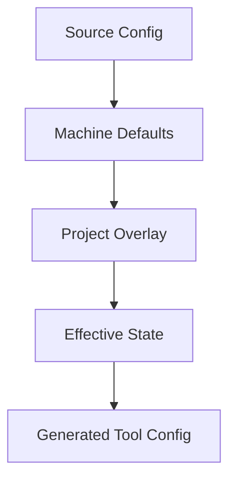

# CLI Tool Docusaurus Setup Guidebook

## Purpose

This guide explains how to stand up a Docusaurus documentation site for a CLI tool or local developer platform.

It is based on the Docusaurus migration completed for the Darwinian Harness docs, but it is written as a general manual for coworkers who need to build similar projects. Use it when a repo needs a documentation site that is:

- easy to run locally
- strict enough to catch broken links before deploy
- structured around CLI workflows, concepts, references, and troubleshooting
- deployable as a static site, usually through Cloudflare Pages
- independent from the product runtime so docs work does not destabilize the CLI

The concrete implementation that informed this manual lives under `docs-docusaurus/`.

## When Docusaurus Is The Right Fit

Docusaurus is a strong default when the docs are mostly markdown, need a sidebar, and should publish as a static site.

Use Docusaurus when:

- the product is a CLI, SDK, protocol, or developer tool
- documentation needs navigation, versionable files, code blocks, diagrams, and good link checking
- contributors should write ordinary markdown instead of editing a custom CMS
- the site should deploy from CI or a static hosting provider
- future custom React components may be useful, but are not required on day one

Avoid Docusaurus when:

- the site is primarily a marketing landing page
- most content is pulled from a database or external CMS at request time
- docs require server-side personalization
- the team wants a fully custom frontend rather than a documentation framework

For CLI tools, the practical advantage is that Docusaurus lets you create a stable information architecture before every page is fully written. You can ship a navigable docs skeleton, add real pages where users need them first, and fill the rest over time without breaking the build.

## Project Shape

Keep the docs site in a dedicated directory inside the repo:

```text
repo-root/
  package.json
  src/
  test/
  docs-docusaurus/
    package.json
    bun.lock
    docusaurus.config.ts
    sidebars.ts
    docs/
    src/css/custom.css
    static/img/
    wrangler.toml
```

This keeps the docs dependency graph separate from the CLI package. It also makes it obvious which files belong to the docs site and which files belong to the product.

For migration projects, leave the previous docs tree in place until content has been reviewed:

```text
docs-astro/
  DEPRECATED.md
```

The deprecation file should say where the active docs now live and warn contributors not to add new content to the old tree. Do not delete the old docs tree in the same patch unless the task is explicitly a cleanup. Keeping it around as a reference reduces migration risk.

## Preflight Decisions

Before creating files, decide these items explicitly.

### Site Location

Choose a stable directory name. For repo-local Docusaurus sites, `docs-docusaurus/` is clear and avoids collisions with existing `docs/` folders that may contain plans, assets, or generated material.

Do not overload an existing `docs/` tree unless the repo already uses it as a web docs site.

### URL Shape

Decide whether docs live at the domain root or under a subpath.

Root:

```ts
url: 'https://example.com',
baseUrl: '/',
presets: [
  [
    'classic',
    {
      docs: {
        routeBasePath: '/',
      },
    },
  ],
],
```

Subpath:

```ts
url: 'https://example.com',
baseUrl: '/docs/',
presets: [
  [
    'classic',
    {
      docs: {
        routeBasePath: '/',
      },
    },
  ],
],
```

For a root docs site, give the intro page `slug: /` so `/` resolves to real documentation content.

```md
---
slug: /
sidebar_position: 1
---

# Project Name
```

### Product Naming

If the docs are part of a rename, choose one naming policy before writing content.

Good policies:

- use the new public name everywhere
- mention the old name only on a dedicated migration page
- avoid old package names in examples until the rename lands

Bad policies:

- mixing old and new CLI names across pages
- writing examples that cannot work yet without noting the dependency
- hiding rename uncertainty in placeholder text

If the codebase still uses the old command name but the docs must point forward, add a readiness note in the implementation plan and avoid using the docs examples as runnable smoke tests until the rename lands.

### Version Pinning

Pin a known-good Docusaurus version instead of using a floating latest dependency. The Darwinian Harness docs used:

```json
{
  "@docusaurus/core": "3.9.2",
  "@docusaurus/preset-classic": "3.9.2",
  "@docusaurus/theme-mermaid": "3.9.2"
}
```

The exact version can change per project, but the rule is stable: keep the core Docusaurus packages on the same version and commit the lockfile.

### Strictness

Turn strict link checking on from the beginning:

```ts
onBrokenLinks: 'throw',
onBrokenAnchors: 'throw',
markdown: {
  hooks: {
    onBrokenMarkdownLinks: 'throw',
  },
},
```

Strictness is easier to start with than to retrofit after dozens of pages exist.

## Package Setup

Create a package file inside the docs directory:

```json
{
  "name": "example-docs",
  "version": "0.1.0",
  "private": true,
  "scripts": {
    "docusaurus": "docusaurus",
    "start": "docusaurus start",
    "build": "docusaurus build",
    "swizzle": "docusaurus swizzle",
    "deploy:pages": "wrangler pages deploy ./build",
    "clear": "docusaurus clear",
    "serve": "docusaurus serve",
    "typecheck": "tsc"
  },
  "dependencies": {
    "@docusaurus/core": "3.9.2",
    "@docusaurus/preset-classic": "3.9.2",
    "@docusaurus/theme-mermaid": "3.9.2",
    "@mdx-js/react": "^3.0.0",
    "clsx": "^2.0.0",
    "prism-react-renderer": "^2.3.0",
    "react": "^19.0.0",
    "react-dom": "^19.0.0"
  },
  "devDependencies": {
    "@docusaurus/module-type-aliases": "3.9.2",
    "@docusaurus/tsconfig": "3.9.2",
    "@docusaurus/types": "3.9.2",
    "typescript": "~5.6.2",
    "webpack": "5.99.9",
    "wrangler": "^3.0.0"
  },
  "engines": {
    "node": ">=20.0"
  }
}
```

Important notes:

- Do not set `"type": "module"` unless you have verified the Docusaurus build path under your runtime. In the Darwinian Harness setup, `"type": "module"` caused the generated server bundle to fail with `require.resolveWeak is not a function`.
- Pin `webpack` if the Docusaurus version expects an older Webpack option shape. In this setup, Webpack `5.107.x` rejected `webpackbar` options that worked with `5.99.9`.
- Commit the docs lockfile. Generated output and dependency folders should be ignored; the lockfile should not be ignored.

Install from the docs directory:

```bash
cd docs-docusaurus
bun install
```

## TypeScript Setup

Add `tsconfig.json`:

```json
{
  "extends": "@docusaurus/tsconfig",
  "compilerOptions": {
    "baseUrl": "."
  },
  "exclude": [".docusaurus", "build"]
}
```

Keep the docs TypeScript check separate from the product TypeScript check:

```bash
cd docs-docusaurus
bun run typecheck
```

## Docusaurus Config

A practical CLI-tool docs config usually includes:

- title and tagline
- production URL and base URL
- strict link checking
- docs at root or a deliberate subpath
- Mermaid if diagrams are part of the conceptual docs
- blog disabled unless the project actually has a blog
- edit URLs pointing at the docs directory
- nav and footer links to high-value docs pages
- syntax highlighting languages used by the CLI

Template:

```ts
import { themes as prismThemes } from 'prism-react-renderer';
import type { Config } from '@docusaurus/types';
import type * as Preset from '@docusaurus/preset-classic';

const config: Config = {
  title: 'Project Name',
  tagline: 'Short product description',
  favicon: 'img/favicon.svg',

  future: {
    v4: true,
  },

  url: 'https://example.com',
  baseUrl: '/',
  organizationName: 'example-org',
  projectName: 'example-project',

  onBrokenLinks: 'throw',
  onBrokenAnchors: 'throw',

  i18n: {
    defaultLocale: 'en',
    locales: ['en'],
  },

  markdown: {
    mermaid: true,
    hooks: {
      onBrokenMarkdownLinks: 'throw',
    },
  },

  themes: ['@docusaurus/theme-mermaid'],

  presets: [
    [
      'classic',
      {
        docs: {
          sidebarPath: './sidebars.ts',
          routeBasePath: '/',
          editUrl: 'https://github.com/example-org/example-project/tree/main/docs-docusaurus/',
        },
        blog: false,
        theme: {
          customCss: './src/css/custom.css',
        },
      } satisfies Preset.Options,
    ],
  ],

  themeConfig: {
    image: 'img/social-card.png',
    colorMode: {
      respectPrefersColorScheme: true,
    },
    navbar: {
      title: 'Project Name',
      logo: {
        alt: 'Project Name',
        src: 'img/logo.svg',
        srcDark: 'img/logo-dark.svg',
      },
      items: [
        {
          type: 'docSidebar',
          sidebarId: 'tutorialSidebar',
          position: 'left',
          label: 'Docs',
        },
        {
          href: 'https://github.com/example-org/example-project',
          label: 'GitHub',
          position: 'right',
        },
      ],
    },
    footer: {
      style: 'dark',
      links: [
        {
          title: 'Documentation',
          items: [
            { label: 'Introduction', to: '/' },
            { label: 'Getting Started', to: '/getting-started/installation' },
            { label: 'Concepts', to: '/concepts/architecture' },
            { label: 'Reference', to: '/reference/cli/status' },
          ],
        },
        {
          title: 'Community',
          items: [
            {
              label: 'GitHub',
              href: 'https://github.com/example-org/example-project',
            },
            {
              label: 'Issues',
              href: 'https://github.com/example-org/example-project/issues',
            },
          ],
        },
      ],
      copyright: `Copyright © ${new Date().getFullYear()} Project Name. Built with Docusaurus.`,
    },
    prism: {
      theme: prismThemes.github,
      darkTheme: prismThemes.dracula,
      additionalLanguages: ['bash', 'typescript', 'json', 'toml'],
    },
  } satisfies Preset.ThemeConfig,
};

export default config;
```

## Information Architecture For CLI Tools

A good CLI-tool docs site should teach users in layers:

1. what the tool is
2. how to install it
3. how to run the first useful workflow
4. how the mental model works
5. how to operate common workflows
6. where to look up exact commands and schemas
7. how to debug failures

The Darwinian Harness docs used this seven-section structure:

```text
Intro
Getting Started
  Installation
  First Run
  Choose Your Path
    Use a team's harness
    Set up your machine
    Override one project
    Author and publish a card
Concepts
Guides
Reference
  CLI
  Schemas
  Specs
Troubleshooting
FAQ
```

This structure generalizes well. Replace domain-specific pages with the tool's real concepts, but keep the user journey intact:

- Getting Started is for first success.
- Concepts are for mental models.
- Guides are for workflows.
- Reference is for exact syntax and contracts.
- Troubleshooting is for symptoms, diagnostics, and recovery.

## Sidebar Strategy

Prefer an explicit `sidebars.ts` over purely generated sidebars for CLI documentation. It gives reviewers a stable information architecture and prevents accidental navigation churn when files move around.

Template:

```ts
import type { SidebarsConfig } from '@docusaurus/plugin-content-docs';

const sidebars: SidebarsConfig = {
  tutorialSidebar: [
    'intro',
    {
      type: 'category',
      label: 'Getting Started',
      collapsed: false,
      items: [
        'getting-started/installation',
        'getting-started/first-run',
      ],
    },
    {
      type: 'category',
      label: 'Concepts',
      collapsed: false,
      items: [
        'concepts/architecture',
        'concepts/state-model',
      ],
    },
    {
      type: 'category',
      label: 'Guides',
      collapsed: true,
      items: [
        'guides/common-workflow',
        'guides/team-setup',
      ],
    },
    {
      type: 'category',
      label: 'Reference',
      collapsed: true,
      items: [
        {
          type: 'category',
          label: 'CLI',
          collapsed: true,
          items: [
            'reference/cli/init',
            'reference/cli/status',
            'reference/cli/write',
          ],
        },
      ],
    },
    {
      type: 'category',
      label: 'Troubleshooting',
      collapsed: true,
      items: [
        'troubleshooting/common-errors',
      ],
    },
    'faq',
  ],
};

export default sidebars;
```

Create `_category_.json` files only when useful for generated metadata or future category index pages. Do not rely on them as the source of truth if `sidebars.ts` is explicit.

## Content Strategy

### Real Pages First

Write at least two real pages before shipping:

- `intro.md`: explains the product, audience, model, and where to go next
- `getting-started/installation.md`: gives concrete install and verification steps

For CLI tools, the intro page should answer:

- What is this tool?
- What problem does it solve?
- What local or remote state does it touch?
- What should a new user run first?
- How is it conservative or safe by default?

The installation page should answer:

- What runtimes are required?
- How do I install or link the CLI?
- How do I verify the install?
- What command should I run next?
- What common installation failure should I check first?

### Stub Pages

Stub pages are useful when the IA is larger than the first content pass. They let the build prove all routes exist and let reviewers evaluate navigation early.

Use a consistent stub:

```md
---
sidebar_position: 1
---

# Page Title

> **Coming soon.** This page is part of the planned documentation structure but has not been written yet.
>
> If you need this content now, open an issue or check the current usage guide.
```

Avoid empty markdown files. Empty or nearly empty MDX pages can hide navigation mistakes and create a poor user experience.

### CLI Reference Pages

Do not dump `--help` output directly into docs on day one unless you have an automated refresh path. Hand-curated command group pages are usually better for early docs.

For each command group, include:

- what the command is for
- common examples
- flags that change write behavior
- output modes, especially `--json`
- safety notes
- links to relevant guides

Example structure:

````md
# `tool write`

## Purpose

Explain what gets written and where.

## Common Uses

```bash
tool write --dry-run
tool write
tool write --target=claude
```

## Safety

Explain dry-run behavior, managed ownership, and drift detection.

## Related Pages

- [Status](./status)
- [Doctor](./doctor)
````

### Concepts And Diagrams

Use Mermaid for layered models, state composition, lifecycle diagrams, and command flows.

Enable it in config:

```ts
markdown: {
  mermaid: true,
},
themes: ['@docusaurus/theme-mermaid'],
```

Example:

````md

````

Verify Mermaid in a browser or headless DOM check. Static HTML greps may not show the raw Mermaid source after Docusaurus transforms it.

## Styling And Branding

Start with restrained branding. Docs are tools, not landing pages.

Minimum assets:

```text
static/img/favicon.svg
static/img/logo.svg
static/img/logo-dark.svg
static/img/social-card.png
```

Placeholders are acceptable for v1 if they are clearly marked as follow-up work. The important part is that the site builds, nav works, and metadata points at real paths.

Keep CSS small:

```css
:root {
  --ifm-color-primary: #2f7d32;
  --ifm-code-font-size: 95%;
}

[data-theme='dark'] {
  --ifm-color-primary: #5fbf63;
}
```

Avoid heavy custom components at scaffold time. Add custom React only when the markdown docs need a real interaction or repeated structured component.

## Root Package Scripts

Expose docs commands from the repo root:

```json
{
  "scripts": {
    "docs:dev": "cd docs-docusaurus && bun run start",
    "docs:build": "cd docs-docusaurus && bun run build",
    "docs:deploy": "cd docs-docusaurus && bun run deploy:pages"
  }
}
```

These scripts let contributors run docs workflows without remembering the docs directory internals.

Also update the root `.gitignore`:

```gitignore
docs-docusaurus/node_modules/
docs-docusaurus/build/
docs-docusaurus/.docusaurus/
docs-docusaurus/.wrangler/
```

The docs package should also have its own `.gitignore`:

```gitignore
/node_modules
/.docusaurus
/build
/.wrangler
.DS_Store
```

## Cloudflare Pages Deployment

For Cloudflare Pages, add `wrangler.toml`:

```toml
name = "example-docs"
pages_build_output_dir = "build"
compatibility_date = "2026-05-29"
```

Add a deploy script:

```json
{
  "deploy:pages": "wrangler pages deploy ./build"
}
```

Verify the Wrangler command shape:

```bash
bunx wrangler pages deploy --help | grep -- --project-name
```

The custom domain is normally configured in the Cloudflare dashboard, not in repo config. Document that distinction in the docs README so reviewers do not look for domain setup in code.

## Local Development Workflow

Install:

```bash
cd docs-docusaurus
bun install
```

Start:

```bash
bun run start --port 3030 --no-open
```

Build:

```bash
bun run clear
bun run build
```

Serve the built output:

```bash
bun run serve --port 3030
```

Smoke test representative routes:

```bash
curl -fsS http://localhost:3030/ | grep -q "Project Name"
curl -fsS http://localhost:3030/getting-started/installation | grep -q "Installation"
curl -fsS http://localhost:3030/concepts/architecture | grep -q "Architecture"
curl -fsS http://localhost:3030/reference/cli/write | grep -q "Coming soon"
```

Use a variable name like `route` in shell loops. In zsh, assigning to `path` can overwrite the shell's command search path and cause confusing `command not found` failures.

## Verification Checklist

Run these before opening a PR:

```bash
bun run typecheck
cd docs-docusaurus
bun run typecheck
bun run clear
bun run build
```

From the repo root:

```bash
bun run docs:build
```

Old-name or forbidden-term check:

```bash
grep -RIn -E '(old-cli-name|old-package-name|old-domain)' \
  docs-docusaurus/docs \
  docs-docusaurus/src \
  docs-docusaurus/static \
  docs-docusaurus/*.ts \
  docs-docusaurus/*.toml \
  docs-docusaurus/*.json \
  docs-docusaurus/README.md
```

Use project-specific terms. For a rename, this check is as important as the build.

Smoke routes:

```bash
cd docs-docusaurus
bun run serve --port 3030
```

In another shell:

```bash
for route in / /getting-started/installation /concepts/architecture /reference/cli/write; do
  curl -fsS "http://localhost:3030${route}" >/tmp/docs-smoke.html
  printf 'smoke OK %s\n' "$route"
done
```

Mermaid runtime check:

- open the Mermaid page in a browser
- confirm the page contains an actual SVG diagram
- confirm expected node labels render

Do not rely only on grepping static HTML for the word `mermaid`; Docusaurus can transform the diagram before runtime.

Full repo tests are useful as a regression signal, but they may not be a docs gate if the repo already has unrelated failing tests. If they fail before the docs work, record the baseline clearly and do not attribute unrelated failures to the docs patch.

## Common Failure Cases

### `require.resolveWeak is not a function`

Likely cause: the docs package is treated as ESM through `"type": "module"`, while the generated Docusaurus server bundle expects CommonJS package semantics.

Fix:

- remove `"type": "module"` from `docs-docusaurus/package.json`
- rebuild from a clean state

```bash
cd docs-docusaurus
bun run clear
bun run build
```

### Webpack Progress Plugin Option Errors

Symptom: build fails with unknown ProgressPlugin or `webpackbar` option keys.

Likely cause: a newer Webpack release is stricter than the Docusaurus version expects.

Fix:

- pin Webpack to the known-good version
- reinstall
- rebuild

```bash
cd docs-docusaurus
bun add -d webpack@5.99.9
bun run build
```

### Broken Link Failures

Strict link checking will fail the build on:

- missing docs pages referenced in sidebars
- missing anchors
- relative links that point outside the docs tree incorrectly
- stale edit URLs if they are generated from wrong assumptions

Fix the docs structure rather than weakening the checker. Use placeholder pages when the IA needs a route before content exists.

### Static HTML Does Not Show Mermaid Source

Docusaurus can compile Mermaid into runtime chunks or rendered SVG. If a grep does not find the Mermaid source, inspect the rendered DOM instead.

Useful signals:

- Mermaid JS chunk included in the build
- `docusaurus-mermaid-container` present
- `<svg>` rendered in the article body
- expected node labels visible in the SVG

### Dev Server Uses A Different Webpack Than Build

The dev server can report a Webpack version from its internal dependency graph even when the production build uses the pinned version. Treat production build success as the release gate. Use the dev server for manual inspection and content review.

## PR And Commit Strategy

Group docs work into logical commits:

1. site scaffold and content
2. root command wiring and ignores
3. migration notes, deprecation markers, or planning docs

Example commit messages:

```text
[feat:docs] scaffold docusaurus documentation site

- Add Docusaurus site configuration, assets, and deploy wiring
- Build the sidebar IA with seed content and stubs
- Include Mermaid support and strict link checking
```

```text
[chore:docs] wire docusaurus root commands

- Add root docs scripts for local development, builds, and deploys
- Ignore generated Docusaurus build, cache, and deployment output
- Keep generated docs dependencies out of the repository
```

```text
[doc:docs] record docusaurus migration plan

- Mark the old docs tree as deprecated during migration
- Capture implementation decisions and verification notes
- Keep the migration plan aligned with the committed docs structure
```

Keep commit messages about the work and its reason. Do not include tool provenance or process chatter.

PR body structure:

```md
## Summary
- Add a Docusaurus docs site under `docs-docusaurus/`
- Add root docs scripts and generated-output ignores
- Mark the previous docs tree as deprecated

## Validation
- `bun run typecheck`
- `cd docs-docusaurus && bun run typecheck`
- `bun run docs:build`
- old-name grep across `docs-docusaurus/`
- local dev server smoke check

## Notes
- Full repo tests are not a docs gate if unrelated baseline failures already exist.
```

## Recommended Implementation Sequence

Use this sequence for a new CLI-tool docs site:

1. Record preflight decisions: site path, production URL, naming policy, deploy target, package manager, version pins.
2. Create `docs-docusaurus/` with package, TypeScript config, Docusaurus config, sidebar, CSS, and placeholder assets.
3. Install dependencies and commit the lockfile.
4. Write `intro.md` with `slug: /`.
5. Write `getting-started/installation.md`.
6. Add the full sidebar IA with stub pages.
7. Add at least one concept page with a Mermaid diagram if diagrams are useful for the domain.
8. Add root scripts and ignore generated folders.
9. Add deployment config and docs README.
10. Mark the old docs tree deprecated if this is a migration.
11. Run typecheck, build, old-name grep, serve smoke tests, and Mermaid runtime verification.
12. Commit in logical groups.
13. Push and open a PR with validation evidence.

## Day-Two Follow-Ups

After the scaffold lands, schedule follow-up tasks for:

- replacing placeholder logo, favicon, and social card assets
- filling stub pages in priority order
- adding CI for `bun run docs:build` on docs changes
- adding command reference generation if the CLI help output stabilizes
- adding redirects if replacing a live docs site with existing URLs
- adding analytics only after privacy and governance expectations are clear
- removing the deprecated docs tree once migrated content has been reviewed

Do not overload the initial scaffold PR with every follow-up. The first PR should prove the docs system works, establish the IA, and create a reliable path for future content work.
