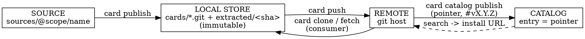

# ABOUTME: Operational model of where a drwn Mind Card lives, is stored, materialized, and updated across its lifecycle, written as user-facing guidance for authoring and managing cards.
# ABOUTME: Complements analysis 90 (skill-update data model) by mapping the four storage homes plus the apply/materialize path and the manual transitions between them.

# Analysis 92 — Mind Card Lifecycle: Storage, Materialization, and Update Model

**Date**: 2026-07-02
**Author**: Claude + Remy
**Status**: Draft
**References**: [analyses/90_skill-update-model-investigation.md, analyses/89_darwinian-operator-card-migration-design.md, analyses/66_drwn-write-root-target-architecture.md, knowledges/10_drwn-cli-architecture.md, cli/core/effective-state.ts, cli/core/sync.ts, cli/core/card-lock.ts, cli/core/store-paths.ts, cli/context.ts]

---

## Executive Summary

A drwn Mind Card is not a single object in one place. Over its lifecycle it exists in **four distinct storage homes** (source, immutable local store, git remote, catalog), and separately becomes live in a project through **two more steps** (apply → materialize). The defining property of the model is that **nothing propagates automatically between these locations** — every transition is an explicit, forward-only CLI command, and published versions are immutable.

Most confusion managing cards traces to one wrong assumption: that editing a card in one place makes the change appear elsewhere. It does not. This document maps each location, the command that moves content between them, and where a card's content is finally written into agent tool config. It is written as guidance a user can act on, and it complements analysis 90, which investigates the *data model* problem behind skill copies and recommends first-class provenance; here we document the model *as it exists today* so users can operate it correctly in the meantime.

## Context

This analysis was prompted by the question: *what is the current model around where a card is instantiated/materialized, and where it is stored and updated — and what should a user know to best manage their cards going forward?*

The observations below are grounded in the live store on the author's machine and in the CLI source. Scope facts (project vs machine, `card.lock` location, write-record paths) are verified directly against `cli/core/effective-state.ts` and `cli/core/card-lock.ts`, cited inline.

## Investigation

### The four storage homes

All four live under the machine store root `~/.agents/drwn/` (resolved by `cli/core/store-paths.ts`).

| Home | On disk | Mutable? | Role |
|------|---------|----------|------|
| **Source** | `sources/@scope/name/` | Editable | The working draft: `card.json`, `skills/`, `hooks/`, mind content, and its own `.git`. The only intended edit point. |
| **Local store** | `cards/@scope/name.git` (bare repo) + `extracted/<treeSha>/` | Immutable | Published versions. Each publish is a git commit + `vX.Y.Z` tag; content is extracted content-addressed by tree SHA. |
| **Remote** | External git host (e.g. GitHub) | Append-only | Distribution. Where other machines fetch/clone the card from. |
| **Catalog** | `catalogs/<host>_<repo>` + `catalogs.json` | Index | Discovery only. Holds *entries* (name + install URL + description), **not** card content. |

Supporting store files observed alongside these: `machine.json` (machine defaults + authoring scope), `store.json` (store metadata), `url-card-map.json` (maps git URLs to cards), `auth/` (credentials), and the machine-scope `skills/`, `generated/`, `mcp-servers/` staging directories.

### The transitions between homes (each is one explicit command)

- **`card publish`** snapshots the mutable source into an immutable store version.
- **`card push`** sends the store's bare repo (branch + version tags) to a git remote.
- **`card catalog publish`** adds a *pointer* (an install URL pinned to `#vX.Y.Z`) to a catalog. The catalog never holds the card body.
- A consumer goes catalog → `search` → `card clone <installUrl>` → their own local store.

### Instantiation: apply → materialize

Producing/pushing/cataloging a card does not make it *do* anything. A card becomes active on the consumer side in two further explicit steps:

1. **Apply** (`apply-mind-card` / `drwn card apply`) records intent by pinning a card ref into a project's **`card.lock`**, at `<projectRoot>/.agents/drwn/card.lock` (`cli/core/card-lock.ts:74`). No tool files change.
2. **Materialize** (`materialize-minds` / `drwn write`) reads the lock and the computed effective state (`buildEffectiveState`, `cli/core/effective-state.ts`) and writes into the real agent tool config via `syncRepository` (`cli/core/sync.ts`).

### Scope decides where materialization writes

`buildEffectiveState` derives scope from whether a project config is found walking up from cwd (`findProjectConfig`, `effective-state.ts:56`):

- `writeScope = projectRoot ? "project" : "machine"` (`effective-state.ts:102`)
- `scopeRoot = projectRoot ?? homeDir` (`effective-state.ts:98`)
- write-record path is per-project or global accordingly (`effective-state.ts:120`)

| Scope | Trigger | Writes into |
|-------|---------|-------------|
| **Project** | A `.agents/drwn/config.json` exists above cwd | Project tool files: `.mcp.json`, `.codex/config.toml`, `.cursor/mcp.json`, project-local skills, `<project>/.agents/drwn/generated/` |
| **Machine** | No project config found | Machine tool files: `~/.claude`, `~/.codex`, `~/.claude/skills`, `~/.codex/skills` |

Skills materialize as symlinks/copies into the tool skill directories; MCP servers merge into tool config files. The CLI also requires `registry/config.json` under the repo root or `AGENTS_REPO_ROOT` to run at all (`cli/context.ts:37`).

### Drift protection during materialization

`syncRepository` records every path it writes in a **write-record** of "managed paths," and enforces two asymmetric gates (detailed in analysis 66 and the write-pipeline reading from this session):

- **Refuse to overwrite**: if a managed file was edited by the user since the last write, `drwn write` aborts rather than clobbering it (bypass only with `--force`).
- **Refuse to delete**: during cleanup of paths no longer desired, a path is removed only if it still matches what drwn last wrote; user-modified files are preserved.

Net effect for users: `drwn write` will not silently destroy hand edits to `~/.claude/settings.json` or a project's `.mcp.json`.

### The update problem (summary; see analysis 90 for the data model)

Because bundling a skill (`card source add-skill --from <path>`) **copies** the skill into the source, and publishing **snapshots** the source, a card carries frozen copies. When the upstream skill changes, the card is stale until re-synced. Analysis 90 measured 10+ physical copies of a single skill across the pipeline and recommends first-class upstream provenance; this document treats the copy model as-is and prescribes the manual loop (see Recommendations).

## Findings

1. **A card lives in four storage homes plus an applied/materialized runtime state; none of the six auto-sync.** Every transition is an explicit forward-only command.
2. **Published versions are immutable.** You never edit `1.0.0`; you publish `1.0.1`. Store versions are git commit + tag, extracted content-addressed.
3. **The catalog stores pointers, not content.** A catalog entry is only as good as its install URL and the referenced tag remaining reachable (public repo, intact tag).
4. **Materialization target depends on scope**, decided by the presence of a project `config.json`; this is code-verified in `effective-state.ts`.
5. **Materialization is safe against user edits** via managed-path write-record gates.
6. **Bundled skills are frozen snapshots** — the primary ongoing maintenance hazard, addressed operationally by `sync-card-skills` and structurally by analysis 90's provenance recommendation.

## Recommendations

### Mental model to internalize

> Source is where you write; the local store is the immutable ledger; remote and catalog are distribution and discovery; `card.lock` + `drwn write` are how a card becomes live files in a tool — and the user drives every transition by hand.

If a change "isn't showing up," a hop was skipped. Walk the chain: edited source? published? pushed? catalog entry updated? applied? written?

### Authoring / publishing loop (producer)

1. `drwn card new <name> --scope @<handle>`
2. `drwn card source add-skill <card> <skill> --from <path>` (dry-run first) / `author-mind-content` for persona/beliefs/memory
3. `drwn card source set <card> --description ...`; write `README.md`
4. `drwn card source doctor <card> --json` → require `ok: true`
5. `drwn card publish <card>` → `drwn card validate <card>@<version>`
6. `share-mind-card`: `card remote add` → `card push` → `card catalog publish --mode direct --url 'git+https://…#vX.Y.Z'`

### Update loop (the frozen-snapshot fix)

When an upstream skill or content changes:

1. `sync-card-skills` (re-pulls each bundled skill via `card source add-skill --replace`, dry-run gated), **or** re-run `add-skill --from … --replace` per skill.
2. `drwn card source set <card> --version <bumped>` (immutability means a new version, never an in-place edit).
3. `doctor` → `publish` → `validate` → `push`.
4. `card catalog publish` the new `#vX.Y.Z` (use `--replace` to update the existing entry, or add a new versioned entry).

### Consumer loop

1. Discover: `drwn search card <name> --scope <catalog>`
2. Install into store: `drwn card clone <installUrl>`
3. Apply intent: `apply-mind-card` / `drwn card apply <ref>` (writes `card.lock`)
4. Materialize: `drwn write` (respect the scope you are in; check `drwn status`)
5. Update later: `drwn card outdated --fetch` → re-apply → `drwn write`
6. Diagnose without mutating: `inspect-minds`; repair drift: `repair-minds`

### Operational guidance

- **Check scope before writing.** Run `drwn status` to confirm project vs machine; machine-scope `drwn write` touches global `~/.claude`/`~/.codex`.
- **Keep the remote reachable.** A public catalog entry breaks if the repo goes private or the tag is deleted. Prefer explicit HTTPS install URLs so consumers without SSH can install.
- **Treat the source as the single edit point.** Editing extracted/store/materialized copies is lost on the next publish or write.

## Open Questions

1. Should the frozen-snapshot maintenance loop be collapsed by adopting analysis 90's provenance model (upstream pointer + dev-mode link), and on what timeline? Until then `sync-card-skills` is the stopgap.
2. Should `card catalog publish` for a new version auto-`--replace` the prior entry, or is retaining multiple versioned entries preferred for discoverability?
3. Is there a need for a single "release" command that chains sync → bump → publish → push → catalog to reduce the multi-step update loop to one action?

## Appendix

### A. Command → transition map

| Transition | Command | Direction |
|------------|---------|-----------|
| edit → immutable version | `drwn card publish` | source → store |
| version → git host | `drwn card push` | store → remote |
| advertise version | `drwn card catalog publish` | remote → catalog (pointer) |
| import a card | `drwn card clone` / `drwn card fetch` | remote → store |
| record intent | `drwn card apply` | store → project `card.lock` |
| write live files | `drwn write` | lock → tool config |
| refresh bundled skills | `sync-card-skills` / `add-skill --replace` | upstream → source |

### B. Concrete state (this machine, 2026-07-02)

The card built this session, `@remyjkim/knowledge-docs@1.0.0`, exists as:

- **Source**: `~/.agents/drwn/sources/@remyjkim/knowledge-docs/`
- **Local store**: `cards/@remyjkim/knowledge-docs.git` + `extracted/61315160…`, integrity `sha256-b4035ef5…646a0`
- **Remote**: `git@github.com:remyjkim/knowledge-docs-card.git` (public; `main` + `v1.0.0`)
- **Catalog**: `@community` entry `knowledge-docs` → `git+https://github.com/remyjkim/knowledge-docs-card.git#v1.0.0`

It bundles three copied skills (`drafting-`, `auditing-`, `restructuring-knowledge-docs`) whose canonical sources live at `darwinian-minds/skills/shared/` — the exact frozen-snapshot relationship described in the Update loop.
