# ABOUTME: Defines the six-seat delivery team, gate-safe execution graph, worktree discipline, and evidence contract for I214 Goose support and its separately numbered Pi successor.
# ABOUTME: Keeps I214 Goose-only while establishing a reusable contract-first operating model for architecture, planning, implementation, qualification, review, and knowledge capture.

# I214 Goose Target Support — Team Strategy and Execution Graph

**Status:** Post-I265 base-integration strategy amendment — exact-byte Owner approval pending

**Date:** 2026-08-11

**Base:** `origin/main` at `cef3090c013134b578d87fd938a6741fd288d36a`

**Branch:** `codex/i214-goose-target-team-strategy`
**Program order:** I214 Goose first; Pi support follows under a separately generated Issue Tracker ID

## 1. Executive decision

Use a **hybrid, contract-first team** with one architecture coordinator and five stable
specialists. Shared target infrastructure has a single production-code owner. Runtime
adapters remain leaf modules. One teammate stays independent of production authorship
and reviews frozen artifacts from clean checkouts.

**G1 reconciliation:** specialist evidence narrowed I214 after this strategy was first
approved. Goose policy hooks and all machine-scope projection are now explicit successor
work, not conditional I214 delivery. The target architecture and decision register are the
authority for that technical scope; this strategy is amended below to match them.

The Owner also removed public backward compatibility as a requirement but allowed a hard cut
only when it drastically lowers both complexity and effort. A0 rejected a universal target/
ownership cut for I214: it expands every existing producer and fixture while removing only the
dual-record transaction. The narrower adapter sidecar and separate leaf ledger remain selected
for lower effort and blast radius, while explicitly accepting a somewhat richer topology.

T5-R2 independently reviewed the Owner-approved candidate v2 hashes and returned seven
important findings. T1 through T4 upheld the underlying defects and reconciled them into the
Owner-approved candidate v3. T5-R3 then found three further gaps: Goose validates its winning
plugin map as one value before path relevance; Unicode path portability remained incomplete;
and five Parallel, Beads, and MarkItDown extension writes were not awaited.

The P5 source pass accepts all three findings and also closes the adjacent Card project-config
read-then-write race. Its candidate-v4 reread showed that dirty state spans the complete enabled
plugin discovery set and that persistence can migrate and fully reserialize writable user
configuration. Candidate v4 validates the whole plugin map first, models aggregate complete
discovery, blocks plugin consent/materialization for unsafe existing writable config, broadens
the disclosure, uses a closed ASCII-only `PortableProjectionPathV1`, awaits all five extension
calls, and routes Card worker updates through the same under-lock mutation primitive. The path
hard cut is confined to new target-ledger projection: all 138 nodes across the 49 eligible
current shared/Card roots already qualify. It removes Unicode normalization/caseless and
Git-ignore escaping work, drastically
reducing complexity and effort at that boundary under `I214-D004`; the universal target/
ownership hard cut remains rejected. No ledger/receipt schema number, adapter ABI, separate-
ledger choice, Pi scope, or universal-cut decision changes. Candidate v4 received explicit
`I214-D006` Owner approval on 2026-08-11; a fresh exact-hash T5 review remains mandatory before
formal G1 submission.

The Owner then identified `/Users/pureicis/dev/goose` as the authoritative latest Goose source.
A0 halted the v5 freeze, audited its clean
`db7a704446975c88d3b67490c74d33bcd684404e` checkout (workspace version `1.45.0`), and reconciled
the delta before delegating implementation planning. The adapter/observer and projection topology
remain selected. The latest source adds an experimental second skill engine, changes
`GOOSE_PATH_ROOT` validation, suppresses hooks for Summon subagents, removes the standalone HTTP
server and bundled text UI, and leaves project-plugin `skills/` undiscoverable. Candidate v5
therefore narrows the positive activation envelope and deletes obsolete tests rather than
inventing compatibility for removed entry points.

Candidate v5 also replaces the implied whole-command transaction with complete proposed-state
preflight plus ordered recoverable commits. One subordinate whole-image project-projection
journal still commits V1 output and the separate target ledger together. Upstream commits are
reported honestly and retried idempotently; they are never claimed to have been rolled back by a
later projection failure.

Before G1 submission, `origin/main` advanced 45 commits and landed I265 at `cef3090`. A0 rebased
the two I214 documentation commits cleanly, verified range/blob equivalence, and ran a fresh
exact-Bun-1.2.21 baseline: 2,365 pass, 11 expected skips, 0 fail plus green typecheck, release,
package, and docs checks. I265 changes shared seams that I214 plans to extend, so A0 opened this
bounded semantic amendment rather than treating the conflict-free rebase as sufficient.
`I214-D011` authorizes that rebase/investigation only; the earlier exact-byte D010 approval cannot
authorize this changed strategy or the related architecture/plan bytes.

The topology remains unchanged. I214 must preserve Worker 1.3's Card runtime-admission and
application declarations, zero-effect materializer admission gate, package identity 1.3.0,
`store.minDrwnVersion >= 1.3.0` for declared closures, offline derivation command, required release
members, provenance/publication controls, retired Buzz delivery Card absence, required Buzz
tooling, and accepted I268 vectors. I214
adds the adapter registry and complete project preflight
after admission/store validation; it neither releases Worker 1.3 nor publishes Finch Cards. I267
retains release/adoption authority and I268 retains Finch publication authority in their own
lanes.

This topology is designed to avoid two predictable failure modes:

1. Five implementation agents colliding in central files such as `types.ts`,
   `targets.ts`, `sync.ts`, `skills.ts`, `write-record.ts`, and Worker generation.
2. A phase-relay team losing runtime knowledge between evidence, design,
   implementation, debugging, and live qualification.

I214 remains Goose-only. The Pi teammate participates during I214 as a future-consumer
witness, ensuring the shared seam does not make Pi unnecessarily difficult, but no Pi
production behavior lands under I214. Pi receives its own issue, architecture, plan,
gates, implementation branch, completion record, and knowledge-capture transition.

## 2. Governing constraints

### 2.1 Issue workflow

The v0.4 contract in `AGENTS.md` is authoritative:

- Owner Status records the Owner's current execution phase.
- Reviewer Status records only the earliest ready, unapproved gate.
- A review verdict sets Owner Status to `Received`; the Owner acknowledges it into the
  next phase in a separate transaction.
- Gates remain ordered G1 → G2 → G3 even when downstream work is stacked.
- Every status mutation is one atomic three-surface transaction: tracker property,
  Issue Status table, and newest-first Issue Thread entry.
- Cross-person review headers use real Notion user mentions resolved from the issue row.
- Slack and internal agent messages are notification channels, not workflow state.
- Legacy Turn/Handoff state is prohibited.

The referenced `.ai/rules/org-wide/06_issue_workflow.md` and repo-wide rule files are
absent from current `origin/main`, while inherited worktree/setup prose mentions pnpm in
a Bun repository. The coordinator must report this rule drift before any Issue Tracker
mutation and use verified repository reality for commands.

### 2.2 Issue identity and scope

- I214 is the canonical Goose issue. The handoffs describe it as `Created` and
  G1-ready; that is evidence, not a substitute for reading the current tracker row.
- Before G1 authoring, A0 verifies the live I214 Owner Status, Reviewer Status, Owner,
  and Reviewer. If Owner Status is still `Created`, the human Owner must atomically enter
  `Architecting` before the team begins G1 work.
- The untracked Goose manual at the dirty primary checkout,
  `.ai/analyses/134_goose-configuration-guide.md`, is perishable evidence. It must be
  imported into the I214 G1 documentation branch with provenance before that checkout
  is cleaned, reset, or replaced.
- Pi work must start by creating its issue row, reading the generated ID, and then naming
  `clNNNN_...` architecture, plan, branch, PR, and completion artifacts.
- No one may guess or preallocate the Pi issue number.
- A shared technical dependency does not make Goose and Pi one issue.

### 2.3 Human authority boundary

The six-seat agent team is an execution mechanism, not the Issue Tracker authority.

- The human Owner decides scope, risk acceptance, consent semantics, cancellation,
  merge authorization, and `Received` acknowledgements.
- The human Reviewer records Passed or Changes requested.
- The independent agent verifier provides adversarial evidence but is not a synthetic
  Notion Reviewer.
- The coordinator may prepare an atomic transaction, but it may execute it only with the
  authority appropriate to the person making the state change.
- Neither the coordinator nor an author may approve their own work.

### 2.4 Concurrent-issue quarantine

The Owner reports that I238 and I266–I269 are actively being worked by other coworkers. I214
must not edit, rebase, cherry-pick from, clean, test inside, or otherwise coordinate those mutable
worktrees. The absence of a locally registered worktree is not evidence that an issue is idle.

I265 is the completed exception: its integration-ready work landed on `origin/main` at `cef3090`,
and A0 audited that immutable descendant from the I214 worktree without entering an I265 lane.
The rebase was textually clean but semantically overlapped Card manifest, Worker materializer,
release-artifact, package-readiness, and docs-readiness seams; this amendment records the required
preservation and test contracts.

I214 architecture documentation may continue in its isolated worktree. Before G2 freeze or any
production implementation, A0 waits for each remaining issue owner to identify an integration-ready landed
SHA or explicit non-overlap disposition. A0 then audits the combined descendant of `main` against
I214's declared production/test path inventory and current-state seams. Any overlap is resolved
in the I214 worktree after those changes land—never in a coworker's active worktree—and material
contract drift returns to G1 amendment. The implementation base must be that recorded descendant,
not mechanically `cef3090` or the historical `ea13a582` documentation base.

## 3. Alternatives considered

### 3.1 Phase relay

One agent architects, another plans, implementation agents build, and a final agent
tests.

**Advantages:** obvious gate boundaries and low simultaneous file contention.

**Rejected because:** every phase creates a high-entropy handoff; runtime assumptions
are repeatedly reinterpreted; most specialists sit idle; testing discovers design
failures after the runtime expert has left the critical path.

### 3.2 Independent vertical squads

Separate Goose, Pi, ownership, and testing agents build end-to-end slices in parallel.

**Advantages:** strong local ownership and fast early progress.

**Rejected because:** each squad needs the same unfinished target registry, path model,
sync orchestrator, ownership schema, and Worker aggregate. The
apparent parallelism becomes merge conflict, duplicated abstraction, and inconsistent
cleanup behavior.

### 3.3 Hybrid contract-first team — selected

Stable specialists retain domain context throughout the issue. Shared interfaces and
hotspot files have one owner and are frozen before leaf work begins. Runtime, safety,
and qualification work proceeds in parallel only after its dependencies and write sets
are independent.

The cost is a heavier coordinator role and wave scheduling. That cost is preferable to
false parallelism in repository-wide projection code.

## 4. Team composition

### A0 — Architecture Coordinator / Orchestrator

**Mission:** maintain one coherent issue, one decision history, one dependency graph,
and one reviewed integration SHA.

**Owns:**

- Issue identity and scope ledger.
- G1 architecture synthesis and G2 plan synthesis.
- Decision log and unresolved Owner-decision queue.
- Worktree/branch allocation and file-ownership lock table.
- Integration branch, merge order, and candidate SHA freezes.
- Gate packet assembly and PR description, including Testing & CI evidence.
- Completion documentation and knowledge-capture coordination.
- Preparation and verification of permitted Issue Tracker transactions.

**Must not:**

- Author production implementation.
- Issue a gate verdict.
- silently repair a teammate's failed change.
- Resolve an Owner-level consent or scope decision by assumption.
- Merge commits newer than the independently reviewed SHA.

**Required outputs:** architecture, plan, dependency DAG, decision register, evidence
index, integration log, completion record, and knowledge-capture checklist.

### T1 — Target Platform and Runtime Contract Lead

**Mission:** create the smallest shared seam required by the active issue while
preserving all existing target behavior.

**Owns:**

- Capability-oriented target adapter contract.
- Target registry, schema, selection, and dispatch wiring.
- Shared path and projection primitives.
- Central synchronization integration points.
- Contract fixtures for file-shaped and directory-shaped targets.
- Later, under the Pi issue, the versioned `drwn.runtime-bundle@1` schema and loader
  boundary.

**Exclusive shared hotspots:**

- `cli/core/types.ts`
- `cli/context.ts` adapter-sidecar discovery/loading boundary
- `cli/core/targets.ts`
- `cli/core/paths.ts`
- `cli/core/machine-config.ts`
- `cli/core/user-config.ts`
- `cli/core/config-local.ts`
- `cli/core/mcp.ts`
- `cli/core/effective-state.ts`
- `cli/core/card-manifest.ts`, preserving I265 `runtimeAdmission` and
  `applicationRequirements` fields, validation, and deployable-closure semantics
- `cli/core/card-project.ts`
- `cli/core/card-capture.ts`
- `cli/core/card-diff.ts`
- `cli/core/project.ts`
- `cli/core/project-writes.ts`, preserving project schema through every mutation helper
- `cli/core/extensions/project-config.ts`, `parallel.ts`, `beads.ts`, and `markitdown.ts`,
  exposing explicit Promise-returning helpers on the validated project-state path and deleting
  the unused unlocked Beads writer
- `registry/config.json` read-only byte-parity fixture and new
  `registry/target-adapters.json`
- `cli/core/sync.ts` and `cli/core/sync-project-instructions.ts` planning/dispatch
- `cli/core/skills.ts` shared-surface wiring
- `cli/core/card-skill-resolver.ts` source-identity derivation for shared projections
- `cli/core/projection-ownership.ts` legacy partial-selection semantics
- `cli/core/git-hygiene.ts` pure hygiene-plan rendering and legacy parity
- `cli/core/write-watch.ts` exact ledger-derived suppression wiring
- `cli/core/hook-generator/runtime-selection.ts` and
  `cli/core/hook-generator/sync-hooks.ts`, legacy planning only; no Goose runtime change
- `cli/core/worker-materialize.ts`, factoring only to compose I214 preflight while preserving
  I265's complete admission gate, targetless config derivation, and
  admission → store identity → preflight/any applicable consent ordering
- `cli/core/worker-generator/sync-worker.ts`
- `cli/commands/write.ts`
- `cli/commands/mcp/write.ts`
- `cli/commands/mcp/list.ts` registered-target reporting
- `cli/index.ts`, bounded command registration for T4's frozen consent command only; no target
  behavior in the shared entrypoint
- `cli/commands/init.ts`
- `cli/commands/extensions/setup.ts`, awaiting Beads, Parallel, and MarkItDown config mutations
- `cli/commands/extensions/add.ts` awaited-writer parity
- `scripts/verify-release-readiness.ts` and `test/package-readiness.test.ts`, additively
  preserving Worker 1.3 readiness and runtime-admission coverage
- `scripts/release/artifact-contract.ts` and
  `test/scripts-release-artifact-contract.test.ts`, retaining every pre-I214
  `REQUIRED_RELEASE_MEMBERS` entry; separately asserting
  `cli/core/runtime-admission-manifest.ts`, `cli/core/runtime-admission-derive.ts`,
  `cli/core/runtime-admission-descriptors.ts`, and `cli/tools/runtime-admission-derive.ts` remain
  npm-pack members; and appending, extracting, and production-parsing the packaged adapter
  sidecar from initial and recovery/download artifacts, including negative artifacts
- new adapter-contract/index modules
- later `cli/core/runtime-bundle/**`

**Must not:** implement target-specific Goose or Pi behavior inside the shared contract.

**Required outputs:** versioned contract, strict schema/version failure rules, deterministic
fixtures, RED/GREEN tests, the explicit no existing-target/record migration decision, and a
frozen contract SHA.

### T2 — Goose Runtime Lead

**Mission:** turn current Goose evidence into an honest first-class target.

**Owns:**

- Exact Goose binary, version, source, and provider-class evidence.
- Refresh of analysis 134 and the experiment-07 probe ledger.
- Goose leaf adapter modules.
- Project plugin projection for MCP only.
- Goose instruction-capability and shared-skill conformance fixtures; T2 owns no instruction
  renderer, V1 instruction mutation, or shared-projector implementation.
- Exact no-hook, no-machine-output, and no direct drwn-authored global-config-write claims.
- Goose-specific tests, documentation, and live qualification fixtures.

**Must not:** directly edit T1's shared hotspots. Required shared wiring is requested as
a bounded change from T1.

**Required outputs:** capability matrix, probe bundle, adapter commits, target-local
tests, live qualification report, and honest support/degradation language.

### T3 — Pi Runtime Lead

**Mission during I214:** challenge the shared design as a future consumer without
broadening I214.

**Mission during the Pi issue:** deliver stock Pi coding-agent CLI support and the
high-level Pi SDK integration.

**Owns during I214:**

- Pi consumer-fit review of the target contract.
- Current upstream compatibility note.
- Explicit Pi non-requirements for I214.
- Detection of Goose-only assumptions that would force a breaking redesign.

**Owns during the Pi issue:**

- Pi target leaf adapter.
- Generated `.pi/extensions/drwn` bridge.
- MCP-to-Pi tool registration.
- Coding-agent SDK loader and resource overrides.
- Pi lifecycle mapping, target-local tests, docs, and live qualification.
- AgentHarness maturity re-probe; direct AgentHarness support stays absent until its
  execution paths are implemented and separately approved.

**Must not during I214:** author Pi production code or expand I214 acceptance criteria
into Pi delivery.

### T4 — Ownership, Safety, and Diagnostics Lead

**Mission:** ensure target support is reversible, consent-aware, fail-closed, and
truthfully observable.

**Owns:**

- Managed versus ambient versus user-owned state classification.
- Separate target-projection-ledger semantics for new surfaces; V1 write-record production
  behavior stays frozen.
- Foreign-file collision behavior.
- Drift detection and force/repair limits.
- Stale cleanup and uninstall semantics.
- Secret-reference preservation and redaction.
- Symlink, traversal, and partial-write safety.
- Per-entry ownership for directory-shaped targets; foreign descendants and unknown
  siblings are preserved, and recursive deletion of a mixed-owned directory is
  prohibited.
- `status`/`doctor` diagnostics for runtime-global side effects.
- Goose plugin auto-registration analysis.
- Pi trust/settings/package-install boundaries.

**Primary write set after T1 handoff:**

- read-only regression fixtures for `cli/core/write-record.ts`; production edits require a
  separately Owner-reviewed defect amendment
- new ledger, whole-image snapshot, executor, journal, consent, transaction, and path-safety modules
- `cli/core/inventory-lock.ts`, extending the repository-wide order through consent and the Org
  operation level,
  project-state, and projection locks
- `cli/core/project-state-transaction.ts`, extending atomic recovery across selected base/local
  config and lock images, including absence
- `cli/core/ambient-capabilities.ts`
- `cli/core/ambient-policy.ts`
- `cli/core/diagnostics.ts`
- `cli/commands/status.ts`, `cli/commands/doctor.ts`, and the new
  `cli/commands/target/consent.ts`
- ownership, drift, cleanup, and security tests

**Must not:** independently change target identity/schema or serve as final verifier of
its own safety implementation.

### T5 — Independent Qualification and Gate Reviewer

**Mission:** attempt to falsify the architecture, plan, implementation, and support
claims from a clean checkout at a frozen SHA.

**Owns:**

- Independent G1 architecture review packet.
- Independent G2 execution-readiness review.
- G3 clean-tree test and live-runtime qualification.
- Negative/adversarial scenarios.
- Baseline-versus-delta audit.
- Candidate filesystem before/after diff.
- Evidence-to-claim reconciliation.
- Reviewed-SHA identity check before merge.

**Must not:**

- Author production code under review.
- Fix a finding in place.
- Trust teammate summaries instead of rerunning commands.
- Review a moving candidate SHA.
- Become the formal human Reviewer merely because its review is independent.

If T5 proposes a committed regression test, ownership transfers to an implementing
teammate before final review, and T5 reviews a fresh candidate.

## 5. Responsibility matrix

| Activity | Responsible | Accountable authority | Consulted | Independent evidence |
|---|---|---|---|---|
| Canonical issue identity | A0 mechanically | Human Owner | T5 | Tracker ID read-back |
| Scope and consent decisions | Human Owner | Human Owner | A0, T1–T4 | T5 checks no silent assumption |
| G1 architecture | A0 | Human Owner | T1–T4 | T5 review; human gate verdict |
| G2 task plan | A0 | Human Owner | T1–T4 | T5 readiness review; human verdict |
| Shared target contract | T1 | A0 integration | T2–T4 | T5 at contract/G3 checkpoints |
| Goose target | T2 | A0 integration | T1, T4 | T5 |
| Pi future-consumer check in I214 | T3 | A0 | T1, T2 | T5 |
| Pi implementation in successor issue | T3 | A0 integration | T1, T4 | T5 |
| Ownership and safety | T4 | A0 integration | T1, runtime lead | T5 |
| Component TDD | Implementing teammate | A0 | Runtime evidence owner | T5 reruns |
| Live qualification | Runtime lead | A0 | T4 | T5 independently samples/reruns |
| Merge | A0 mechanically when authorized | Human Owner | T1–T4 | T5 verifies reviewed SHA |
| Completion and knowledge capture | A0 | Human Owner | T1–T4 | T5 evidence audit |

## 6. Execution graph

```mermaid
flowchart TD
    S0["Internal preflight · verify tracker, fresh worktree, dependencies, baseline"]
    S0 --> C0["T1 · Source and shared-contract audit"]
    S0 --> G0["T2 · Refresh Goose binary/provider probes"]
    S0 --> O0["T4 · Consent, ownership, and threat model"]

    C0 --> A1["A0 · Synthesize I214 G1 architecture"]
    G0 --> A1
    O0 --> A1
    A1 --> P0["T3 · Pi future-consumer challenge"]
    P0 --> O1A["Human Owner · Approve candidate architecture and material decisions"]
    O1A --> F1["A0 · Freeze exact G1 artifact hashes and claims"]
    F1 --> V1["T5 · Independent pre-submission G1 findings/evidence packet"]
    V1 -->|Changes required| A1
    V1 -->|Pass| S1["Human Owner · Submit G1; atomically set Reviewer Status = G1 Review"]
    S1 --> R1["Human Reviewer · Verdict; atomically set Owner Status = Received"]
    R1 -->|Changes requested| A1C["Human Owner · Acknowledge Received → Architecting"]
    A1C --> A1
    R1 -->|Passed| A1P["Human Owner · Acknowledge Received → Planning"]

    A1P --> A2["A0 · G2 dependency and TDD plan"]
    A2 --> O2A["Human Owner · Approve candidate G2 plan"]
    O2A --> F2["A0 · Freeze exact G2 plan"]
    F2 --> V2["T5 · Independent pre-submission G2 readiness packet"]
    V2 -->|Changes required| A2
    V2 -->|Pass| S2["Human Owner · Submit G2; atomically set Reviewer Status = G2 Review"]
    S2 --> R2["Human Reviewer · Verdict; atomically set Owner Status = Received"]
    R2 -->|Changes requested| A2C["Human Owner · Acknowledge Received → Planning"]
    A2C --> A2
    R2 -->|Passed| A2P["Human Owner · Acknowledge Received → Building"]

    A2P --> T1F["T1 · Implement shared target foundation test-first"]
    T1F --> CF["A0/T1 · Contract freeze checkpoint"]
    CF --> OF["T4 · Freeze directory ownership, collision, drift, and cleanup primitives"]
    CF --> P1["T3 · Pi compatibility witness; no Pi production"]
    OF --> G1["T2 · Goose leaf adapter and plugin"]
    G1 --> O1["T4 · Ambient registration and output-aware diagnostics"]

    O1 --> INT
    P1 --> INT
    INT["A0 · Integrate declared commits in fixed order"]
    INT --> SHA["A0 · Freeze G3 candidate SHA and evidence index"]
    SHA --> V3["T5 · Clean-tree pre-submission findings and qualification evidence"]
    V3 -->|Changes required| FIX["A0 assigns finding to original owner"]
    V3 -->|Pass| S3["Human Owner · Submit G3; atomically set Reviewer Status = G3 Review"]
    S3 --> R3["Human Reviewer · Verdict; atomically set Owner Status = Received"]
    R3 -->|Changes requested| A3C["Human Owner · Acknowledge Received → Building"]
    A3C --> FIX
    FIX --> INT
    R3 -->|Passed| A3P["Human Owner · Acknowledge Received → In Review"]
    A3P --> MERGE["A0 · Verify PR head equals reviewed SHA, then merge if authorized"]
    MERGE --> MS["Human Owner · Atomically record Owner Status = Merged"]
    MS --> CD["A0 · Write cl0214 Goose completion document"]
    CD --> KC["Human Owner · Atomically record Knowledge-captured"]

    C0 --> PI0["T3 · Refresh Pi evidence in a provisional research lane"]
    MERGE --> PI1["Create Pi issue, read generated ID, branch from current main"]
    PI0 --> PI1
    PI1 --> PI2["Repeat G1/G2/G3 with T3 leading and T2 as Goose regression witness"]
```

## 7. Concurrency waves

The agent runtime permits four active agents including the coordinator. Six logical
seats therefore operate in deliberate waves.

| Wave | Active seats | Purpose | Exit condition |
|---|---|---|---|
| Internal preflight | A0 + T1 + T2 + T4 | Tracker verification, source map, Goose evidence, ownership risks | Evidence packets delivered |
| Consumer challenge | A0 + T3 | Pi-fit review of the draft seam | Pi witness packet delivered |
| G1 pre-submission qualification | A0 + T5 | Clean review of frozen G1 candidate | T5 pass or amendment findings before formal submission |
| Planning | A0 + T1 + T2 + T4, then T3 | Build topological work packets | Integrated G2 plan frozen |
| G2 pre-submission qualification | A0 + T5 | Check executability and TDD ordering | T5 pass or amendment findings before formal submission |
| Foundation | A0 + T1 | Implement/freeze shared contract | Contract checkpoint passes |
| Ownership primitives | A0 + T4 | Freeze per-entry directory ownership, collision, drift, and cleanup APIs | Ownership checkpoint passes |
| Goose leaf build | A0 + T2 + T3 | Goose adapter; Pi witness only | Goose output shape frozen |
| Output-aware diagnostics | A0 + T4 | Ambient registration and diagnostics against frozen Goose output | Safety/diagnostic commits ready |
| Integration | A0 + T1 as needed | Integrate in fixed order | Candidate SHA frozen |
| G3 pre-submission qualification | A0 + T5 | Full deterministic/live verification | T5 pass or amendment findings before formal submission |

T5 does not review while authors are changing the candidate. Authors may answer factual
questions during review but do not mutate the reviewed worktree.

## 8. False-parallelism rule

Two tasks may run concurrently only when all are true:

1. They do not write the same files or generated directories.
2. Neither consumes an interface, schema, or artifact the other has not frozen.
3. They do not share mutable external state, including real home directories,
   credentials, ports, provider rate limits, or runtime configuration.
4. Each result is independently reviewable and mergeable.

Otherwise the coordinator serializes them.

The following must not be parallelized:

- Target enum/config/schema changes and target-selection/sync orchestration.
- `.agents/skills` path changes and write-record cleanup semantics.
- Write-record schema changes and diagnostics interpreting those records.
- Consent-receipt binding and plugin projection while the safety contract is unfrozen.
- Runtime-bundle schema generation and Pi consumers.
- Goose and Pi production changes in one worktree.
- Gate review and authorship by the reviewer.
- Live probes sharing actual `~/.agents`, `~/.config/goose`, `~/.pi`, credentials, or
  provider-global state.

## 9. Branch and worktree strategy

### 9.1 Coordinator lane

- Base every issue on a fetched, explicit `origin/main` SHA.
- Coordinator integration branch: `codex/i214-goose-support` for implementation.
- G1/strategy documentation may begin on
  `codex/i214-goose-target-team-strategy`, but final branch structure follows the Owner's
  PR decomposition decision.
- The dirty primary checkout is read-only evidence; never pull, reset, or clean it while
  analysis 134 remains untracked.

### 9.2 Teammate lanes

Each code-writing teammate gets an isolated worktree and branch based on the
coordinator-declared integration SHA:

- `codex/i214-t1-target-contract`
- `codex/i214-t2-goose-adapter`
- `codex/i214-t4-ownership-diagnostics`
- T3 uses a research-only lane during I214; its production branch is created only after
  the Pi issue ID exists.

T5 receives a detached or dedicated clean review worktree at the frozen SHA. No teammate
edits a shared worktree. No branch is rebased or force-updated while T5 is reviewing it.

### 9.3 Integration protocol

1. A0 records the base SHA and allowed write set in the assignment.
2. The teammate produces one or more logically scoped commits with repository area
   prefixes.
3. The teammate returns a complete evidence packet.
4. A0 verifies the commit SHA and changed paths before integration.
5. A0 integrates in the G2-declared order.
6. Contract/focused tests run after each shared-spine integration.
7. A0 freezes the candidate only after all required deltas are integrated and clean.

Any undeclared edit to a shared hotspot is rejected back to the teammate rather than
resolved opportunistically during integration.

## 10. Assignment and handoff contract

Every teammate assignment contains:

- Issue ID and exact scope.
- Role/seat for the assignment.
- Base SHA and worktree/branch.
- Owned files/directories and explicit no-touch list.
- Inputs and frozen dependency versions.
- Required output artifact.
- Exact verification commands.
- Stop conditions and decisions requiring A0 or human Owner input.

Every completed handoff contains:

- Issue ID, base SHA, and head SHA.
- Summary of work performed.
- Files read and files changed.
- Commands run with exact pass/fail/skip counts.
- Claims verified, falsified, degraded, unverified, or unsupported.
- Evidence paths and digests.
- New risks and decisions requiring human authority.
- Known baseline failures versus change-induced failures.
- Next dependency and recommended assignee.

“Tests pass” without commands and counts is not a valid handoff.

## 11. Coordinator control artifacts

A0 maintains these compact, reviewable artifacts:

### 11.1 Scope and issue ledger

- Canonical issue ID, title, Owner, Reviewer, statuses, and current phase.
- In-scope and explicitly out-of-scope behaviors.
- Cross-issue dependencies that do not broaden the current issue.

### 11.2 Decision register

Each decision records:

- ID and date.
- Decider/authority.
- Question and selected option.
- Alternatives rejected.
- Evidence/rationale.
- Affected interfaces and tasks.
- Whether dependent work must rebase or repeat qualification.

### 11.3 File-ownership lock table

- Path or module boundary.
- Current owning seat.
- Base/integration SHA.
- Contract version consumed.
- Lock status and release condition.

### 11.4 Evidence index

- Claim.
- Support status: verified, degraded, unverified, unsupported.
- Deterministic test or live probe.
- Runtime binary/version/source/provider class.
- Candidate SHA.
- Evidence path/digest.

### 11.5 Baseline ledger

- Setup state, including submodule pin and package-manager version.
- Baseline commands and counts.
- Known failures with root-cause classification.
- Delta after each integration checkpoint.

## 12. Internal bootstrap/preflight checkpoint

This is an internal execution checkpoint, not a fourth workflow gate. It never appears
in Reviewer Status or the Issue Tracker gate sequence, which remains G1 → G2 → G3.

Before G1 authoring:

- Read the live I214 tracker row and issue page. If still `Created`, the human Owner
  atomically enters `Architecting` before work begins.
- Work from fresh `origin/main`, not the dirty primary checkout.
- Record the exact base SHA.
- Initialize `darwinian-worker-skills` at the pinned commit.
- Run `bun install --frozen-lockfile`.
- Run the focused target/projection suite, full `bun test ./test/`, TypeScript checking,
  and any release/docs checks required by the current repository.
- Classify baseline failures rather than absorbing them into I214.
- Import analysis 134 with provenance and verify it is not silently renumbered.
- Record Goose binary version, upstream repository/source SHA, provider class, and test
  configuration.
- Keep real home/runtime directories read-only; all live probes use isolated state.
- Resolve actual Owner and Reviewer users from the I214 row before preparing status
  transactions.
- Record the missing-rule/Bun-versus-pnpm drift.

If the fresh initialized baseline differs materially from the expected repository state,
stop and adjudicate before implementation.

## 13. G1 architecture strategy

### 13.1 Parallel evidence packets

T1 produces:

- Current target extension blast radius.
- Proposed capability-oriented adapter boundary.
- Compatibility constraints for existing Claude, Codex, Cursor, and OpenCode behavior.
- A contained path to directory-shaped target outputs.

T2 produces:

- Refreshed Goose capability matrix: project instructions, skills, MCP, diagnostics,
  cleanup, recipes, and explicit hook/machine non-support.
- Direct-provider versus CLI-provider behavior.
- Exact reproduction of aggregate plugin-map insertion plus writable-config migration and
  serialization side effects.
- Evidence-backed exclusion of `PreToolUse` and every Goose hook surface from I214.
- Immutable-source verification of the project-plugin MCP transport codec.

T4 produces:

- State-ownership classification.
- Consent and threat model.
- Collision/drift/cleanup/rollback rules.
- Secret and sandbox boundaries.

T3 challenges the synthesized design for Pi compatibility without adding Pi scope.

### 13.2 G1 required decisions

The architecture must settle or explicitly defer:

- A capability adapter rather than another `McpFormat` enum member.
- Pure adapter `capabilities`, `declareReadSet`, and `plan` operations plus a
  shared-executor-only mutation boundary. Optional point-in-time activation belongs to the pure
  sibling `TargetRuntimeObserverV1`; Goose must not require a dummy
  `configPath`, `mcpKey`, or file-shaped `McpFormat` merely to satisfy current assumptions.
- A concrete shared executor API with read-only prepare/inspect, authority-bounded apply, and
  intent-derived recovery; callers cannot pass mutation callbacks or select recovery direction.
- Strict registered-target validation in project config without widening machine policy or Card
  target authority.
- A strict default-disabled `registry/target-adapters.json` sidecar while
  `registry/config.json` and `CanonicalConfig.targets` remain file-target-only.
- The enabled/disabled × full/MCP-only/skills-only `AGENTS.md` matrix: enabled full invokes
  target-neutral V1 reconciliation; every partial or disabled row retains instructions without
  drift blocking; machine scope remains non-mutating unsupported.
- `.agents/skills` as the Owner-selected authoritative Goose projection; existing target
  projections remain unchanged.
- Goose-owned skill eligibility is only effective `shared` scope plus explicit Card
  shared-equivalence; `claude-only`, `codex-only`, and `experimental` create no Goose consumer.
- `SharedSkillIdV1` plus a bounded ASCII-only projected-path grammar, ASCII-lowercase collision
  keys, conservative legacy-path blocking, and exact anchored Git-ignore leaves at the new
  shared-projector boundary without widening legacy validators.
- Target-neutral or multi-consumer ownership for a skill projected once but read by
  Goose and Pi. Disabling one consumer must not remove a still-required projection.
- The latest-source-confirmed precedence
  `project .agents > project .goose > project .claude > user .agents > user .claude`,
  re-qualification for newer versions, and per-skill git-hygiene rules.
- Goose project plugin directory ownership.
- Whole-winning-map Goose configuration semantics before relevance filtering, including complete
  project/user direct-child discovery, settings suppression, aggregate enabled reinsertion,
  writable-user parsing/migrations/full serialization, stable malformed/unsafe diagnostics,
  redaction, and consent disclosure.
- At audited commit `db7a704446975c88d3b67490c74d33bcd684404e`, plugin MCP is stdio-only;
  unsupported transports/options fail before
  mutation rather than being omitted or coerced.
- Goose environment projection emits safe literals, inherits only same-name exact `${VAR}`
  references, and rejects aliases, interpolation, and Goose-disallowed keys before mutation.
- Per-entry ownership inside the plugin tree; recursive deletion of a directory
  containing foreign descendants is prohibited.
- Goose-created global plugin-map insertion, writable-config migration, and full-file
  serialization as ambient state: detect/explain, do not silently claim or delete.
- A pre-materialization consent/receipt model for the complete disclosed global-config effect,
  including decline, accept, revoke, stale current-scope receipts, residual exact registration,
  aggregate unrelated-plugin insertion risk, and an unsafe-writable-config blocker. The conservative default is
  `goose.enabled = false` until G1 approves another explicit opt-in model.
- Every machine capability is `unsupported:out_of_scope_i214` and requires a separately
  approved successor issue to expand.
- Every Goose hook capability is `unsupported:out_of_scope_i214`; I214 creates no hook
  files, codecs, runtime registration, public exports, tests that imply delivery, or claims.
- Fail-closed behavior for foreign plugin paths and drifted owned bytes.
- Cleanup/removal after partial failure.
- Separate materialize/cleanup/revoke journal intents; revoke recovery rolls cleanup forward
  under its matching tombstone and never restores plugin bytes.
- Centrally derive the singular executor intent: ordinary unfiltered and enabled-target writes
  use materialize (which may also retire disabled/stale adapter leaves), explicit disabled
  `--target=goose` uses cleanup, and consent revocation uses revoke.
- Exact anchored per-file Git-ignore output from ASCII-only portable paths and dynamic
  project/`.agents` watch sentinels with hash/mode-aware suppression; no plugin/skill container
  or foreign descendant is hidden.
- Exact Goose config/settings paths, XDG and absolute-only `GOOSE_PATH_ROOT` behavior, precedence, alias
  handling, redacted evidence, and status/doctor severity/exit behavior for the pinned runtime.
- Exact audited source/binary identity gates only plugin publication and consent grant; provider class gates
  support claims, while cleanup/revoke remain available and collision-free consent-free
  projection follows its explicit warning/block matrix.
- The unused unlocked Beads writer is removed; all five Parallel, Beads, and MarkItDown init/
  setup mutations await explicit Promise-returning locked helpers; Card worker updates mutate
  under the same lock; and concurrency tests prove exact Goose-override preservation.
- Recipes/sub-workers as initial scope or explicit non-goal.
- A two-engine activation model: the legacy loop requires the effective `skills` extension,
  while experimental `GOOSE_STATE_MACHINE` or a per-reply bang-shell dispatch selects the state
  machine and discovers skills directly from session CWD; skills
  and MCP always receive separate verdicts, and the positive envelope requires state machine
  unset/false.
- Deleted legacy HTTP receives no compatibility layer; ACP transports share one session contract;
  external mutable TUI runtime activation remains unverified; Summon hook suppression and global/
  contained subdirectory hints remain explicit ambient observations.
- Complete preflight plus ordered recoverable upstream commits, followed by one whole-image
  project-projection journal over V1 plus the separate ledger; no whole-command rollback claim.
- The boundary between I214 infrastructure and the separately numbered Pi issue.

### 13.3 G1 exit criteria

- Honest current-state and target-state matrices.
- All state classified as managed, ambient, or user-owned.
- Version/provider qualification policy.
- Error, rollback, cleanup, and diagnostic behavior.
- Security and secret handling.
- Non-goals and residual risks.
- Testable acceptance criteria.
- Independent T5 review packet.
- Human Reviewer verdict recorded via v0.4 transaction.

During G1 review, the team may draft G2 decomposition but does not start production
implementation.

## 14. G2 planning strategy

A0 writes the canonical task plan after integrating specialist work packets. The plan
must be topologically ordered and TDD-first.

Every implementation task specifies:

- Exact files to create/modify/test.
- Owning seat and no-touch paths.
- Failing test to write first.
- Command proving RED for the intended reason.
- Minimal behavior to implement.
- Command proving GREEN.
- Focused regression command.
- Commit boundary and area-based commit prefix.
- Rollback and stop conditions.
- Dependency/frozen contract version.

The G2 plan must also define:

- Integration/cherry-pick order.
- Rebase rules after shared contract changes.
- Deterministic CI versus opt-in live qualification.
- Candidate-freeze procedure.
- Mandatory PR Testing & CI evidence template.
- Baseline-delta reporting.
- Completion/knowledge-capture tasks.

T5 rejects G2 readiness if tasks overlap write sets, consume unfrozen interfaces, omit
RED/GREEN evidence, lack exact commands, or mix live-provider success with deterministic
CI claims.

During G2 review, the team may prepare isolated environments and refresh external
evidence but does not start production implementation.

## 15. Contract-freeze checkpoint

Before leaf adapter implementation:

- The adapter interface is versioned or otherwise explicitly frozen.
- Directory-shaped adapters own only capabilities, declared read sets, deterministic plans,
  and ambient interpretation without a fake file config path or `McpFormat`; the shared
  executor exclusively owns prepare/apply/recover/inspect and every mutation.
- Existing target tests prove no behavior drift.
- File-shaped and directory-shaped fixtures exist.
- Output is deterministic and digestible.
- Unknown fields/versions have explicit compatibility behavior.
- Target selection and partial-write ownership are specified.
- T4 agrees the ownership record can represent the new surface.
- T2 confirms the Goose leaf adapter can be implemented without shared-hotspot edits.
- T3 confirms the seam does not preclude the separately scoped Pi architecture.

A post-freeze schema or material architecture change requires human Owner adjudication,
an explicit architecture amendment, T1-owned implementation, dependent-lane rebases,
and repeat of every invalidated G1/G2 review and contract qualification step.

The adapter freeze is followed by a separate **ownership-primitives freeze** before T2
implements the plugin lifecycle. T4 must first prove the per-entry directory ownership,
foreign-collision, drift, partial-failure, removal, and write-record APIs that T2 will
consume. Ambient registration diagnostics can follow after T2 freezes the actual Goose
output shape.

## 16. I214 implementation strategy

### 16.1 Foundation lane — T1

- Write failing contract tests.
- Add the capability-oriented target seam with pure plan/read-set/ambient operations and
  Goose registration points; only T4's shared executor may mutate files.
- Add strict registered-target validation and complete project-only Goose enable/disable tests.
- Preserve separate literal precedence chains for project file targets, machine file targets,
  and project-only adapters; project scope must not begin consuming machine policy.
- Prove every project-config mutation path either validates and preserves a Goose override or
  deliberately creates a fresh targetless config; route Card worker updates through a single
  read-and-write-under-lock mutation so alternate writers cannot silently drop it.
- Delete the unused unlocked Beads skill writer; give Parallel, Beads, and MarkItDown helpers
  explicit `Promise<string>` contracts; await the two guided-init and three extension-setup
  calls before success/output; keep prompts, subprocesses, probes, and downloads outside the
  lock; and prove durable/concurrent preservation of the Goose override.
- Production-parse the sidecar from qualified package bytes and cover missing, malformed,
  unknown-key, and unsupported-ABI failures without breaking target-independent help/version or
  explicit machine-only file-target commands.
- Remove the requirement for directory-shaped targets to pretend they have one config
  file, `mcpKey`, or `McpFormat`.
- Add target-neutral or multi-consumer `.agents/skills` ownership semantics if approved
  at G1, including partial-write, enable/disable, and last-consumer cleanup rules.
- Freeze enabled-full canonical instruction reconciliation versus strict retain for every
  partial or disabled Goose row, without assigning a Goose consumer to `AGENTS.md`.
- Keep adapter-plan entries target-ledger-only; instruction capability selection invokes the
  existing target-neutral V1 planner as a separate executor input.
- Expose one closed effective-scope eligibility decision: shared and Card-shared-equivalent are
  Goose-eligible; claude-only, codex-only, and experimental are not.
- Freeze source-derived shared-projection keys and executor-derived consumer identities;
  adapters may never claim another target's consumer ID.
- Freeze projection-wide joins and upgrades: compatible consumers require identical producer,
  key, digest, topology, hashes, and modes; all tree entries share one consumer set; unknown or
  unselected consumers allow compatible joins/removal of another consumer but block upgrades.
- Freeze ASCII-only `PortableProjectionPathV1` for every new projection node, use ASCII-lowercase
  collision keys, block nonportable existing V1 paths from mixed target-ledger operations, render
  exact anchored per-file Git-hygiene plans without escaping, and build dynamic project/`.agents`
  watch topology with hash/mode-aware suppression; T4 alone publishes planned `.gitignore` bytes.
- Own canonical Goose target identity and exhaustive selection wiring.
- Preserve existing target behavior.
- Freeze the contract and publish fixtures to dependent lanes.

### 16.2 Ownership-primitives lane — T4

- Keep `drwn.write-record@1` unchanged and add the separate strict
  `drwn.target-projection-ledger@1` for adapter-native leaves.
- Add per-entry ownership for directory-shaped outputs.
- Keep `.agents`, `.agents/skills`, and `.agents/plugins` as unowned, never-removed shared
  anchors; ownership starts at the skill ID and `plugins/drwn` boundaries.
- Refuse foreign root collisions and preserve unknown descendants/siblings.
- Prohibit recursive deletion of a mixed-owned plugin directory.
- Define collision, drift, removal, and partial-failure APIs consumed by the Goose lane.
- Implement the frozen prepare/apply/recover/inspect API, six-level shared lock protocol,
  literal ledger/receipt/journal validators, journal-stable read-only inspection, and
  materialize/cleanup/revoke recovery directions.
- Add symlinked-descendant and checkpointed intermediate-swap, partially drifted tree,
  interrupted write, concurrent-write, corrupt-receipt revoke, cross-record prefix overlap,
  revoke-never-restores, and install/remove/install tests.
- Add `SharedSkillIdV1`; bounded ASCII path grammar and ASCII-lowercase collision keys; current-
  corpus qualification; conservative nonportable-V1 blocking; absent-root watcher; native/
  fallback attachment; journal-stable suppression; and hostile input/exact Git-ignore tests.
- Freeze the ownership contract before T2 starts plugin lifecycle implementation.

### 16.3 Goose lane — T2

- Add Goose-local plugin renderers and capability/qualification modules.
- Declare instruction capability without emitting an adapter entry; exercise T1's separate
  target-neutral V1 instruction plan only through conformance fixtures.
- Consume T1/T4 shared-skill plans without implementing shared projection, and materialize the
  plugin only after explicit target opt-in and approved pre-materialization consent.
- Render only `.agents/plugins/drwn/{plugin.json,.mcp.json}` as one indivisible MCP unit.
- Validate the raw selected server definition locally before rendering: exact allowed keys,
  non-empty command, string-array args, string-map env, and explicit rejection of cwd,
  headers, timeout, unknown output fields, and reserved `PLUGIN_ROOT`.
- Implement the pinned stdio environment rules: safe literals, same-name inherited references,
  and fail-closed alias/interpolation/disallowed-key cases.
- Preserve every skill source file's executable/non-executable mode class in the plan.
- Consume only the T1-qualified effective shared/Card-equivalent skill set; never reclassify a
  claude-only, codex-only, or experimental source.
- Exercise T4's ownership APIs rather than implementing target-local deletion or drift
  logic.
- Assert zero Goose hook files, codecs, runtime-selection changes, and enforcement claims.
- Reject every machine-scoped Goose invocation without mutation.
- Keep recipes out unless G1 explicitly includes them.
- Reject active Goose output in `committedSurfaces` mode until a portable adoption manifest has
  a separately approved contract; continue to permit disabled/revoke cleanup with no new output.
- Add target-local unit/integration/live tests and docs.

### 16.4 Output-aware diagnostics lane — T4

- Detect Goose-created global registration as ambient state.
- Implement the pinned path/config/settings precedence classifier, validating the entire winning
  plugin map before redacted relevance filtering; enumerate direct project/user plugin children
  with project same-name precedence; and model settings-before-registration, all enabled absent-
  root insertions, writable-user parse/migration/preliminary-save/full-serialization behavior,
  and write-failure-still-active results. Render only aggregate unrelated-discovery counts.
  Status/doctor cover absent, exact current/disabled, foreign, whole-map malformed, unsafe
  writable config, stale current-scope receipt, and residual exact-registration states without
  scanning arbitrary map keys or old receipt paths.
- Implement the exact XDG/`GOOSE_PATH_ROOT` classifier and the operation-specific runtime/provider
  warning, blocker, status, and doctor matrix; unresolved paths and unreadable/malformed/non-
  mapping writable configs block plugin consent/materialize but not consent-free projection or
  cleanup/revoke, and provider class never changes receipt identity.
- Cover decline, accept, revoke, removal, stale current-scope receipt, project-move-as-missing,
  and residual exact-registration behavior without
  claiming or silently deleting Goose-owned global entries.
- Prove secret references remain unresolved and logs redacted.
- Reconcile diagnostics against the frozen Goose output shape.

### 16.5 Pi witness lane — T3

- Compile/check the I214 seam against a conceptual Pi adapter.
- Record any Pi blocker as a future architecture input.
- Do not add Pi target unions, files, generated extensions, package dependencies, or
  acceptance claims.

### 16.6 Integration lane — A0

- Verify changed paths match assignments.
- Integrate T1 before all dependent lanes.
- Integrate runtime and ownership changes only at declared checkpoints.
- Run focused contract tests after every shared integration.
- Keep candidate clean and record exact SHAs.
- Assign findings back to the original owner.

## 17. Test and qualification strategy

Use three evidence layers.

### 17.1 Deterministic unit/contract tests

- Target recognition and descriptors.
- Renderer output and normalization.
- Ownership records.
- Literal ledger and receipt variant validation, including retained/current consumer invariants,
  strict unknown-kind rejection, opaque unknown consumers, and read-only unknown producer pairs.
- Foreign collision and drift behavior.
- Partial/targeted/full writes.
- The 18-case enabled/disabled × full/MCP-only/skills-only × absent/current/drifted
  `AGENTS.md` matrix: enabled full creates/reconciles target-neutral instructions; every partial
  or disabled row retains instructions byte-for-byte without drift blocking or ownership change;
  adapter-native entries never contain `AGENTS.md`.
- Project scope plus explicit non-mutating machine-scope rejection.
- Disable/remove/cleanup.
- Target opt-in defaults plus consent decline, accept, revoke, stale current-scope receipt,
  project-move-as-missing, and residual exact-registration behavior.
- Four-scope Goose eligibility (`shared`, `claude-only`, `codex-only`, `experimental`), Card
  shared-equivalence, OpenCode coexistence, multi-consumer `.agents/skills` enable/disable, and
  last-consumer cleanup.
- Duplicate skill IDs, precedence, and single-source/idempotent discovery across
  `.agents`, `.claude`, and `.goose` surfaces.
- `SharedSkillIdV1`; exact ASCII `PortableProjectionPathV1` byte/depth bounds and fixed hidden
  names; Windows forbidden/reserved and Unicode rejection; current 138-node corpus; ledger/
  journal parsing; ASCII case aliases; nonportable existing-V1 blocking; under-lock directory-
  entry revalidation; stable codes/reasons; and JSON-escaped hostile diagnostics.
- Compatible join/removal with an opaque future `target:pi` consumer, identical per-tree
  consumer sets, and blocked projection-wide upgrades with unknown or unselected consumers.
- Deterministic generated bundle/plugin bytes.
- Goose stdio codec plus literal/inherited/alias/interpolation/disallowed environment fixtures and
  fail-closed unsupported transport/option cases.
- Explicit no-hook, no-machine-output, no-recipe, and no direct drwn-authored global-config-write
  behavior.
- Write-twice and install/remove/install idempotence.
- `drwn write` lock/race behavior in the delivered version, proving plugin bytes and ownership
  records cannot diverge.
- Exact unescaped anchored per-file Git-ignore output verified with `git check-ignore -v`.
- Dynamic project/`.agents` watch sentinels, absent-root creation/deletion/recreation,
  create-complete-tree-during-attach coverage, native/fallback attachment parity, null
  filenames/errors, journal-stable hash/mode suppression, explicit root/suppression diagnostic
  states, retained-path visibility, and legacy-only suppression parity.
- Removal of the unused Beads direct writer; explicit Promise types; all five Parallel/Beads/
  MarkItDown init/setup calls awaited; exact human/JSON paths; sequential guided init; no success
  on busy/atomic failure; dry-run and external-effect boundaries; Goose-override preservation;
  and deterministic Card-versus-extension/Goose concurrency.
- Exact default/absolute/empty/relative XDG; absent, accepted representable absolute, ignored
  empty/relative, and accepted-but-unrepresentable absolute non-Unicode `GOOSE_PATH_ROOT`;
  mapping/non-mapping
  config layers; and Unicode/non-Unicode `PLUGINS` JSON/scalar/string shapes; whole-map invalidation by a
  malformed unrelated entry; project-over-user same-name discovery; unreadable discovery roots/
  entries and non-Unicode child-name skipping; platform-default user-plugin roots for ignored
  empty/relative `GOOSE_PATH_ROOT`; registered `drwn` plus an absent unrelated plugin; settings-disabled
  exclusions plus missing-array defaults, accepted unknown fields, and wrong-shape skipping;
  all-enabled reinsertion; aggregate
  redaction; missing/unreadable/malformed/valid-current/valid-legacy writable configs; platform/
  provider migrations including malformed-to-fresh platform output; migration-save success plus
  final-plugin-save failure; full-file ordering/comment/alias presentation changes; unsafe-config
  blocking; candidate-v5 disclosure/effect-digest
  staleness; unresolvable-home/platform behavior; exact/mismatched/unknown/absent runtime;
  stable warning/blocker codes; materialize-recovery rollback; config-path-independent receipt
  validity; provider qualification; and every apply/consent/cleanup/status/doctor row in the
  architecture matrix.
- Existing target non-regression.
- Worker 1.3 integration: Card parsing/round-trip preserves `runtimeAdmission` and
  `applicationRequirements`; a deployable closure requires both; invalid admission beats store
  verification and I214 preflight with zero effects; valid admission plus a late generic I214
  blocker leaves every persistent byte unchanged; current Worker materialization remains
  targetless; and admitted declarations/envelope survive the materialize projection round trip.
- Unfiltered materialize recovery that updates target-neutral V1 instructions while retiring
  disabled Goose adapter leaves.
- Whole-image absent/file/symlink/tree recovery across every V1 managed-path kind and complete
  project mutation inventory; no project `.bak*`; unchanged machine backup fixtures; upstream-
  committed/projection-failed retry state with no false success.
- State-machine-disabled/enabled skill behavior with MCP asserted separately across every native
  entry point; main versus Summon hook registration; ACP exact-name replacement versus normalized
  alias collisions; config-map-key name injection; ACP transport parity; Desktop empty/nonempty
  override behavior; external-TUI launcher-only evidence; project-plugin skill exclusion; global
  and dynamically contained hints; and staged installed-plugin snapshot instability.

These run without Goose, Pi, credentials, network, or real home directories.

### 17.2 Filesystem/runtime-integration tests

- Temporary project and home directories.
- Fake extension/plugin runtime APIs.
- Deterministic local MCP server.
- Child-process lifecycle and cleanup.
- Symlink/path traversal, symlinked descendants, mixed-owned directory, partially
  drifted tree, interrupted-write, and concurrent-write scenarios.
- Filesystem before/after diff.

### 17.3 Opt-in live qualification

Every live claim records:

- Runtime binary path/digest, exact source commit, and build-provenance digest.
- Printed runtime/workspace version, which is evidence but not sufficient identity by itself.
- Provider class and model/provider configuration.
- Candidate SHA and test fixture digest.
- Isolated state directories.
- Exact command and exit status.
- Result/evidence path with redaction.

Live success does not replace deterministic CI. Live failure caused by external auth or
provider availability remains visible and cannot be relabeled as product success.

## 18. Goose live-qualification matrix

Use isolated `HOME`, `XDG_CONFIG_HOME`, state/data/cache directories, and
`CONTEXT_FILE_NAMES`. Diff the complete sandbox because Goose writes outside a single
XDG configuration path.

Qualify at minimum:

| Claim | Direct provider | CLI-harness provider | Required evidence |
|---|---|---|---|
| Root `AGENTS.md` ingestion | Yes | Yes | Sentinel and exclusion control |
| `.agents/skills` discovery | Yes | Yes | Exact skill source/path |
| Project plugin discovery | Yes | Yes | Plugin identity and filesystem diff |
| MCP tool invocation | Yes | Provider-qualified | Deterministic local MCP server transcript |
| Aggregate plugin-map insertion and writable-config migration/serialization effect | Yes | Yes | User-config sandbox before/after diff |
| Cleanup/stale registration diagnostic | Yes | Yes | Removal plus doctor/status output |
| Legacy versus state-machine skill behavior | Yes | Yes | Separate skill/MCP vectors and environment evidence |
| ACP stdio versus HTTP/WebSocket selection parity | Yes | Yes | Equivalent new/load/fork session evidence |
| TUI launcher selection | N/A | N/A | Launcher resolution only; no external-runtime support claim |

Hook events, hook enforcement, failure/batch behavior, provider bypass, and machine-scope
projection are not I214 qualification targets. Static and deterministic tests instead prove
that every such request returns `unsupported:out_of_scope_i214` and creates no output.

## 19. Pi successor strategy

### 19.1 Entry conditions

- I214 shared seam is merged or has an explicitly frozen dependency branch.
- Pi issue row exists and generated ID is read.
- Analysis 133 is refreshed against the exact supported Pi release.
- Scope is stock `@earendil-works/pi-coding-agent` CLI plus high-level SDK.
- Direct low-level AgentHarness integration remains deferred unless upstream execution
  paths are implemented, re-probed, and approved.

### 19.2 Team rotation

- A0 remains coordinator.
- T1 guards shared compatibility and owns `drwn.runtime-bundle@1`.
- T3 becomes primary runtime implementer.
- T2 becomes Goose-regression/cross-runtime witness.
- T4 owns Pi trust, extension authority, settings non-mutation, secrets, cleanup, and
  lifecycle safety.
- T5 remains independent.

### 19.3 Target outcome

The Pi issue should deliver:

- Native root instructions and shared `.agents/skills` projection.
- Versioned runtime bundle containing active Worker identity, provenance, instruction
  digests, skills, MCP definitions, and portable policy metadata.
- Self-contained `.pi/extensions/drwn` bridge.
- MCP-to-Pi tool registration and cleanup.
- Supported lifecycle mapping.
- Node-compatible high-level SDK loader using the same runtime bundle.
- Exact-version CLI and SDK qualification.

Darwinian must not edit `.pi/settings.json`, run `pi install`, auto-install packages,
resolve secrets into generated files, or record project trust. Those remain user-owned.

## 20. Security and ownership acceptance criteria

- Generated artifacts contain secret references/names, never resolved secret values.
- Evidence and diagnostics redact sensitive values.
- No remote import, runtime package auto-installation, or implicit evaluation is added.
- Existing foreign `.agents/plugins/drwn` or `.pi/extensions/drwn` paths fail closed.
- Plugin materialization requires explicit target opt-in and the G1-approved consent
  receipt before any Goose load can trigger global registration; decline writes no
  plugin, revoke removes only owned entries, and stale registration remains ambient.
- Managed ownership records include consumer set/target, path entry, digest, and producer
  identity; shared `.agents/skills` survives until its last active consumer is removed.
- Modified managed content is preserved on removal and reported as drift.
- Unknown descendants and siblings inside a managed directory are preserved. Cleanup is
  per-entry and never recursively deletes a mixed-owned directory.
- Symlinks and traversal cannot escape the project root; machine scope creates no target
  projection, and its consent receipt remains machine-local operator state.
- Writes are atomic or recoverable after partial failure.
- Concurrent writes in the delivered version are serialized or fail busy without allowing
  plugin bytes and ownership records to diverge.
- Goose-created global registration is ambient: detect and explain it; never silently
  delete it.
- Pi trust and settings remain user-owned.
- Unsafe shared-projector IDs, nested paths, literal-ignore inputs, and portable path aliases
  fail before projection mutation. Incomplete watcher coverage fails live `write --watch` before
  its initial or next watched apply; ordinary one-shot prepare/apply does not require watchers.
- Unsupported/newer/absent runtime versions warn for consent-free collision-free projection,
  block unqualified same-ID precedence and all plugin consent/publication, and never block safe
  cleanup/revoke; unqualified providers downgrade support claims only.

## 21. G3 candidate and review protocol

### 21.1 Candidate freeze

A0 records:

- Candidate SHA and branch.
- Architecture/plan revisions.
- Runtime versions/provider classes.
- Required test commands.
- Baseline ledger.
- Evidence locations/digests.
- Declared residual risks and unsupported behaviors.

No author mutates the candidate during T5 review.

### 21.2 T5 verification

T5 independently runs:

- Focused target/ownership/diagnostic tests.
- Full `bun test ./test/` from initialized repository state.
- `bunx tsc --noEmit` after tests, never concurrently with the full suite.
- Documentation/release gates required by current repository reality.
- Package and release-artifact qualification that require registry/target-adapters.json.
- Additive Worker 1.3 package regression proving the same tar retains every pre-I214
  `REQUIRED_RELEASE_MEMBERS` entry, separately retains the exact four runtime-admission npm-pack
  paths, production-parses target-adapters.json in initial and recovery/download lanes, keeps the
  retired Buzz delivery Card absent, and keeps required Buzz tooling present.
- Package/install smoke if target changes affect distribution.
- Negative security and cleanup scenarios.
- Isolated live Goose qualification.
- Git status and filesystem before/after checks.
- Evidence-to-documentation claim audit.

T5 returns bounded findings with severity, evidence, affected requirement, and required
next action. It does not fix them.

### 21.3 Finding loop

1. A0 routes each finding to the original owning seat.
2. The owner produces a new commit and evidence packet.
3. A0 integrates and freezes a new candidate SHA.
4. T5 reviews the relevant delta and reruns invalidated evidence.
5. Only the final frozen SHA enters the human G3 review packet.

### 21.4 Merge integrity

Immediately before merge:

- PR head equals the T5-reviewed SHA.
- Required human gate verdict is recorded.
- Owner has acknowledged `Received` into `In Review` after G3 pass.
- Mandatory Testing & CI evidence is present.
- No newer unreviewed commit or generated artifact exists.

After merge, the human Owner atomically records `Owner Status = Merged`. A0 then writes
`.ai/tasks/cl0214_goose_target_completion.md` and completes the knowledge-update
checklist. `Knowledge-captured` is a later, separate transition; it is never collapsed
into the merge transaction.

## 22. Atomic workflow transaction protocol

For every Owner Status or Reviewer Status change, the authorized person completes and
verifies one transaction:

1. Update every applicable Issue Tracker property, including Owner Status and/or
   Reviewer Status.
2. Mirror both statuses in the issue page's Issue Status table.
3. Add the newest-first Issue Thread entry immediately below the conventions toggle,
   containing timestamp, event label, one-line title, evidence, and next action.
4. For submission/review events, use actual Owner → Reviewer or Reviewer → Owner Notion
   mentions resolved from the row; plain names, roles, and unlinked `@name` text are
   invalid.

For review completion:

1. Reviewer records Passed or Changes requested and sets Owner Status to `Received`.
2. Verify all three surfaces.
3. Owner separately acknowledges `Received` into the prescribed phase.
4. Verify all three surfaces again.

A pass exposes only the earliest ready, unapproved next gate. Changes requested removes
the current gate from the reviewer queue until the Owner revises and explicitly
resubmits it. T5 supplies findings/evidence only; it never records Passed or Changes
requested.

Internal teammate handoffs do not change Issue Tracker state. A Decision entry records
only the decision and does not tag or imply a reviewer handoff.

## 23. Stop conditions and recovery

Stop and escalate when:

- Issue identity, Owner, Reviewer, or scope cannot be verified.
- Current runtime behavior materially contradicts the evidence base.
- An Owner-level consent/security choice is unresolved.
- A teammate needs an undeclared shared-hotspot edit.
- The contract changes after dependent work begins.
- A live probe would require mutating real user configuration.
- Candidate SHA changes during independent review.
- Baseline failures cannot be distinguished from change-induced failures.
- A gate would be skipped, self-approved, or recorded without the full atomic transaction.
- Pi work would broaden I214 instead of using its own issue.

Recovery principles:

- Preserve evidence and drifted user bytes.
- Revert through ordinary reviewed commits; never destructively reset user work.
- Rebase/recreate dependent lanes from the new frozen contract SHA.
- Repeat only evidence invalidated by the change, with T5 adjudicating scope.
- Record changes to approved architecture as explicit decisions, not silent plan edits.

## 24. Success definition

This team strategy succeeds when:

- I214 progresses through G1, G2, G3, merge, completion, and knowledge capture without
  violating v0.4 workflow state.
- Goose support claims are exact by capability, version, and provider class.
- Shared files have one writer and leaf work achieves real parallelism without conflict.
- Managed, ambient, and user-owned state remain distinguishable and recoverable.
- Independent evidence is tied to immutable SHAs and reproducible commands.
- I214 does not absorb Pi scope.
- The Pi successor reuses the team and compatible seam without requiring a Goose
  redesign or exposing disposable generated Worker state as an accidental public API.

## 25. Immediate next actions

1. Freeze the exact post-I265 architecture, strategy, coverage, decision-register, skill-probe,
   historical/current baselines, and stacked GATE 2 plan hashes against repository base
   `cef3090` and Goose source `db7a7044…`.
2. Dispatch independent read-only architecture/plan adversaries against those exact bytes; any
   material finding returns to amendment and invalidates only the affected evidence.
3. Present the reviewed post-I265 hash set to the human Owner for renewed exact-artifact
   approval; the earlier D010 approval remains historical and cannot authorize changed bytes.
4. After approval, finalize the register deterministically, commit the amendment, and dispatch
   exact-commit T5 review. Only a PASS may proceed to the G1 PR/submission and separately recorded
   stacked Planning transaction.
5. Because v0.4 permits stacked downstream work, refine the GATE 2 plan while G1 awaits human
   review; before G2 freeze, collect I238/I266–I269 landed-SHA or non-overlap dispositions and
   audit the combined base without touching their worktrees. G2 cannot pass before G1 and the
   remaining integration gate; implementation begins only after G2 passes and the Owner
   acknowledges Received into Building.

## 26. References

- `AGENTS.md` — CL Issue-driven Workflow v0.4 contract and repository overrides.
- `.ai/analyses/133_pi_framework_manul.md` — Pi runtime manual requiring current-version
  refresh before implementation.
- `.ai/analyses/134_goose-configuration-guide.md` — preserved Goose live evidence imported from
  the dirty primary checkout with recorded provenance and digest.
- `.ai/analyses/135_cursor_goose_direction_handoff.md` — I214 creation and evidence
  status.
- `.ai/analyses/136_architecture_coordinator_handoff.md` — G1 next actions and workflow
  cautions.
- `.ai/analyses/122_feature_opencode_target_support_target_architecture.md` — prior
  target-support architecture structure.
- `cli/core/types.ts`, `cli/core/targets.ts`, `cli/core/sync-project-instructions.ts`,
  `cli/core/skills.ts`, `cli/core/sync.ts`, `cli/core/write-record.ts`,
  `cli/core/diagnostics.ts`, and `cli/core/worker-generator/sync-worker.ts` — current
  shared implementation seams.
