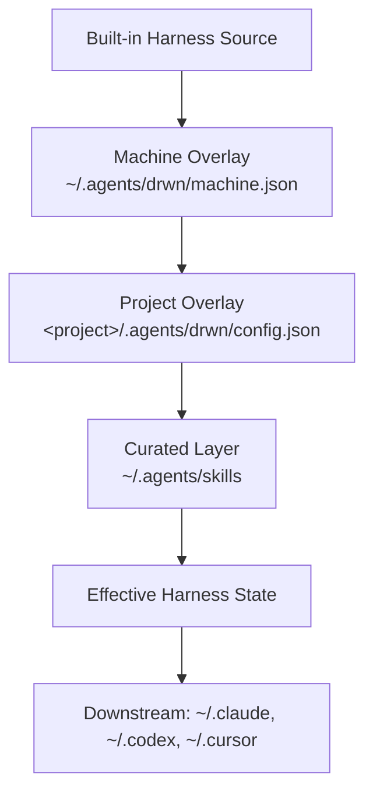

# Task 27: Docusaurus Docs Site Implementation Plan

> **For Claude:** REQUIRED SUB-SKILL: Use `superpowers:executing-plans` to implement this plan task-by-task.

**Status**: Implemented Locally (No Worktree / No Commit, 2026-05-29)
**Created**: 2026-05-29
**Updated**: 2026-05-29
**Assigned**: Unassigned
**Priority**: High
**Estimated Effort**: 1 PR (3–5 sessions)
**Dependencies**: `.ai/analyses/40_drwn-cli-usage-guide.md`
**References**: [analyses/40_drwn-cli-usage-guide.md, README.md, docs-astro/src/content/docs/01-getting-started.md, docs-astro/wrangler.toml, /Users/pureicis/dev/inf-minds/docs/docusaurus.config.ts, /Users/pureicis/dev/inf-minds/docs/sidebars.ts]

---

## Objective

Stand up a Docusaurus 3 docs site at `docs-docusaurus/` with Darwinian Harness branding, a nested 7-section information architecture, two seed pages (intro + install), and a Cloudflare Pages deploy path. The existing `docs-astro/` site is left in place but deprecated. All new content uses the post-rename naming (`darwinian-harness`, `drwn`) from day one.

---

## Success Criteria

- [x] `docs-docusaurus/` exists with a working Docusaurus 3.9.2 project
- [x] `bun run build` (inside `docs-docusaurus/`) completes with zero broken links / anchors
- [x] `bun run start` serves the site locally with the Darwinian Harness navbar, footer, and home page
- [x] Sidebar mirrors the 7-section IA (Intro / Getting Started / Concepts / Guides / Reference / Troubleshooting / FAQ) with placeholder pages where content is not yet written
- [x] At least two pages have real content: `intro.md` and `getting-started/installation.md`
- [x] `darwiniantools.com` is configured as the production URL (root, no subpath)
- [x] Cloudflare Pages deploy config (`wrangler.toml`) is present and matches the `docs-astro/` pattern, retargeted at a new project name
- [x] No references to `bgng` or `beginning-harness` anywhere in `docs-docusaurus/` content (only in `intro.md` if explicitly framing the rename; otherwise none)
- [x] `docs-astro/` carries a `DEPRECATED.md` pointer; the directory itself is preserved untouched
- [x] Root `package.json` exposes `docs:dev` / `docs:build` scripts that proxy into `docs-docusaurus/`
- [x] Mermaid diagrams render in at least one stub page (`concepts/layered-model.md`)

---

## Decisions Locked Before Implementation

| # | Decision | Source |
|---|---|---|
| D1 | Docs site lives at `docs-docusaurus/`. Existing `docs/` (assets, plans, presentations) is untouched. | Remy, this conversation |
| D2 | `docs-astro/` is killed conceptually but preserved on disk for now. Mark with `DEPRECATED.md`. | Remy, this conversation |
| D3 | Production URL is `darwiniantools.com` at root. **No `/harness/` subpath at this time.** Future subpathing is a separate task. | Remy, this conversation |
| D4 | All content uses `darwinian-harness` / `drwn` from day one. No migration page; the rename is a hard-cut and the old CLI was never published. | Remy, this conversation |
| D5 | 7-section nested IA: Intro / Getting Started / Concepts / Guides / Reference / Troubleshooting / FAQ. | Brainstorm in this conversation |
| D6 | Four onboarding paths under Getting Started: Use a team's harness / Set up your machine / Override for one project / Author and publish a card. | Brainstorm in this conversation |
| D7 | Docusaurus 3.9.2 + `@docusaurus/theme-mermaid`, matching `inf-minds/docs` versions verbatim. | Reference repo |
| D8 | Strict link checking from day one: `onBrokenLinks: 'throw'`, `onBrokenAnchors: 'throw'`, `markdown.hooks.onBrokenMarkdownLinks: 'throw'`. | Reference repo + project rigor |
| D9 | Cards are a top-level Concepts subsection, not buried under skills. | Brainstorm in this conversation |
| D10 | Reference/CLI is hand-curated (one page per command group) — no auto-generated `--help` dump in v1. | Brainstorm in this conversation |
| D11 | Bun is the package manager. `docs-docusaurus/` has its own `package.json` and `bun.lock`, matching how `docs-astro/` is set up. | Repo convention |
| D12 | Branding assets (logo, favicon, social card) start as placeholders. Final assets are a follow-up task once designed. | Pragmatic — no branding exists yet |
| D13 | Do not set `"type": "module"` in `docs-docusaurus/package.json`; Docusaurus 3.9.2's generated server bundle relies on CJS package semantics for `require.resolveWeak`. | Execution discovery |
| D14 | Pin `webpack` to `5.99.9` in `docs-docusaurus` dev dependencies; the latest 5.107 line rejects `webpackbar` options used by Docusaurus 3.9.2. | Execution discovery |

**Readiness note:** the current repo and package metadata still use `beginning-harness` / `bgng`. This plan intentionally writes forward-looking docs with `darwinian-harness` / `drwn` per D4. Do not try to smoke-test the seed-page CLI examples against the current package before the separate rename task lands.

---

## Architecture

### Directory Layout

```
docs-docusaurus/
├── .gitignore
├── docusaurus.config.ts
├── sidebars.ts
├── tsconfig.json
├── package.json
├── bun.lock                       (generated)
├── wrangler.toml                  (Cloudflare Pages)
├── docs/                          (markdown content)
│   ├── intro.md
│   ├── getting-started/
│   │   ├── installation.md
│   │   ├── first-run.md
│   │   └── paths/
│   │       ├── overview.md
│   │       ├── use-team-harness.md
│   │       ├── setup-your-machine.md
│   │       ├── override-one-project.md
│   │       └── author-and-publish-card.md
│   ├── concepts/
│   │   ├── layered-model.md
│   │   ├── ownership-and-write-records.md
│   │   ├── local-store.md
│   │   ├── skills.md
│   │   ├── mcp-servers.md
│   │   ├── extensions-bundles-cards.md
│   │   ├── cards.md
│   │   ├── materialization.md
│   │   └── diagnostics-model.md
│   ├── guides/
│   │   ├── per-project-patterns.md
│   │   ├── setup-beads.md
│   │   ├── setup-parallel.md
│   │   ├── setup-markitdown.md
│   │   ├── authoring-multi-skill-cards.md
│   │   ├── sharing-with-a-team.md
│   │   ├── doctor-in-ci.md
│   │   └── migrating-hand-edited-configs.md
│   ├── reference/
│   │   ├── cli/
│   │   │   ├── init.md
│   │   │   ├── add.md
│   │   │   ├── search.md
│   │   │   ├── library.md
│   │   │   ├── write.md
│   │   │   ├── scan.md
│   │   │   ├── skills.md
│   │   │   ├── mcp.md
│   │   │   ├── extensions.md
│   │   │   ├── card.md
│   │   │   ├── store.md
│   │   │   ├── status.md
│   │   │   └── doctor.md
│   │   ├── schemas/
│   │   │   ├── machine-json.md
│   │   │   ├── project-config-json.md
│   │   │   ├── card-manifest.md
│   │   │   └── write-record-json.md
│   │   └── specs/
│   │       ├── card-spec.md
│   │       └── extension-spec.md
│   ├── troubleshooting/
│   │   ├── reading-doctor.md
│   │   ├── using-status-why.md
│   │   ├── common-drift.md
│   │   ├── stale-symlinks.md
│   │   └── ownership-conflicts.md
│   └── faq.md
├── src/
│   ├── css/
│   │   └── custom.css
│   ├── components/                (empty for v1; add custom React later)
│   └── pages/                     (empty for v1; landing page is docs/intro.md via routeBasePath='/' and intro slug='/')
└── static/
    └── img/
        ├── favicon.svg            (placeholder)
        ├── logo.svg               (placeholder)
        ├── logo-dark.svg          (placeholder)
        └── social-card.png        (placeholder)
```

### URL Shape

- `routeBasePath: '/'` → docs live at the site root, no `/docs/` prefix
- Slugs follow directory structure: `darwiniantools.com/concepts/layered-model`, `darwiniantools.com/reference/cli/write`
- Root URL (`darwiniantools.com/`) resolves to `intro.md` via `slug: /`

### Build & Deploy Pipeline

- `bun install` inside `docs-docusaurus/`
- `bun run build` → outputs `docs-docusaurus/build/`
- `bun run deploy:pages` → `wrangler pages deploy ./build`
- Cloudflare Pages project: `darwiniantools-docs`
- Custom domain `darwiniantools.com` is configured in the Cloudflare dashboard, not in code

### Stub Page Pattern

Every stub page uses this template so the IA is navigable and the build passes strict link checking:

```markdown
---
sidebar_position: <n>
---

# <Title>

> **Coming soon.** This page is part of the planned IA but has not been written yet.
>
> If you need this content now, please open an issue at [github.com/remyjkim/darwinian-harness/issues](https://github.com/remyjkim/darwinian-harness/issues) or check the [drwn CLI usage guide](https://www.notion.so/curation-labs/40_drwn-cli-usage-guide.md).
```

Stubs are intentionally non-empty so Docusaurus doesn't error on empty MDX files and so users landing on them get a clear signal.

---

## Tech Stack

- **Docusaurus**: 3.9.2 (`@docusaurus/preset-classic`, `@docusaurus/theme-mermaid`)
- **React**: 19
- **TypeScript**: ~5.6
- **Node**: ≥ 20 (engine requirement for Docusaurus 3)
- **Runtime**: Bun 1.2+ (Docusaurus runs under Bun; falls back to `bunx` for CLI invocations)
- **Deployment**: Cloudflare Pages via Wrangler 3+

---

## Entry Checks

Run before editing:

```bash
git status --short --branch
bun test
bun run typecheck
```

Expected:

- working tree has the in-progress `.ai/` files from the current branch but no other unrelated changes
- `bun run typecheck` passes
- `bun test` is run and the pre-change result is recorded

Current readiness audit result on 2026-05-29:

- Branch: `remyjkim/harness-card-v1.1`
- `bun run typecheck`: passes
- `bun test`: fails before docs changes with 13 existing harness test failures around downstream skill symlink materialization and MCP drift reporting

Do **not** treat the current pre-existing `bun test` failures as caused by this docs task. During execution, rerun `bun test` only as a baseline/regression signal: if the failure count or failure set changes after docs-only edits, stop and investigate. The required docs-specific gate for this PR is `cd docs-docusaurus && bun run build`.

Execution note on 2026-05-29: this task was executed directly in the existing dirty worktree per user instruction, with no new worktree and no commits. Docs-specific verification passed (`bun run typecheck`, `docs-docusaurus` typecheck, root `docs:build`, local serve smoke checks, Wrangler CLI shape check, old-name grep, and Mermaid runtime DOM verification). A fresh full `bun test` run reported `378 pass`, `16 fail`, and `1 error`; the failures are in existing harness materialization / MCP drift / package-ingest tests, not docs files.

If a clean working tree is preferred, stash or commit untracked `.ai/` files first.

Confirm the active branch is `remyjkim/harness-card-v1.1` or create a child branch for this work:

```bash
git checkout -b remyjkim/docs-docusaurus
```

---

## Phase 1: Scaffold the Project

Goal: get a minimal Docusaurus project running locally.

### Task 1.1: Create the directory structure

**Step 1.** Create the root directory and content subdirs (no files yet beyond what we'll write in subsequent tasks):

```bash
mkdir -p docs-docusaurus/{docs,src/css,src/components,src/pages,static/img}
mkdir -p docs-docusaurus/docs/{getting-started,concepts,guides,reference,troubleshooting}
mkdir -p docs-docusaurus/docs/getting-started/paths
mkdir -p docs-docusaurus/docs/reference/{cli,schemas,specs}
```

**Step 2.** Verify:

```bash
ls docs-docusaurus/
ls docs-docusaurus/docs/
```

Expected: subdirectories present, no files yet.

### Task 1.2: Create `package.json`

**Files:**
- Create: `docs-docusaurus/package.json`

```json
{
  "name": "darwinian-harness-docs",
  "version": "0.1.0",
  "private": true,
  "scripts": {
    "docusaurus": "docusaurus",
    "start": "docusaurus start",
    "build": "docusaurus build",
    "swizzle": "docusaurus swizzle",
    "deploy:pages": "wrangler pages deploy ./build",
    "clear": "docusaurus clear",
    "serve": "docusaurus serve",
    "typecheck": "tsc"
  },
  "dependencies": {
    "@docusaurus/core": "3.9.2",
    "@docusaurus/preset-classic": "3.9.2",
    "@docusaurus/theme-mermaid": "3.9.2",
    "@mdx-js/react": "^3.0.0",
    "clsx": "^2.0.0",
    "prism-react-renderer": "^2.3.0",
    "react": "^19.0.0",
    "react-dom": "^19.0.0"
  },
  "devDependencies": {
    "@docusaurus/module-type-aliases": "3.9.2",
    "@docusaurus/tsconfig": "3.9.2",
    "@docusaurus/types": "3.9.2",
    "typescript": "~5.6.2",
    "webpack": "5.99.9",
    "wrangler": "^3.0.0"
  },
  "browserslist": {
    "production": [">0.5%", "not dead", "not op_mini all"],
    "development": [
      "last 3 chrome version",
      "last 3 firefox version",
      "last 5 safari version"
    ]
  },
  "engines": {
    "node": ">=20.0"
  }
}
```

### Task 1.3: Create `tsconfig.json`

**Files:**
- Create: `docs-docusaurus/tsconfig.json`

```json
{
  "extends": "@docusaurus/tsconfig",
  "compilerOptions": {
    "baseUrl": "."
  },
  "exclude": [".docusaurus", "build"]
}
```

### Task 1.4: Create `.gitignore`

**Files:**
- Create: `docs-docusaurus/.gitignore`

```
# Dependencies
/node_modules

# Production
/build

# Generated files
.docusaurus
.cache-loader

# Wrangler local state
.wrangler

# Misc
.DS_Store
.env.local
.env.development.local
.env.test.local
.env.production.local

npm-debug.log*
yarn-debug.log*
yarn-error.log*
```

### Task 1.5: Create a minimal `docusaurus.config.ts`

This is a stub config — enough to make `bun install && bun run start` work. The full branding config comes in Phase 2.

**Files:**
- Create: `docs-docusaurus/docusaurus.config.ts`

```ts
import type { Config } from '@docusaurus/types';
import type * as Preset from '@docusaurus/preset-classic';

const config: Config = {
  title: 'Darwinian Harness',
  tagline: 'A local meta-harness for AI agent tools',
  favicon: 'img/favicon.svg',

  url: 'https://darwiniantools.com',
  baseUrl: '/',

  onBrokenLinks: 'throw',
  onBrokenAnchors: 'throw',

  i18n: {
    defaultLocale: 'en',
    locales: ['en'],
  },

  presets: [
    [
      'classic',
      {
        docs: {
          sidebarPath: './sidebars.ts',
          routeBasePath: '/',
        },
        blog: false,
        theme: {
          customCss: './src/css/custom.css',
        },
      } satisfies Preset.Options,
    ],
  ],

  themeConfig: {} satisfies Preset.ThemeConfig,
};

export default config;
```

### Task 1.6: Create a minimal `sidebars.ts`

**Files:**
- Create: `docs-docusaurus/sidebars.ts`

```ts
import type { SidebarsConfig } from '@docusaurus/plugin-content-docs';

const sidebars: SidebarsConfig = {
  tutorialSidebar: ['intro'],
};

export default sidebars;
```

### Task 1.7: Create a stub `intro.md` and `custom.css`

**Files:**
- Create: `docs-docusaurus/docs/intro.md`
- Create: `docs-docusaurus/src/css/custom.css`

`docs-docusaurus/docs/intro.md`:

```markdown
---
sidebar_position: 1
slug: /
---

# Darwinian Harness

Stub — replaced in Phase 5.
```

`docs-docusaurus/src/css/custom.css`:

```css
/* Minimal placeholder. Themed in Phase 3. */
:root {
  --ifm-color-primary: #2e7d32;
}
```

### Task 1.8: Install dependencies and verify the dev server boots

```bash
cd docs-docusaurus
bun install
bun run start --port 3030 &
DEV_PID=$!
sleep 8
curl -sf http://localhost:3030/ > /dev/null && echo "OK"
kill $DEV_PID
```

Expected: `OK` printed; no crash on boot.

If Bun has trouble running the Docusaurus dev server, fall back to `npm install && npm run start` and note this in `docs-docusaurus/README.md` (created in Phase 7).

### Task 1.9: Verify the production build

```bash
cd docs-docusaurus
bun run build
```

Expected:

- `docs-docusaurus/build/` is created
- No "broken link" or "broken anchor" errors
- Build completes in under 60 seconds

### Task 1.10: Commit

```bash
git add docs-docusaurus/.gitignore docs-docusaurus/package.json docs-docusaurus/bun.lock docs-docusaurus/tsconfig.json docs-docusaurus/docusaurus.config.ts docs-docusaurus/sidebars.ts docs-docusaurus/docs/intro.md docs-docusaurus/src/css/custom.css
git commit -m "[feat:docs] scaffold docusaurus site under docs-docusaurus"
```

---

## Phase 2: Full Docusaurus Config

Goal: Darwinian Harness branding, mermaid, prism, navbar, footer.

### Task 2.1: Expand `docusaurus.config.ts`

**Files:**
- Modify: `docs-docusaurus/docusaurus.config.ts`

Replace the file contents with:

```ts
import { themes as prismThemes } from 'prism-react-renderer';
import type { Config } from '@docusaurus/types';
import type * as Preset from '@docusaurus/preset-classic';

const config: Config = {
  title: 'Darwinian Harness',
  tagline: 'A local meta-harness for AI agent tools',
  favicon: 'img/favicon.svg',

  future: {
    v4: true,
  },

  url: 'https://darwiniantools.com',
  baseUrl: '/',
  organizationName: 'remyjkim',
  projectName: 'darwinian-harness',

  onBrokenLinks: 'throw',
  onBrokenAnchors: 'throw',

  i18n: {
    defaultLocale: 'en',
    locales: ['en'],
  },

  markdown: {
    mermaid: true,
    hooks: {
      onBrokenMarkdownLinks: 'throw',
    },
  },

  themes: ['@docusaurus/theme-mermaid'],

  presets: [
    [
      'classic',
      {
        docs: {
          sidebarPath: './sidebars.ts',
          routeBasePath: '/',
          editUrl: 'https://github.com/remyjkim/darwinian-harness/tree/main/docs-docusaurus/',
        },
        blog: false,
        theme: {
          customCss: './src/css/custom.css',
        },
      } satisfies Preset.Options,
    ],
  ],

  themeConfig: {
    image: 'img/social-card.png',
    colorMode: {
      respectPrefersColorScheme: true,
    },
    navbar: {
      title: 'Darwinian Harness',
      logo: {
        alt: 'Darwinian Harness',
        src: 'img/logo.svg',
        srcDark: 'img/logo-dark.svg',
      },
      items: [
        {
          type: 'docSidebar',
          sidebarId: 'tutorialSidebar',
          position: 'left',
          label: 'Docs',
        },
        {
          href: 'https://github.com/remyjkim/darwinian-harness',
          label: 'GitHub',
          position: 'right',
        },
      ],
    },
    footer: {
      style: 'dark',
      links: [
        {
          title: 'Documentation',
          items: [
            { label: 'Introduction', to: '/' },
            { label: 'Getting Started', to: '/getting-started/installation' },
            { label: 'Concepts', to: '/concepts/layered-model' },
            { label: 'Reference', to: '/reference/cli/status' },
          ],
        },
        {
          title: 'Community',
          items: [
            {
              label: 'GitHub',
              href: 'https://github.com/remyjkim/darwinian-harness',
            },
            {
              label: 'Issues',
              href: 'https://github.com/remyjkim/darwinian-harness/issues',
            },
          ],
        },
      ],
      copyright: `Copyright © ${new Date().getFullYear()} Darwinian Harness. Built with Docusaurus.`,
    },
    prism: {
      theme: prismThemes.github,
      darkTheme: prismThemes.dracula,
      additionalLanguages: ['bash', 'typescript', 'json', 'toml'],
    },
  } satisfies Preset.ThemeConfig,
};

export default config;
```

> **Note:** the footer references `/getting-started/installation`, `/concepts/layered-model`, and `/reference/cli/status`. These pages MUST exist (as stubs at minimum) before the build will pass strict link checking. They're created in Phase 4. Do not build between Phase 2 and Phase 4 — build at the end of Phase 4 only.

### Task 2.2: Commit

```bash
git add docs-docusaurus/docusaurus.config.ts
git commit -m "[feat:docs] add full docusaurus branding config"
```

---

## Phase 3: Static Assets and Custom CSS

Goal: placeholder branding that's coherent — not generic Docusaurus defaults.

### Task 3.1: Create placeholder favicon SVG

Use a deterministic SVG favicon so the task does not depend on ImageMagick or a checked-in binary placeholder.

**Files:**
- Create: `docs-docusaurus/static/img/favicon.svg`

`docs-docusaurus/static/img/favicon.svg`:

```svg
<svg xmlns="http://www.w3.org/2000/svg" viewBox="0 0 64 64">
  <rect width="64" height="64" rx="12" fill="#2e7d32"/>
  <text x="32" y="44" font-family="Helvetica, Arial, sans-serif" font-size="36" font-weight="700" fill="#ffffff" text-anchor="middle">D</text>
</svg>
```

### Task 3.2: Create placeholder logo SVGs

**Files:**
- Create: `docs-docusaurus/static/img/logo.svg`
- Create: `docs-docusaurus/static/img/logo-dark.svg`

`docs-docusaurus/static/img/logo.svg`:

```svg
<svg xmlns="http://www.w3.org/2000/svg" viewBox="0 0 64 64" width="32" height="32">
  <rect width="64" height="64" rx="12" fill="#2e7d32"/>
  <text x="32" y="44" font-family="Helvetica, Arial, sans-serif" font-size="36" font-weight="700" fill="#ffffff" text-anchor="middle">D</text>
</svg>
```

`docs-docusaurus/static/img/logo-dark.svg`:

```svg
<svg xmlns="http://www.w3.org/2000/svg" viewBox="0 0 64 64" width="32" height="32">
  <rect width="64" height="64" rx="12" fill="#7bc77f"/>
  <text x="32" y="44" font-family="Helvetica, Arial, sans-serif" font-size="36" font-weight="700" fill="#0b1f10" text-anchor="middle">D</text>
</svg>
```

### Task 3.3: Create placeholder social card

**Files:**
- Create: `docs-docusaurus/static/img/social-card.png`

A 1200x630 PNG is ideal. For v1, use any solid-color PNG. If `imagemagick` is available:

```bash
convert -size 1200x630 xc:'#0b1f10' \
  -fill '#7bc77f' -gravity center -font Helvetica-Bold -pointsize 96 \
  -annotate 0 'Darwinian Harness' \
  docs-docusaurus/static/img/social-card.png
```

Otherwise, create a deterministic 1x1 transparent PNG:

```bash
printf '%s' 'iVBORw0KGgoAAAANSUhEUgAAAAEAAAABCAQAAAC1HAwCAAAAC0lEQVR42mP8/x8AAwMCAO+/p9sAAAAASUVORK5CYII=' \
  | base64 -d > docs-docusaurus/static/img/social-card.png
```

The Phase 7 README TODO already requires replacing placeholder branding assets.

### Task 3.4: Theme `custom.css`

**Files:**
- Modify: `docs-docusaurus/src/css/custom.css`

Replace contents with:

```css
/**
 * Darwinian Harness theme — placeholder palette.
 * Final palette to be defined alongside designed branding assets.
 */

:root {
  --ifm-color-primary: #2e7d32;
  --ifm-color-primary-dark: #266a2a;
  --ifm-color-primary-darker: #235f27;
  --ifm-color-primary-darkest: #1a4d1f;
  --ifm-color-primary-light: #379139;
  --ifm-color-primary-lighter: #3d9a3f;
  --ifm-color-primary-lightest: #5cb360;
  --ifm-code-font-size: 95%;
  --docusaurus-highlighted-code-line-bg: rgba(0, 0, 0, 0.1);
}

[data-theme='dark'] {
  --ifm-color-primary: #7bc77f;
  --ifm-color-primary-dark: #5bbb60;
  --ifm-color-primary-darker: #4eae53;
  --ifm-color-primary-darkest: #3d8d41;
  --ifm-color-primary-light: #94d397;
  --ifm-color-primary-lighter: #a1d8a4;
  --ifm-color-primary-lightest: #c3e6c5;
  --docusaurus-highlighted-code-line-bg: rgba(0, 0, 0, 0.3);
}
```

### Task 3.5: Commit

```bash
git add docs-docusaurus/static/img/ docs-docusaurus/src/css/custom.css
git commit -m "[feat:docs] add placeholder branding assets and theme palette"
```

---

## Phase 4: Information Architecture Scaffold

Goal: every page in the IA exists as a stub, the sidebar is hierarchical, and the build passes strict link checking.

### Task 4.1: Define the stub-page template

For every stub, use this exact body so behavior is consistent:

```markdown
---
sidebar_position: <ORDER>
---

# <Title>

> **Coming soon.** This page is part of the planned IA but has not been written yet.
>
> If you need this content now, please open an issue at [github.com/remyjkim/darwinian-harness/issues](https://github.com/remyjkim/darwinian-harness/issues).
```

`<ORDER>` follows the sidebar order within the parent category. If a stub belongs at the top of a category, use `1`; otherwise increment.

### Task 4.2: Create category index files

Docusaurus categories can be created either via folder + `_category_.json` or by referencing them directly in `sidebars.ts`. We create `_category_.json` files so category metadata lives next to content and can support a future autogenerated sidebar. For v1, Task 4.5 still writes an explicit `sidebars.ts` as the source of truth for exact ordering.

**Files:** create each `_category_.json` below.

`docs-docusaurus/docs/getting-started/_category_.json`:

```json
{
  "label": "Getting Started",
  "position": 2,
  "collapsed": false,
  "link": { "type": "generated-index", "title": "Getting Started" }
}
```

`docs-docusaurus/docs/getting-started/paths/_category_.json`:

```json
{
  "label": "Choose Your Path",
  "position": 3,
  "collapsed": true,
  "link": { "type": "generated-index", "title": "Choose Your Path" }
}
```

`docs-docusaurus/docs/concepts/_category_.json`:

```json
{
  "label": "Concepts",
  "position": 3,
  "collapsed": false,
  "link": { "type": "generated-index", "title": "Concepts" }
}
```

`docs-docusaurus/docs/guides/_category_.json`:

```json
{
  "label": "Guides",
  "position": 4,
  "collapsed": true,
  "link": { "type": "generated-index", "title": "Guides" }
}
```

`docs-docusaurus/docs/reference/_category_.json`:

```json
{
  "label": "Reference",
  "position": 5,
  "collapsed": true,
  "link": { "type": "generated-index", "title": "Reference" }
}
```

`docs-docusaurus/docs/reference/cli/_category_.json`:

```json
{
  "label": "CLI",
  "position": 1,
  "collapsed": true,
  "link": { "type": "generated-index", "title": "CLI Reference" }
}
```

`docs-docusaurus/docs/reference/schemas/_category_.json`:

```json
{
  "label": "Schemas",
  "position": 2,
  "collapsed": true,
  "link": { "type": "generated-index", "title": "Config Schemas" }
}
```

`docs-docusaurus/docs/reference/specs/_category_.json`:

```json
{
  "label": "Specs",
  "position": 3,
  "collapsed": true,
  "link": { "type": "generated-index", "title": "Specs" }
}
```

`docs-docusaurus/docs/troubleshooting/_category_.json`:

```json
{
  "label": "Troubleshooting",
  "position": 6,
  "collapsed": true,
  "link": { "type": "generated-index", "title": "Troubleshooting" }
}
```

### Task 4.3: Create all stub pages

Create one stub file per slug listed below using the template from Task 4.1. The `<Title>` is the kebab-to-Title-Case version of the filename; `<ORDER>` is its position in the parent category.

**Getting Started:**
- `getting-started/installation.md` — Title: "Installation", order 1 (real content from Phase 5)
- `getting-started/first-run.md` — Title: "First Run", order 2 (real content from Phase 5)
- `getting-started/paths/overview.md` — Title: "Overview", order 1
- `getting-started/paths/use-team-harness.md` — Title: "Use a Team's Harness", order 2
- `getting-started/paths/setup-your-machine.md` — Title: "Set Up Your Machine", order 3
- `getting-started/paths/override-one-project.md` — Title: "Override for One Project", order 4
- `getting-started/paths/author-and-publish-card.md` — Title: "Author and Publish a Card", order 5

**Concepts:**
- `concepts/layered-model.md` — Title: "The Layered Model", order 1 (Mermaid stub — see Task 4.4)
- `concepts/ownership-and-write-records.md` — Title: "Ownership and Write Records", order 2
- `concepts/local-store.md` — Title: "The Local Store", order 3
- `concepts/skills.md` — Title: "Skills", order 4
- `concepts/mcp-servers.md` — Title: "MCP Servers", order 5
- `concepts/extensions-bundles-cards.md` — Title: "Extensions vs Bundles vs Cards", order 6
- `concepts/cards.md` — Title: "Cards", order 7
- `concepts/materialization.md` — Title: "Materialization", order 8
- `concepts/diagnostics-model.md` — Title: "Diagnostics Model", order 9

**Guides:**
- `guides/per-project-patterns.md` — Title: "Per-Project Override Patterns", order 1
- `guides/setup-beads.md` — Title: "Set Up Beads", order 2
- `guides/setup-parallel.md` — Title: "Set Up Parallel", order 3
- `guides/setup-markitdown.md` — Title: "Set Up MarkItDown", order 4
- `guides/authoring-multi-skill-cards.md` — Title: "Author a Multi-Skill Card", order 5
- `guides/sharing-with-a-team.md` — Title: "Share a Harness with a Team", order 6
- `guides/doctor-in-ci.md` — Title: "Run drwn doctor in CI", order 7
- `guides/migrating-hand-edited-configs.md` — Title: "Migrate Hand-Edited Tool Configs", order 8

**Reference CLI** (one per command group):
- `reference/cli/init.md` (1), `add.md` (2), `search.md` (3), `library.md` (4), `write.md` (5), `scan.md` (6), `skills.md` (7), `mcp.md` (8), `extensions.md` (9), `card.md` (10), `store.md` (11), `status.md` (12), `doctor.md` (13)

**Reference Schemas:**
- `reference/schemas/machine-json.md` (1), `project-config-json.md` (2), `card-manifest.md` (3), `write-record-json.md` (4)

**Reference Specs:**
- `reference/specs/card-spec.md` (1), `extension-spec.md` (2)

**Troubleshooting:**
- `troubleshooting/reading-doctor.md` (1), `using-status-why.md` (2), `common-drift.md` (3), `stale-symlinks.md` (4), `ownership-conflicts.md` (5)

**Top-level:**
- `faq.md` — Title: "FAQ", order 7

> **Tip for the executor:** writing 45 stub files one at a time would waste effort. Use a single Bash heredoc loop to create them, or use the `Write` tool per file but batch multiple calls in one assistant message. Either approach is acceptable; correctness matters more than speed.

### Task 4.4: Add Mermaid content to the layered-model stub

This is the one stub that gets real content beyond the boilerplate, so we can verify mermaid renders.

**Files:**
- Overwrite: `docs-docusaurus/docs/concepts/layered-model.md`

```markdown
---
sidebar_position: 1
---

# The Layered Model

Darwinian Harness composes effective harness state from five layers, then materializes it into downstream agent tools. The layers compose deterministically; later layers override earlier ones.



> **Coming soon.** This page is part of the planned IA. The diagram above is the canonical mental model; full prose follows.
```

### Task 4.5: Wire up `sidebars.ts`

**Files:**
- Overwrite: `docs-docusaurus/sidebars.ts`

```ts
import type { SidebarsConfig } from '@docusaurus/plugin-content-docs';

const sidebars: SidebarsConfig = {
  tutorialSidebar: [
    'intro',
    {
      type: 'category',
      label: 'Getting Started',
      collapsed: false,
      items: [
        'getting-started/installation',
        'getting-started/first-run',
        {
          type: 'category',
          label: 'Choose Your Path',
          collapsed: true,
          items: [
            'getting-started/paths/overview',
            'getting-started/paths/use-team-harness',
            'getting-started/paths/setup-your-machine',
            'getting-started/paths/override-one-project',
            'getting-started/paths/author-and-publish-card',
          ],
        },
      ],
    },
    {
      type: 'category',
      label: 'Concepts',
      collapsed: false,
      items: [
        'concepts/layered-model',
        'concepts/ownership-and-write-records',
        'concepts/local-store',
        'concepts/skills',
        'concepts/mcp-servers',
        'concepts/extensions-bundles-cards',
        'concepts/cards',
        'concepts/materialization',
        'concepts/diagnostics-model',
      ],
    },
    {
      type: 'category',
      label: 'Guides',
      collapsed: true,
      items: [
        'guides/per-project-patterns',
        'guides/setup-beads',
        'guides/setup-parallel',
        'guides/setup-markitdown',
        'guides/authoring-multi-skill-cards',
        'guides/sharing-with-a-team',
        'guides/doctor-in-ci',
        'guides/migrating-hand-edited-configs',
      ],
    },
    {
      type: 'category',
      label: 'Reference',
      collapsed: true,
      items: [
        {
          type: 'category',
          label: 'CLI',
          collapsed: true,
          items: [
            'reference/cli/init',
            'reference/cli/add',
            'reference/cli/search',
            'reference/cli/library',
            'reference/cli/write',
            'reference/cli/scan',
            'reference/cli/skills',
            'reference/cli/mcp',
            'reference/cli/extensions',
            'reference/cli/card',
            'reference/cli/store',
            'reference/cli/status',
            'reference/cli/doctor',
          ],
        },
        {
          type: 'category',
          label: 'Schemas',
          collapsed: true,
          items: [
            'reference/schemas/machine-json',
            'reference/schemas/project-config-json',
            'reference/schemas/card-manifest',
            'reference/schemas/write-record-json',
          ],
        },
        {
          type: 'category',
          label: 'Specs',
          collapsed: true,
          items: [
            'reference/specs/card-spec',
            'reference/specs/extension-spec',
          ],
        },
      ],
    },
    {
      type: 'category',
      label: 'Troubleshooting',
      collapsed: true,
      items: [
        'troubleshooting/reading-doctor',
        'troubleshooting/using-status-why',
        'troubleshooting/common-drift',
        'troubleshooting/stale-symlinks',
        'troubleshooting/ownership-conflicts',
      ],
    },
    'faq',
  ],
};

export default sidebars;
```

### Task 4.6: Verify the build passes strict link checking

```bash
cd docs-docusaurus
bun run build
```

Expected: build completes with **no** broken link / anchor / markdown link errors. If anything is missing, the build output names the file and link.

### Task 4.7: Verify mermaid renders

```bash
cd docs-docusaurus
bun run start --port 3030 &
DEV_PID=$!
sleep 8
curl -sf http://localhost:3030/concepts/layered-model > /tmp/layered-page.html
grep -q 'mermaid' /tmp/layered-page.html && echo "MERMAID OK"
kill $DEV_PID
```

Expected: `MERMAID OK`.

### Task 4.8: Commit

```bash
git add docs-docusaurus/docs docs-docusaurus/sidebars.ts
git commit -m "[feat:docs] scaffold ia with 7 sections and stubs"
```

---

## Phase 5: Seed Content (Intro + Installation + First Run)

Goal: two pages have real, polished content, demonstrating the writing register.

### Task 5.1: Write `intro.md`

**Files:**
- Overwrite: `docs-docusaurus/docs/intro.md`

Source material: `README.md` opening (the "what is" and "why it exists" framing), rewritten for the docs voice and the `drwn` / `darwinian-harness` naming.

```markdown
---
sidebar_position: 1
slug: /
---

# Darwinian Harness

`darwinian-harness` is a local meta-harness for AI agent tools: one CLI to organize skills, MCP servers, extensions, defaults, project overlays, downstream tool configs, and diagnostics.

The CLI is `drwn`.

Agents are only as reliable as the harness around them. `darwinian-harness` makes that harness explicit, inspectable, reusable, and safe to write into downstream tools.

## What it harnesses

- **Skills and instructions** that guide agent behavior
- **MCP servers and tool definitions** that control capability access
- **Extensions** such as Parallel, Beads, and MarkItDown that bundle project-level setup and diagnostics
- **Machine-wide defaults** for reusable local capabilities
- **Project overlays** for repository-specific agent behavior
- **Downstream state** for Claude Code, Codex, Cursor, and `~/.agents`
- **Diagnostics** that report drift before mutating local files

## Why this exists

Local agent setups tend to drift. One tool gets a new MCP server, another has an older skill directory, and a project needs a slightly different harness than the global baseline.

The harness around an agent is usually scattered across dotfiles, skill directories, MCP configs, extension setup scripts, and project conventions. `darwinian-harness` gives those pieces a local control plane you can inspect, version, dry-run, and write deliberately.

It is useful when you want:

- one reusable MCP and skill inventory instead of separately hand-edited tool configs
- one harness layer shared across compatible agent tools
- project-specific overrides without rewriting global config
- diagnostics for stale links, drifted config, and missing generated files
- an operator CLI that reports before it mutates

If you only need a single MCP config file for one tool, this project is probably more structure than you need.

## What's next

- **New here?** Start with [Installation](./getting-started/installation).
- **Want the conceptual map first?** Read [The Layered Model](./concepts/layered-model).
- **Joining a team that already uses `darwinian-harness`?** Skip to [Use a Team's Harness](./getting-started/paths/use-team-harness).
```

### Task 5.2: Write `getting-started/installation.md`

**Files:**
- Overwrite: `docs-docusaurus/docs/getting-started/installation.md`

Source material: `docs-astro/src/content/docs/01-getting-started.md` Requirements and Install sections, rewritten for `drwn` / `darwinian-harness`.

```markdown
---
sidebar_position: 1
---

# Installation

Pick the installation path that matches what you want to do. The published package is right for almost everyone; work from a checkout only if you plan to edit the registry, maintain a fork, or develop the CLI itself.

## Requirements

- **Bun 1.2+** — runtime for the CLI
- **Node.js** — for MCP servers that spawn `node`
- **npm** — when installing the published package or adding npm skill bundles
- *Optional:* `parallel-cli`, `markitdown`, or `markdownify-mcp`, only when you enable those integrations

## Install the published package

```bash
npm install -g darwinian-harness
drwn status
```

The published package ships with built-in harness defaults. By default, a global `drwn` uses that packaged harness source.

## Work from a checkout

Use this mode if you want to edit the registry, maintain your own fork, add built-in skills, or develop the CLI:

```bash
git clone https://github.com/remyjkim/darwinian-harness.git
cd darwinian-harness
bun install
bun run drwn -- status
```

You can also point a globally-installed `drwn` at a local checkout:

```bash
export AGENTS_REPO_ROOT=/path/to/darwinian-harness
drwn status
```

For day-to-day development inside the checkout, link the package:

```bash
bun link
drwn --help
```

## Verify the install

```bash
drwn --help
drwn status
```

You should see the CLI help banner and a status summary listing repo root, `~/.agents` path, enabled targets, and current inventory counts.

## Next

Continue to [First Run](./first-run) to walk through the standard dry-run → write sequence.
```

### Task 5.3: Write `getting-started/first-run.md`

**Files:**
- Overwrite: `docs-docusaurus/docs/getting-started/first-run.md`

Source material: `.ai/analyses/40_drwn-cli-usage-guide.md` "Recommended First-Run Sequence" + `docs-astro/01-getting-started.md` Quickstart section.

```markdown
---
sidebar_position: 2
---

# First Run

The recommended first-run sequence inspects state before mutating it. Every step is non-destructive until the final `drwn write`.

## Inspect before writing

```bash
drwn status
drwn skills list
drwn mcp list
drwn write --dry-run
```

That gives you:

- a system overview
- the current skill inventory
- the active MCP inventory
- a planned-change preview

## Write the generated state

If the dry run looks right:

```bash
drwn write
```

`drwn write` is the primary one-way materialization command. It reads global config, project config, card locks, and local inventory, then writes effective state into downstream tools.

`drwn` is conservative on write:

- write is non-destructive by default
- drwn-owned stale materialization is cleaned up through write records
- user-owned stale state is reported, not silently removed

## Project-local overrides

If you want overrides for a single project instead of changing your machine-wide config, scaffold a project config first:

```bash
cd /path/to/project
drwn init
drwn status
drwn write --dry-run
```

`drwn init` creates `<project>/.agents/drwn/config.json` and switches subsequent `drwn write` runs into project-local materialization under `<project>/.claude`, `<project>/.codex`, and `<project>/.cursor`.

## Next

- For a deeper conceptual picture, read [The Layered Model](../concepts/layered-model).
- For task-specific entry points, see [Choose Your Path](./paths/overview).
```

### Task 5.4: Verify the build still passes

```bash
cd docs-docusaurus
bun run build
```

Expected: no broken link errors. Cross-links between the three seeded pages (`./first-run`, `../concepts/layered-model`, `./paths/overview`) all resolve.

### Task 5.5: Commit

```bash
git add docs-docusaurus/docs/intro.md docs-docusaurus/docs/getting-started/installation.md docs-docusaurus/docs/getting-started/first-run.md
git commit -m "[feat:docs] seed intro, installation, and first-run pages"
```

---

## Phase 6: Cloudflare Pages Deploy Config

Goal: a `wrangler pages deploy` command works against a new Cloudflare project.

### Task 6.1: Create `wrangler.toml`

**Files:**
- Create: `docs-docusaurus/wrangler.toml`

```toml
name = "darwiniantools-docs"
compatibility_date = "2026-05-29"
pages_build_output_dir = "./build"

[env.production]
name = "darwiniantools-docs"
```

> **Note:** the Cloudflare Pages project `darwiniantools-docs` must be created in the Cloudflare dashboard before the first `wrangler pages deploy`. Custom domain (`darwiniantools.com`) is also configured in the dashboard, not in code.

### Task 6.2: Verify Wrangler deploy command shape

```bash
cd docs-docusaurus
bun run build
bunx wrangler pages deploy --help | grep -- --project-name
```

Expected: `bun run build` passes and Wrangler exposes the `pages deploy` command with `--project-name`. Do not run a real deploy from this task unless the Cloudflare Pages project already exists and Remy explicitly asks for deployment.

### Task 6.3: Commit

```bash
git add docs-docusaurus/wrangler.toml
git commit -m "[feat:docs] add cloudflare pages deploy config"
```

---

## Phase 7: Root Integration

Goal: developers can run docs commands from the repo root, and the new docs site is discoverable.

### Task 7.1: Add root scripts

**Files:**
- Modify: `package.json` (top-level)

Add three scripts to the `scripts` block, keeping all existing scripts and ordering:

```json
{
  "scripts": {
    "bgng": "bun run cli/index.ts",
    "test": "bun test",
    "typecheck": "tsc --noEmit",
    "verify:release": "bun run scripts/verify-release-readiness.ts",
    "docs:dev": "cd docs-docusaurus && bun run start",
    "docs:build": "cd docs-docusaurus && bun run build",
    "docs:deploy": "cd docs-docusaurus && bun run deploy:pages"
  }
}
```

> Use the `Edit` tool with a precise `old_string` / `new_string` so unrelated package.json fields are untouched. Do not add `darwinian-harness` references here yet — the package rename is a separate task.

### Task 7.2: Update root `.gitignore`

**Files:**
- Modify: `.gitignore` (top-level)

Append (do not duplicate existing entries):

```
docs-docusaurus/node_modules/
docs-docusaurus/build/
docs-docusaurus/.docusaurus/
docs-docusaurus/.wrangler/
```

Verify `bun.lock` inside `docs-docusaurus/` is **not** ignored — it must be committed.

### Task 7.3: Write `docs-docusaurus/README.md`

**Files:**
- Create: `docs-docusaurus/README.md`

```markdown
# darwinian-harness docs

Docusaurus 3 site for [darwinian-harness](https://github.com/remyjkim/darwinian-harness). Published at https://darwiniantools.com.

## Local development

```bash
cd docs-docusaurus
bun install
bun run start
```

Opens at http://localhost:3000.

## Build

```bash
bun run build
```

Outputs to `./build`. Strict link checking is enabled; the build fails on broken internal links, broken anchors, or broken markdown links.

## Deploy

```bash
bun run deploy:pages
```

Deploys `./build` to the Cloudflare Pages project `darwiniantools-docs`. The custom domain `darwiniantools.com` is configured in the Cloudflare dashboard.

## TODO

- Replace placeholder branding assets in `static/img/` with designed favicon, logo, and social card
- Fill out stub pages — the IA is scaffolded but most pages currently say "Coming soon"
- Add a CI job that runs `bun run build` on PRs touching `docs-docusaurus/`
```

### Task 7.4: Commit

```bash
git add package.json .gitignore docs-docusaurus/README.md
git commit -m "[feat:docs] wire docs site into root scripts and gitignore"
```

---

## Phase 8: Deprecate `docs-astro/`

Goal: clear signal that `docs-astro/` is no longer the source of truth, without removing it.

### Task 8.1: Add deprecation notice

**Files:**
- Create: `docs-astro/DEPRECATED.md`

```markdown
# This directory is deprecated

`docs-astro/` is no longer the source of truth for the project's documentation. The active docs site is `docs-docusaurus/`, deployed at https://darwiniantools.com.

This directory is preserved for now as a content reference during the migration. **Do not edit files here.** New documentation goes into `docs-docusaurus/`.

This directory will be removed in a future cleanup task once the Docusaurus site has covered the relevant content.
```

### Task 8.2: Commit

```bash
git add docs-astro/DEPRECATED.md
git commit -m "[chore:docs] mark docs-astro as deprecated in favor of docs-docusaurus"
```

---

## Phase 9: Final Verification

Goal: confirm the full pipeline works end-to-end before opening a PR.

### Task 9.1: Clean build from scratch

```bash
cd docs-docusaurus
bun run clear
bun run build
```

Expected: clean build, zero broken-link errors, `build/` populated.

### Task 9.2: Local serve and spot check

```bash
cd docs-docusaurus
bun run serve --port 3030 &
SERVE_PID=$!
sleep 4
curl -sf http://localhost:3030/ | grep -q "Darwinian Harness" && echo "HOME OK"
curl -sf http://localhost:3030/getting-started/installation | grep -q "Installation" && echo "INSTALL OK"
curl -sf http://localhost:3030/concepts/layered-model | grep -q "Layered Model" && echo "LAYERED OK"
curl -sf http://localhost:3030/reference/cli/write | grep -q "Coming soon" && echo "STUB OK"
kill $SERVE_PID
```

Expected: all four `OK` lines printed.

### Task 9.3: Confirm zero references to old naming

```bash
grep -RIn -E '(bgng|beginning-harness|thebeginningharness)' docs-docusaurus/docs docs-docusaurus/src docs-docusaurus/static docs-docusaurus/*.ts docs-docusaurus/*.toml docs-docusaurus/*.json docs-docusaurus/README.md
```

Expected: **no matches**. Any match must be reviewed — the only acceptable exception is if a future Migration page intentionally references the old name (none exists in v1).

### Task 9.4: Final commit pass

If anything was tweaked during verification, commit it:

```bash
git status
# inspect, then commit any fixups with a [fix:docs] message
```

### Task 9.5: Push and open PR

```bash
git push -u origin remyjkim/docs-docusaurus
gh pr create --title "[feat:docs] scaffold docusaurus site under docs-docusaurus" --body "$(cat <<'EOF'
## Summary

- Scaffold Docusaurus 3.9.2 site at `docs-docusaurus/` with Darwinian Harness branding
- 7-section nested IA (Intro / Getting Started / Concepts / Guides / Reference / Troubleshooting / FAQ)
- Two seed pages with real content: `intro.md` and `getting-started/installation.md` (plus `first-run.md`)
- Cloudflare Pages deploy config targeting `darwiniantools-docs` Pages project / `darwiniantools.com`
- Root `package.json` scripts: `docs:dev`, `docs:build`, `docs:deploy`
- `docs-astro/` marked deprecated, not removed

## Test plan

- [ ] `cd docs-docusaurus && bun install && bun run build` succeeds with strict link checking
- [ ] `bun run start` serves the site locally; navbar / footer / mermaid all render
- [ ] No references to `bgng` or `beginning-harness` in `docs-docusaurus/`
- [ ] Cloudflare Pages project `darwiniantools-docs` created in dashboard before first deploy
EOF
)"
```

---

## Risks & Mitigations

| Risk | Mitigation |
|---|---|
| Bun cannot run the Docusaurus dev server reliably | Fall back to `npm install && npm run start`; document in `docs-docusaurus/README.md`. The build itself is Node-compatible regardless. |
| Cloudflare Pages project `darwiniantools-docs` doesn't exist yet | Create it in the Cloudflare dashboard during Phase 6 verification. Deploy will fail until then; that's acceptable since the PR can land without a live deploy. |
| Strict link checking blocks the build | This is by design. Every error names the file and link — fix the link, don't relax the check. |
| Placeholder branding ships to production | Acceptable for v1. Add a follow-up task to design final branding before public launch. The README's TODO list flags this. |
| The 45 stub pages decay into permanent placeholders | Each stub has a clear "Coming soon" banner so users aren't misled. Follow-up tasks fill in real content section by section, starting with Concepts (highest leverage). |
| Future repo rename (`beginning-harness` → `darwinian-harness`) breaks `editUrl` | The `editUrl` already points at the post-rename GitHub path. It will 404 until the GitHub rename happens. Acceptable for the rename window. |

---

## Testing Strategy

- **Build-as-test:** Docusaurus' strict link checking is the primary verification. A clean `bun run build` certifies the IA is internally consistent.
- **Smoke endpoints:** Phase 9 hits four representative URLs (home, real-content page, mermaid page, stub page) to catch runtime rendering failures.
- **Grep for old naming:** Phase 9.3 ensures the cut to new naming is complete in this PR's scope.
- **No unit tests** for the docs site itself — the build is the test.

---

## Out of Scope

These are deliberately deferred:

- Filling in stub pages with real content (separate per-section tasks)
- Designed branding assets (logo, favicon, social card)
- Custom Docusaurus components or landing page
- CI integration to run `bun run build` on PRs touching `docs-docusaurus/`
- Removal of `docs-astro/`
- Repo rename (`beginning-harness` → `darwinian-harness`) — the rename happens at the very end of the broader migration
- Subpathing under `darwiniantools.com/harness/` — root deployment for now
- Migration page from `bgng` to `drwn` — the rename is a hard-cut, old CLI was never published

---

## Notes

- The plan front-loads the strict link-checking decision (D8) because relaxing it later is much more painful than enforcing it from day one.
- Stub pages exist so the sidebar is navigable. Each stub has a banner that tells the reader the page is incomplete and points to GitHub Issues.
- The `concepts/layered-model.md` stub includes a real mermaid diagram so the mermaid theme is exercised during build. If mermaid breaks later, this page catches it first.
- Phases 1–4 must run in order (config references files created later; strict link checking will catch this if violated). Phases 5–8 can interleave in principle but are presented linearly for clarity.
