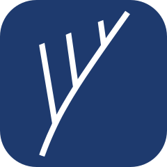

<p align="center">
  
</p>

# darwinian

`darwinian` is a local meta-harness for AI agent tools — a CLI that organizes skills, MCP servers, extensions, explicit machine capabilities, project overlays, and downstream tool state surrounding the agents you already use.

The package is `darwinian`. The command is `drwn`.

## Install

Requires Bun 1.2+ and npm.

```bash
curl -fsSL https://bun.sh/install | bash
npm install -g darwinian
drwn status
```

Or work from a checkout:

```bash
git clone https://github.com/remyjkim/darwinian-worker.git
cd darwinian-worker
bun install
bun run drwn -- status
```

## First run

```bash
drwn init --non-interactive
drwn apply <worker-blueprint-ref>
drwn use <worker-name> --no-write
drwn write --dry-run
drwn write
```

Cards compose capabilities into one Blueprint. A project may install alternative
Worker roots but selects at most one; `drwn write` projects only the selected
root closure plus explicit project overlays. Project declarations do not inherit
machine capability selections.

Machine intent uses the first supported namespaced contract:

```json
{
  "schema": "drwn.machine",
  "schemaVersion": 1,
  "policy": {},
  "capabilities": {
    "profile": null,
    "skills": [],
    "mcpServers": []
  }
}
```

`drwn init --non-interactive` and `--minimal` initialize this explicit empty
intent. Guided `drwn init` preselects the opt-out **Recommended Darwinian
Operator** profile. The immutable `@darwinian/operator@1.0.2` pin contributes
exactly 17 approved machine-safe skills and zero MCP servers; it contributes no
Worker identity, instructions, hooks, permissions, or governance.

Add other machine capabilities explicitly, then project them in a separate
step:

```bash
drwn library defaults add skill <skill-id>
drwn library defaults add mcp <server-id>
drwn write --scope machine --dry-run
drwn write --scope machine
```

Machine writes claim only paths or MCP fields they create and record. Foreign
destinations fail with `MACHINE_PROJECTION_CONFLICT`, including under
`--force`; force can repair only drift in prior drwn-owned state. For a
controlled prelaunch reset, back up the non-secret machine intent and global
write record outside the Store, remove unsupported prototype state, rerun
setup, and reselect capabilities explicitly.

## Store Export Safety

Whole-store export is disabled because `~/.agents/drwn` can contain credentials and operational machine state. `drwn store export` exits with `STORE_EXPORT_DISABLED_UNSAFE`, creates no archive, and has no unrestricted override. Treat any broad Store archives created by earlier releases as sensitive.

## Claude Session Signals Beta

`drwn` includes hidden Claude Code hook commands that can record active Cards and
skill usage beside Claude transcript files. This is an opt-in beta and is disabled by
default.

Enable it in the project you want to observe:

```json
{
  "schema": "drwn.project-config",
  "schemaVersion": 1,
  "workers": [],
  "activeWorker": null,
  "hooks": {
    "signals": { "enabled": true }
  }
}
```

Then run `drwn write`. `drwn` registers the Claude hooks it owns while preserving
user-authored hooks in `.claude/settings.json`.

Signals are appended next to Claude transcripts as `<session-id>.drwn-signals.jsonl`.
The hook commands always exit successfully and stay silent so they do not interrupt Claude
sessions.

## Documentation

- **Public docs:** [docs.darwiniantools.com](https://docs.darwiniantools.com) — concepts, getting-started paths, guides, troubleshooting, CLI reference. Source in [`docs-docusaurus/`](./docs-docusaurus).
- **Disciplines that shape the design:** [`concepts/disciplines`](https://docs.darwiniantools.com/concepts/disciplines)
- **Safety model:** [`concepts/safety-model`](https://docs.darwiniantools.com/concepts/safety-model)
- **CLI quick reference:** [`docs/cli-quickref.md`](./docs/cli-quickref.md)
- **Project Worker V1 contract:** [`docs/contracts/project-worker-v1.md`](./docs/contracts/project-worker-v1.md)
- **Prelaunch project reset:** [`docs/prelaunch-project-reset.md`](./docs/prelaunch-project-reset.md)
- **Architecture (contributors):** [`.ai/knowledges/10_drwn-cli-architecture.md`](./.ai/knowledges/10_drwn-cli-architecture.md)
- **Maintainers:** [`docs/maintainers/`](./docs/maintainers/)

Local docs workflow:

```bash
bun run docs:dev
bun run docs:build
```

Notion OAuth, `ntn` API keys, and external stdio tools such as Momentic remain
operator-owned runtime state. Definitions may be carried by Cards, but secrets
and machine installation state are never project or Blueprint content.

## Contributing

Contributions are welcome when they preserve the conservative write model and include tests for behavior changes. Start with `bun install`, `bun test`, `bun run typecheck`, then read [CONTRIBUTING.md](./CONTRIBUTING.md).
