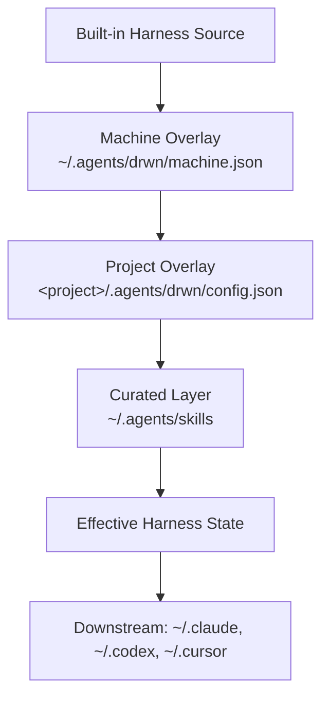

# The Layered Model

Darwinian Harness composes effective harness state from five layers, then materializes it into downstream agent tools. The layers compose deterministically; later layers override earlier ones.

> **Coming soon.** This page is part of the planned IA. The diagram above is the canonical mental model; full prose follows.
