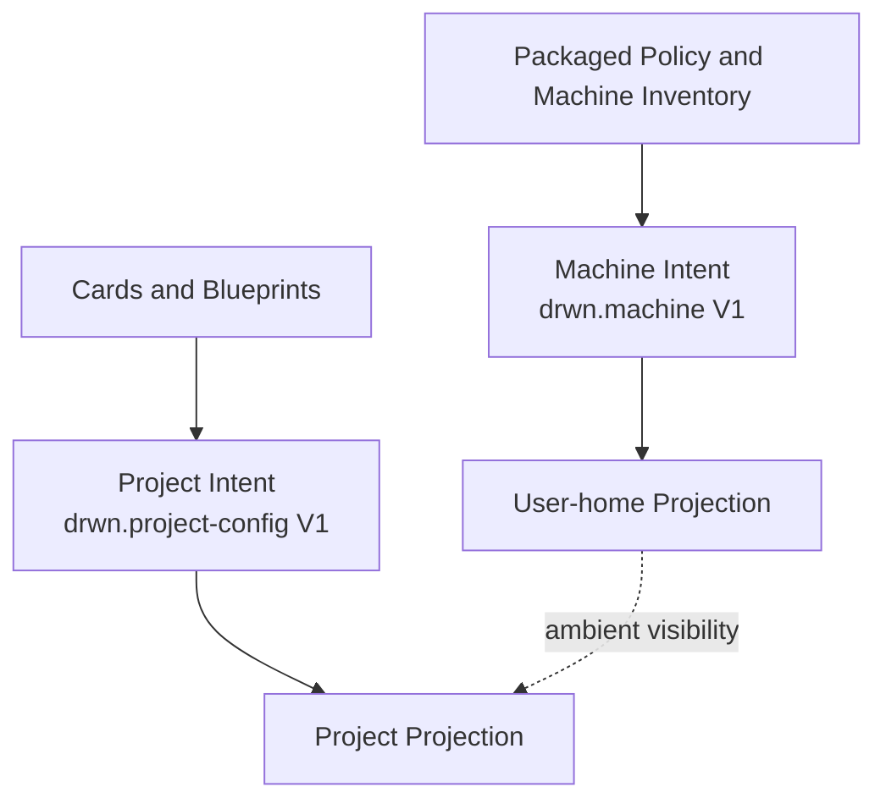

# The Layered Model

Darwinian Minds composes effective harness state from a fixed stack of layers, then materializes it into downstream agent tools. The layers compose deterministically; later layers override earlier ones for keys they touch.



## Composition layers

1. **Packaged source.** `registry/config.json`, `registry/mcp-servers.json`, repo-native skills, and installed inventory content provide policy and available definitions. Availability is not activation.
2. **Machine intent.** Strict `drwn.machine` V1 selects an immutable profile plus explicit skill and MCP IDs. Only approved policy fields merge into packaged policy.
3. **Project roots.** Cards compose into one Blueprint; a project installs root alternatives and selects at most one active Worker closure.
4. **Project overlays.** Strict `drwn.project-config` V1 may add explicit skills, MCP definitions, extensions, targets, and hook controls. Excludes win last.
5. **Projection.** Machine and project writes are separate pure projections with separate ownership records. Machine capabilities may remain ambient in a project session, but never become project declarations.

Effective state is computed by `buildEffectiveState`. Inside a configured project, machine capability intent is intentionally excluded: the base is packaged project-safe policy, then the selected Card closure and project overlays. Outside a configured project, explicit machine intent applies.

## Write-time resolution rules

When `drwn write` resolves a skill name to a filesystem path, it consults three layers in fixed order:

1. **Locked card** — any entry in `card.lock` whose manifest declares the skill name. Resolves to the immutable card store path.
2. **Available inventory source** — repo-native scope dirs (`skills/{shared,claude-only,codex-only,experimental}`) then installed bundles.
3. **Missing** — surfaces as a typed write-time hard fail; no downstream mutation.

**Cards win over other available sources at project write time.** A Card that declares a skill in the selected closure shadows any same-named repo-native or package-backed source. The alternative source is announced as `also available:` in dry-run output but never written.

## Layered reproducibility (the bigger picture)

drwn cards pin **harness state** — the skills, MCP servers, extensions, and downstream targets a project should run on. They do not pin the surrounding environment. For full environmental reproducibility, layer drwn with tools that own the other layers:

```text
Layer 8: drwn cards        — harness state (this tool)
Layer 6: Docker / Compose  — service stack (Postgres, Redis, etc.)
Layer 4: Flox or Nix       — Node, Python, system libs, shell hooks
Layer 3: asdf / mise / Flox — runtime / toolchain versions
Layer 2: pnpm / Cargo / pip — app dependencies + lockfile
```

What cards pin:

- card versions and content-tree integrity in `card.lock`
- per-card bundled skill attribution in `card.lock`
- inline content shipped in cards (skills, MCP server definitions) via sha256 content hashing
- the project overlay

What cards do not pin:

- agent tool versions (Claude Code, Codex, Cursor) — vendor-controlled distribution
- MCP server runtime resolution if a card's `args` uses `npx -y <pkg>` without a version pin (the shipped registry pins these; card authors should too)
- CLI dependencies of skills (`bd`, `markitdown`, `git`, etc.)
- runtime, system libraries, or shell environment

Recommended composition for full reproducibility: `drwn apply` for the harness, Flox/Nix (or asdf/mise) at the shell layer to pin Node/Python/system libs, and Docker Compose at the service layer for runtime dependencies. Each tool pins what it owns.

## See also

- [Local Store](./local-store) — what each path under `~/.agents/drwn/` stores
- [Materialization](./materialization) — how effective state is written to downstream tools
- [Ownership and Write Records](./ownership-and-write-records) — drwn-owned vs user-owned cleanup discipline
- [Cards](./cards) — the card subsystem in depth
- `.ai/knowledges/10_drwn-cli-architecture.md` — full as-built architectural reference
