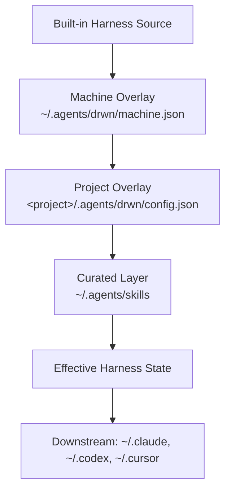

# The Layered Model

Darwinian Minds composes effective harness state from a fixed stack of layers, then materializes it into downstream agent tools. The layers compose deterministically; later layers override earlier ones for keys they touch.



## Composition layers

1. **Built-in harness source.** The packaged `registry/config.json` (target enablement, optional MCP toggles, parallel/catalog defaults) and `registry/mcp-servers.json` (canonical MCP definitions). This is the deterministic baseline every machine inherits.
2. **Machine overlay** at `~/.agents/drwn/machine.json` (`MachineConfig`). Shallow-merges over the baseline for `targets`, `optional`, `defaults`, `catalogs`, `parallel`. Also stores `authoring.scope` for `drwn card new`.
3. **Card manifests** resolved from `projectConfig.cards`. Each locked card contributes `skills.include`, `servers`, `extensions`, `targets`, and its bundled skill content. Manifests merge into the project config via `mergeCardManifestsIntoProjectConfig`.
4. **Project overlay** at `<project>/.agents/drwn/config.json` (`ProjectConfig`). Applied on top of (1) + (3) via `mergeProjectConfig`. On key collisions with card-contributed values, **project wins** for `servers`, `extensions`, and `targets`; `skills.include` is a union; `skills.exclude` is honored last (excludes always win).
5. **Curated layer** at `~/.agents/skills`. Per-skill symlinks pointing into repo-native, package-backed, or card-bundled sources. Curation membership is set by `drwn skills curate` / `drwn library defaults add skill`.

Effective state is computed by `buildEffectiveState`. Inside a configured project, the **machine overlay is intentionally suppressed**: the base is the packaged config, then card manifests, then project overlay. Outside a configured project, the machine overlay applies normally.

## Write-time resolution rules

When `drwn write` resolves a skill name to a filesystem path, it consults three layers in fixed order:

1. **Locked card** — any entry in `card.lock` whose manifest declares the skill name. Resolves to the immutable card store path.
2. **User default** — repo-native scope dirs (`skills/{shared,claude-only,codex-only,experimental}`) then installed bundles.
3. **Missing** — surfaces as a typed write-time hard fail; no downstream mutation.

**Cards win over user-defaults at write time, always.** A card that declares a skill in its manifest shadows any same-named user-default skill. The alternative source is announced as `also available:` in dry-run output but never written. This is the opposite directionality from config merge — at config merge time the project overlay overrides card values; at write-time skill resolution the card wins. They operate on different things (config keys vs filesystem paths).

## Layered reproducibility (the bigger picture)

drwn cards pin **harness state** — the skills, MCP servers, extensions, and downstream targets a project should run on. They do not pin the surrounding environment. For full environmental reproducibility, layer drwn with tools that own the other layers:

```text
Layer 8: drwn cards        — harness state (this tool)
Layer 6: Docker / Compose  — service stack (Postgres, Redis, etc.)
Layer 4: Flox or Nix       — Node, Python, system libs, shell hooks
Layer 3: asdf / mise / Flox — runtime / toolchain versions
Layer 2: pnpm / Cargo / pip — app dependencies + lockfile
```

What cards pin:

- card versions and content-tree integrity in `card.lock`
- per-card bundled skill attribution in `card.lock`
- inline content shipped in cards (skills, MCP server definitions) via sha256 content hashing
- the project overlay

What cards do not pin:

- agent tool versions (Claude Code, Codex, Cursor) — vendor-controlled distribution
- MCP server runtime resolution if a card's `args` uses `npx -y <pkg>` without a version pin (the shipped registry pins these; card authors should too)
- CLI dependencies of skills (`bd`, `markitdown`, `git`, etc.)
- runtime, system libraries, or shell environment

Recommended composition for full reproducibility: `drwn apply` for the harness, Flox/Nix (or asdf/mise) at the shell layer to pin Node/Python/system libs, and Docker Compose at the service layer for runtime dependencies. Each tool pins what it owns.

## See also

- [Local Store](./local-store) — what each path under `~/.agents/drwn/` stores
- [Materialization](./materialization) — how effective state is written to downstream tools
- [Ownership and Write Records](./ownership-and-write-records) — drwn-owned vs user-owned cleanup discipline
- [Cards](./cards) — the card subsystem in depth
- `.ai/knowledges/10_drwn-cli-architecture.md` — full as-built architectural reference
