# Skill Recommendation System - Diagrams

## 1. Phase 2: End-to-End Data Flow (Context-Aware)

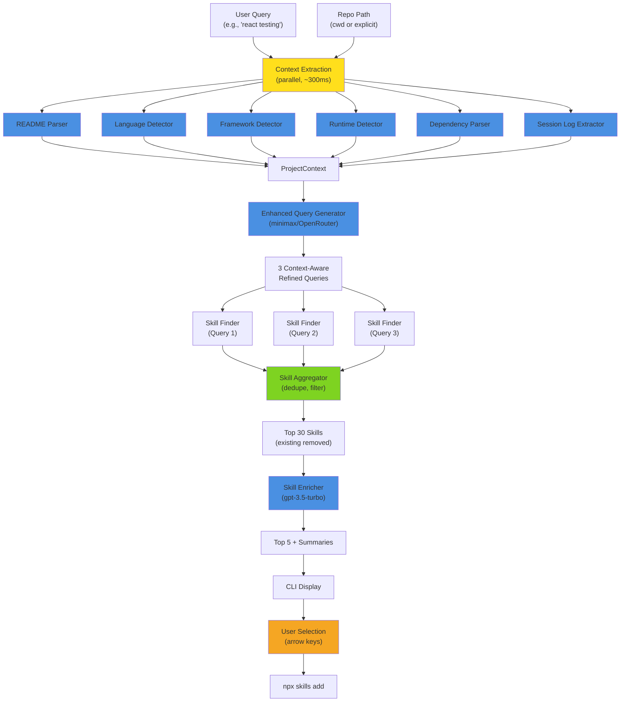

---

## 2. Component Architecture

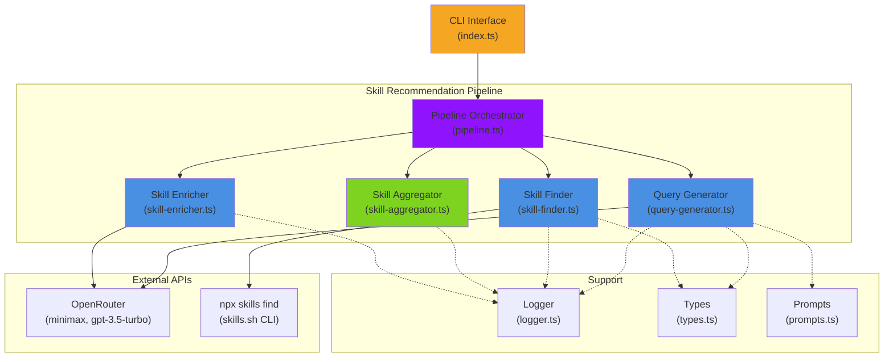

---

## 3. Phase 2: Context Extraction Pipeline (New)

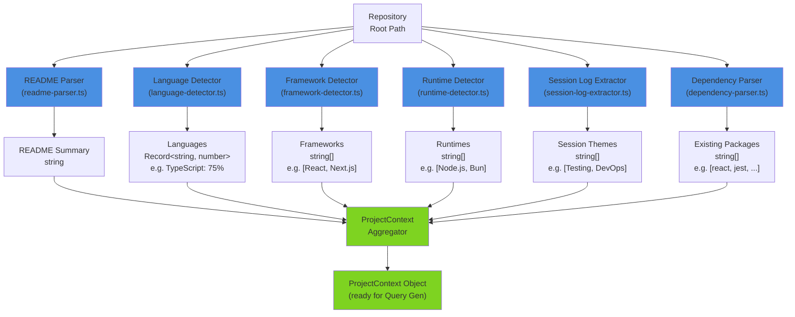

**Latency Breakdown** (all parallel):
- README Parser: ~100ms
- Language Detector: ~200ms (depends on repo size)
- Framework Detector: ~50ms
- Runtime Detector: ~50ms
- Dependency Parser: ~100ms
- Session Log Extractor: ~300ms (reads 5 log files)
- **Total (parallel)**: ~300ms (longest task dominates)

---

## 4. Session Log Extraction Process (New)

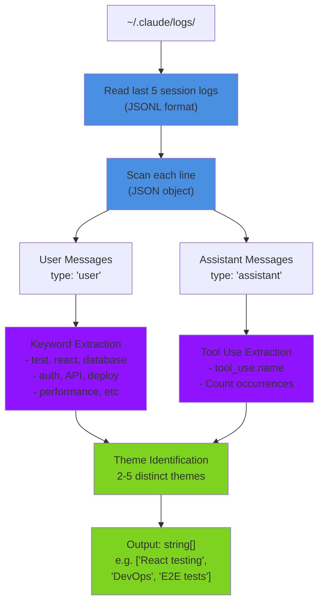

**Example Session Processing**:
```
Session 1 messages:
- user: "add testing for React components"  → Theme: "React testing"
- user: "deploy pipeline setup"              → Theme: "DevOps"
- assistant: tool_use: "Edit" (10 times)
- assistant: tool_use: "Bash" (5 times)      → Dominant tools: Edit, Bash

Session 2 messages:
- user: "E2E test setup with Playwright"     → Theme: "E2E tests"
- assistant: tool_use: "Bash" (8 times)

Combined themes: ["React testing", "DevOps", "E2E tests"]
```

---

## 5. Query Generation Process

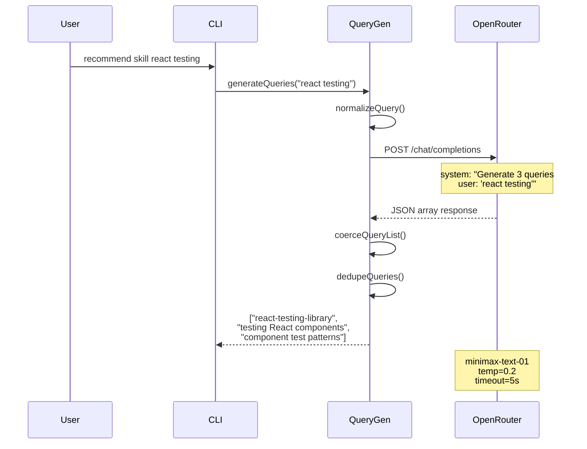

---

## 6. Parallel Skill Finding & Enrichment

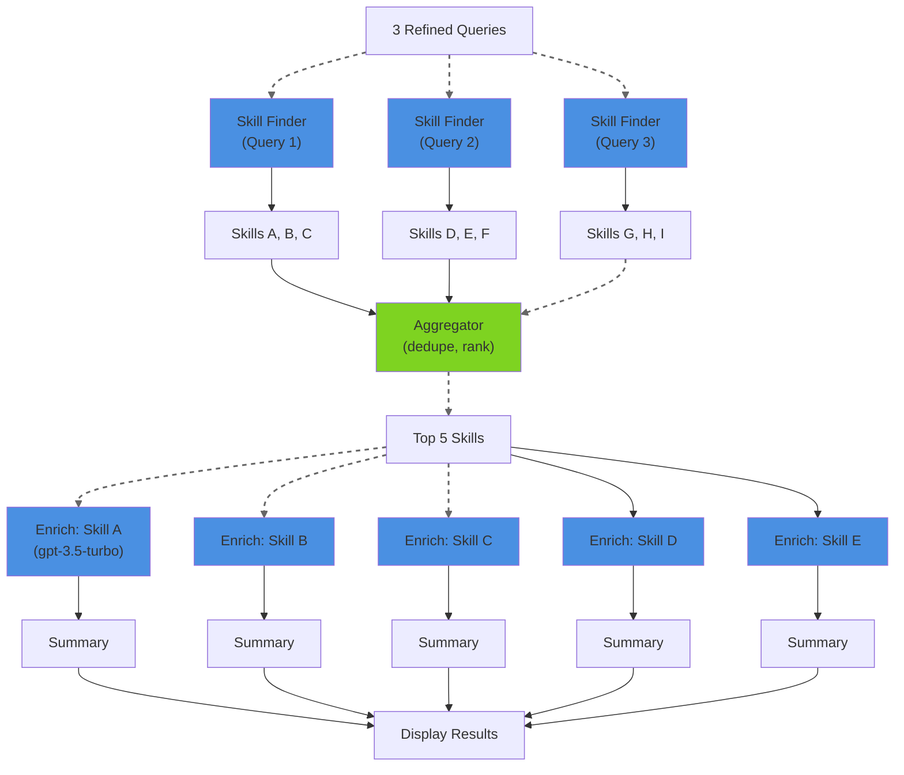

---

## 7. CLI User Interaction Flow

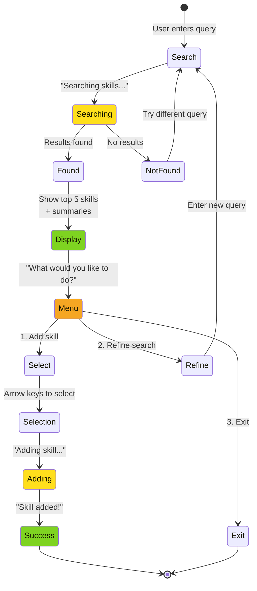

---

## 8. Query Generation Strategies

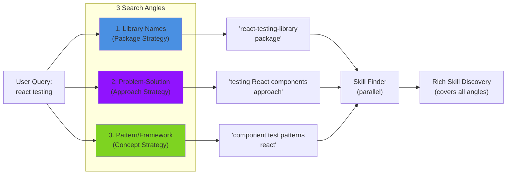

---

## 9. Error Handling & Fallbacks

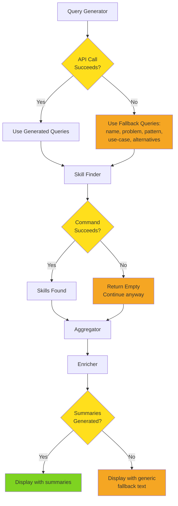

---

## 10. Latency Breakdown (Phase 1 vs Phase 2)

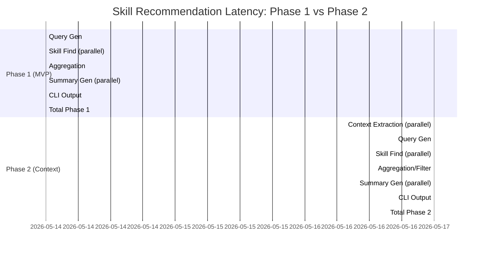

**Phase 1**: 8.7 seconds
- Query Gen: 3s
- Skill Find: 2s
- Enrichment: 3s
- Other: 0.7s

**Phase 2**: 8.5 seconds (similar, context extraction is parallel with query gen)
- Context Extraction: 0.3s (added but parallel)
- Query Gen: 2.5s (slightly faster due to better prompting)
- Skill Find: 2s
- Enrichment: 3s
- Other: 0.7s

---

## 11. Data Structures

```mermaid
graph TB
    QI["QueryGeneratorInput"]
    QI --> QI_q["query: string"]
    
    QO["QueryGeneratorOutput"]
    QO --> QO_oq["originalQuery: string"]
    QO --> QO_rq["refinedQueries: string[]"]
    
    SK["Skill"]
    SK --> SK_id["id: string"]
    SK --> SK_n["name: string"]
    SK --> SK_rs["relevanceScore: number"]
    SK --> SK_desc["description?: string"]
    SK --> SK_src["source?: string"]
    SK --> SK_meta["metadata?: Record"]
    
    SRR["SkillRecommendationResult"]
    SRR --> SRR_oq["originalQuery: string"]
    SRR --> SRR_rq["refinedQueries: string[]"]
    SRR --> SRR_bq["skillsByQuery: Record"]
    SRR --> SRR_as["aggregatedSkills: Skill[]"]
    SRR --> SRR_lat["latencyMs: number"]
    SRR --> SRR_warn["warnings: string[]"]
    
    style SK fill:#e8f4f8
    style SRR fill:#f0f8e8
```

---

## 12. Phase 3: Caching Architecture

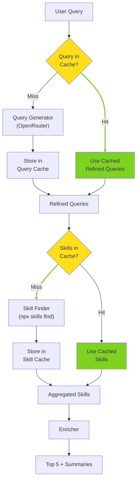

---

## 13. OpenRouter API Integration

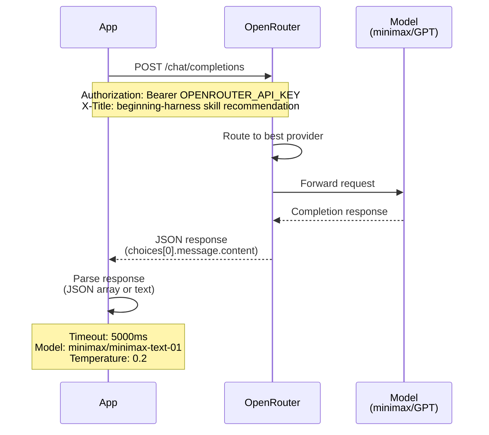

---

## 14. Phase 4: Web UI Architecture

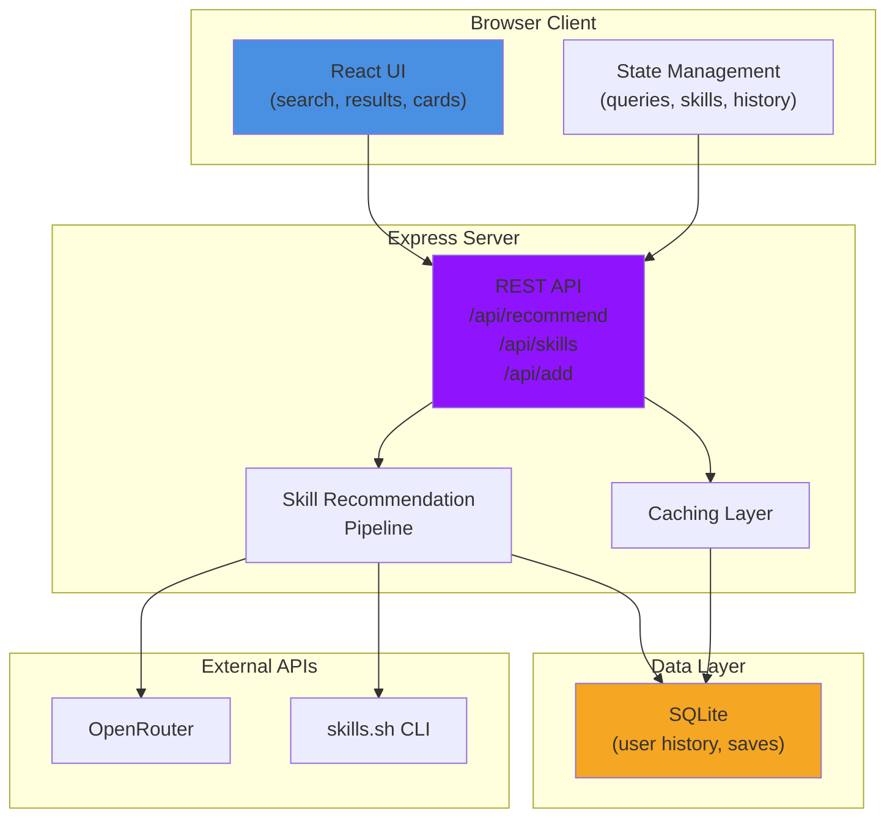

---

## 15. Cost Breakdown by Component

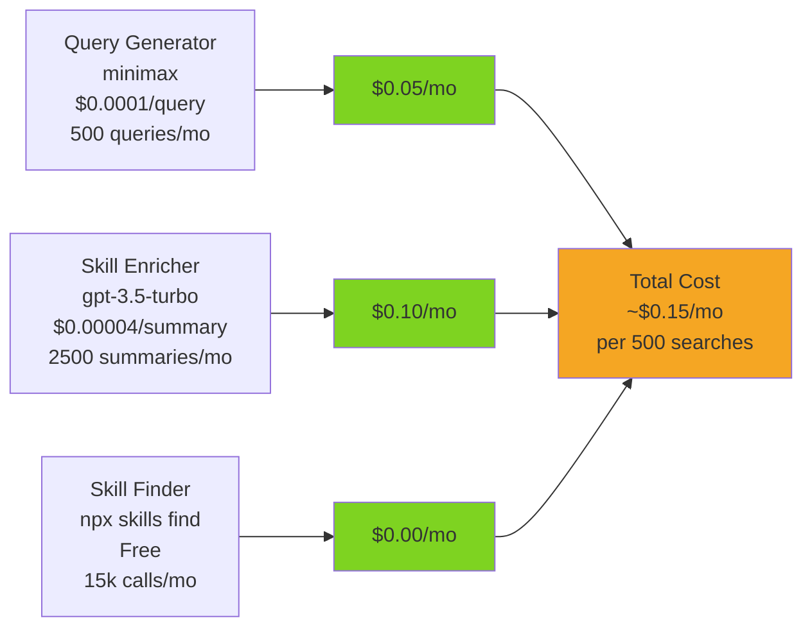

---

## 16. Success Metrics Timeline

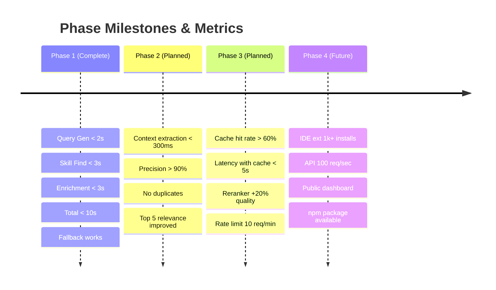

---

## 17. Deployment & Environment

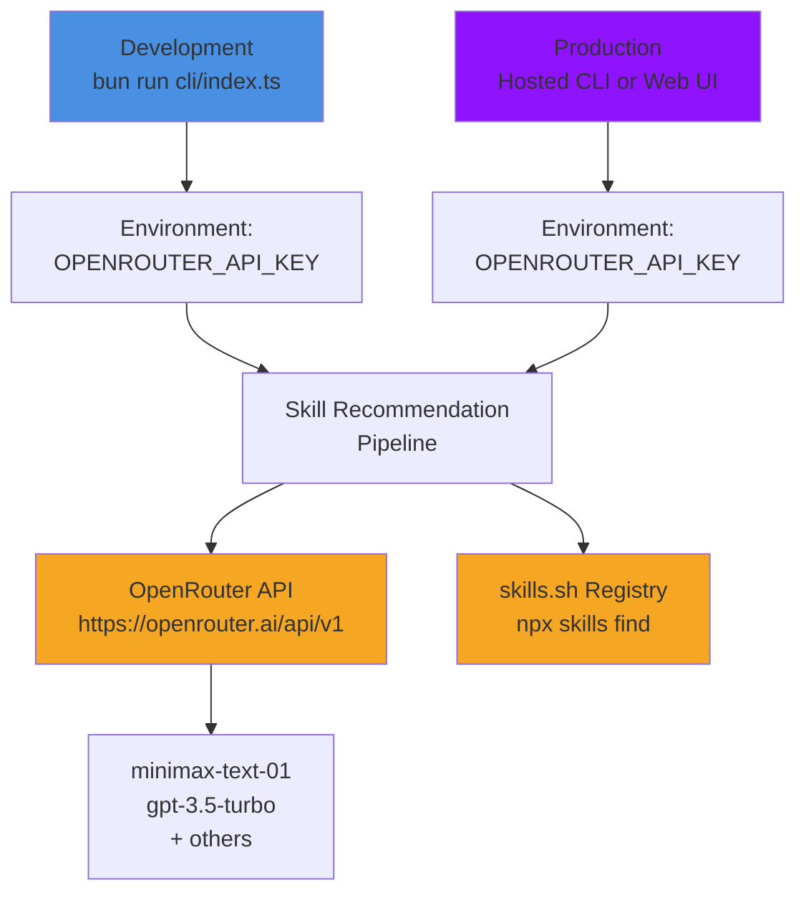

---

## Diagram Legend

| Color | Meaning |
|-------|---------|
| 🔵 Blue | AI/LLM Components (Query Gen, Skill Enrichment) |
| 🟣 Purple | Orchestration/Architecture |
| 🟢 Green | Processing/Output |
| 🟠 Orange | External APIs/External Services |
| 🟡 Yellow | Decision Points/Conditional Logic |

---

## How to View These Diagrams

These Mermaid diagrams can be viewed in:
- **GitHub**: Rendered automatically in markdown
- **Markdown Viewers**: Many support Mermaid (Obsidian, VS Code with extensions)
- **Online**: Copy to https://mermaid.live

---

## References

- [Mermaid Documentation](https://mermaid.js.org/)
- [Skill Recommendation PRD](./prd.md)
- [Production Setup Guide](./PRODUCTION_SETUP.md)
