# Skill Recommendation System - Diagrams

## 1. Data Pipeline Flow

```mermaid
graph LR
    A["User Query<br/>(e.g., 'react testing')"] 
    B["Query Generator<br/>(minimax/OpenRouter)"]
    C["3 Refined Queries<br/>(library, problem, pattern)"]
    D["Skill Finder<br/>(npx skills find)"]
    E["Skills by Query<br/>(5 per query)"]
    F["Skill Aggregator<br/>(dedupe, rank)"]
    G["Top 30 Skills"]
    H["Skill Enricher<br/>(gpt-3.5-turbo)"]
    I["Top 5 + Summaries"]
    J["CLI Display"]
    K["User Selection<br/>(arrow keys)"]
    L["npx skills add"]
    
    A --> B
    B --> C
    C --> D
    D --> E
    E --> F
    F --> G
    G --> H
    H --> I
    I --> J
    J --> K
    K --> L
    
    style B fill:#4a90e2
    style D fill:#4a90e2
    style F fill:#4a90e2
    style H fill:#4a90e2
    style K fill:#f5a623
```

---

## 2. Component Architecture

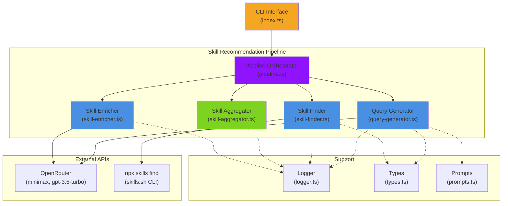

---

## 3. Query Generation Process

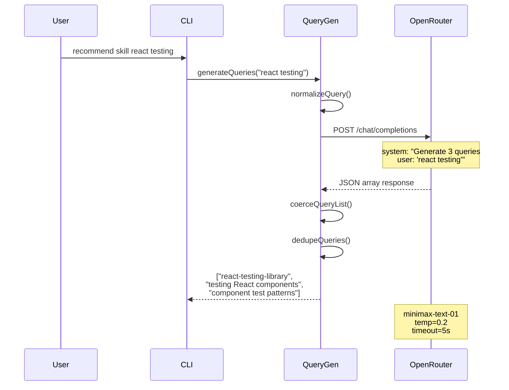

---

## 4. Parallel Skill Finding & Enrichment

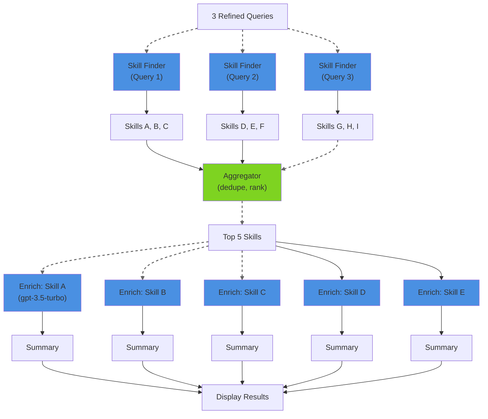

---

## 5. CLI User Interaction Flow

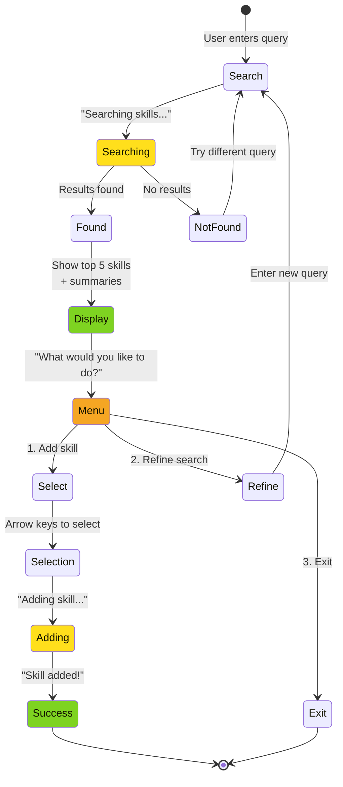

---

## 6. Query Generation Strategies

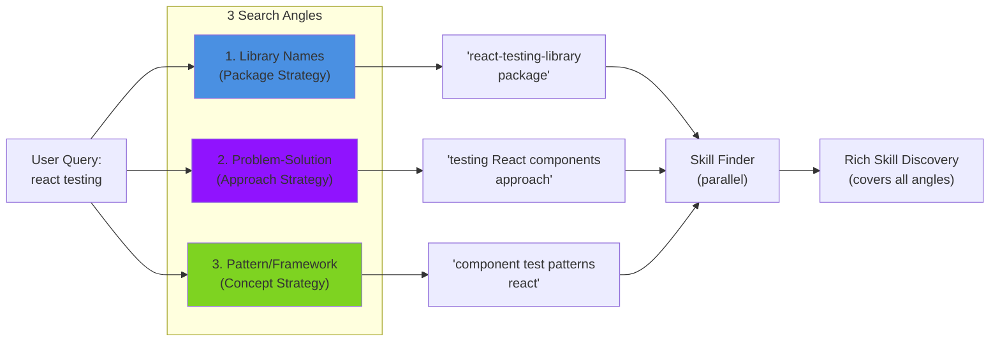

---

## 7. Error Handling & Fallbacks

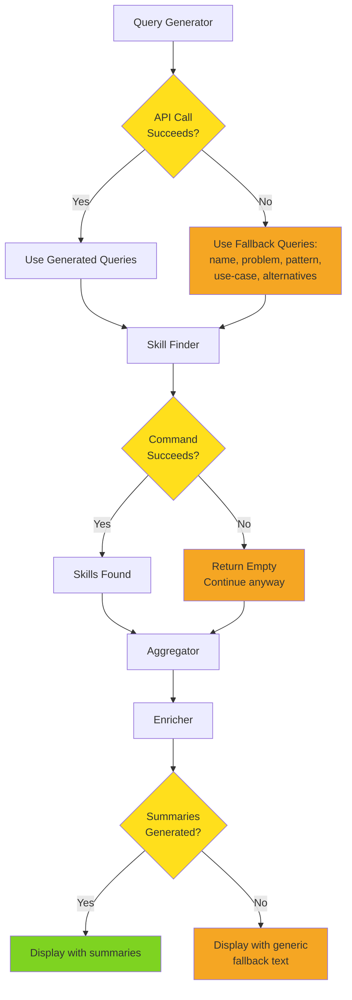

---

## 8. Latency Breakdown

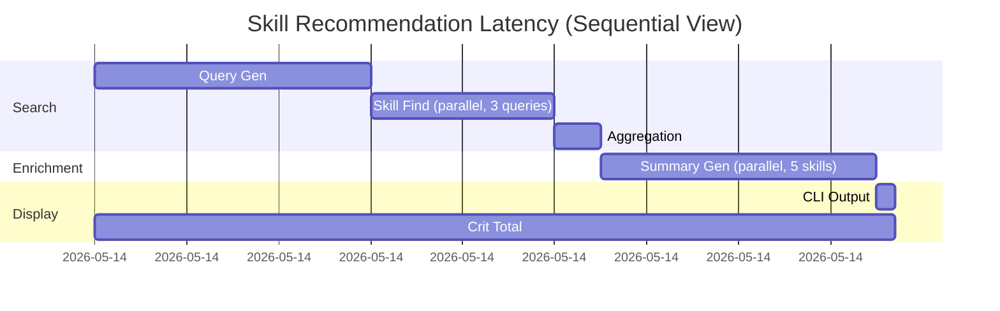

---

## 9. Data Structures

```mermaid
graph TB
    QI["QueryGeneratorInput"]
    QI --> QI_q["query: string"]
    
    QO["QueryGeneratorOutput"]
    QO --> QO_oq["originalQuery: string"]
    QO --> QO_rq["refinedQueries: string[]"]
    
    SK["Skill"]
    SK --> SK_id["id: string"]
    SK --> SK_n["name: string"]
    SK --> SK_rs["relevanceScore: number"]
    SK --> SK_desc["description?: string"]
    SK --> SK_src["source?: string"]
    SK --> SK_meta["metadata?: Record"]
    
    SRR["SkillRecommendationResult"]
    SRR --> SRR_oq["originalQuery: string"]
    SRR --> SRR_rq["refinedQueries: string[]"]
    SRR --> SRR_bq["skillsByQuery: Record"]
    SRR --> SRR_as["aggregatedSkills: Skill[]"]
    SRR --> SRR_lat["latencyMs: number"]
    SRR --> SRR_warn["warnings: string[]"]
    
    style SK fill:#e8f4f8
    style SRR fill:#f0f8e8
```

---

## 10. Phase 2: Caching Architecture

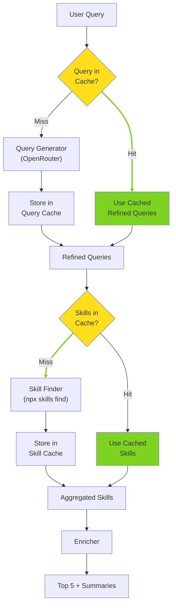

---

## 11. OpenRouter API Integration

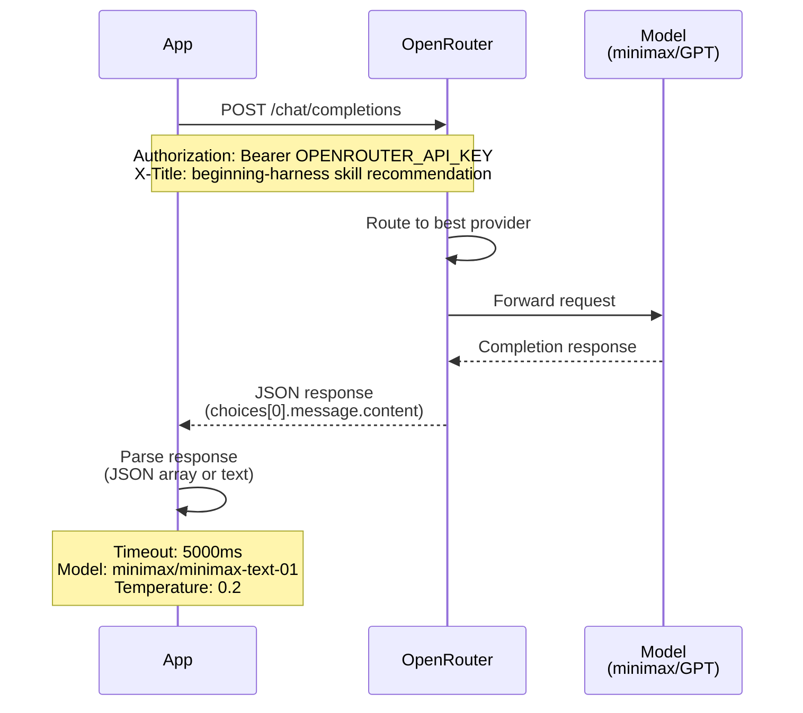

---

## 12. Phase 3: Web UI Architecture

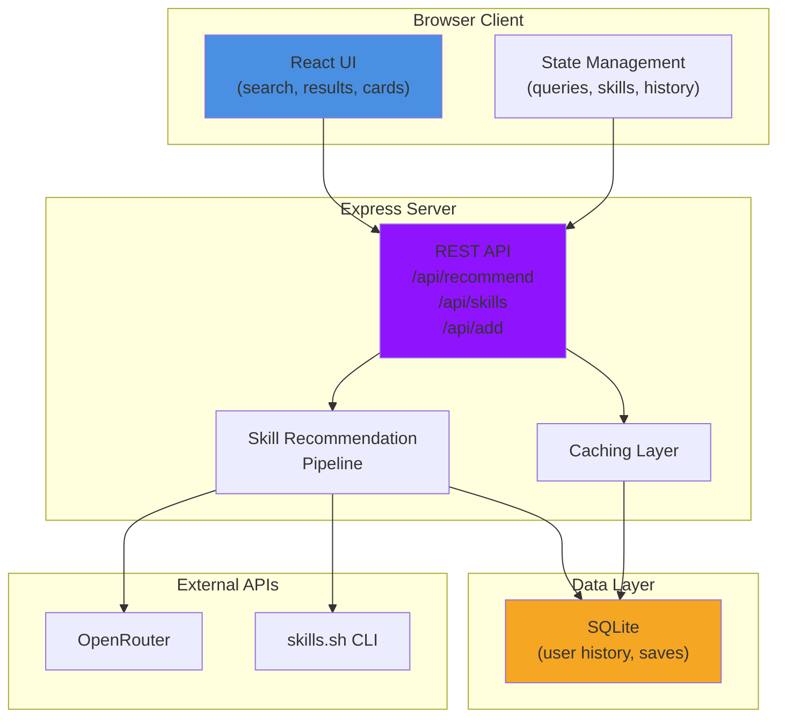

---

## 13. Cost Breakdown by Component

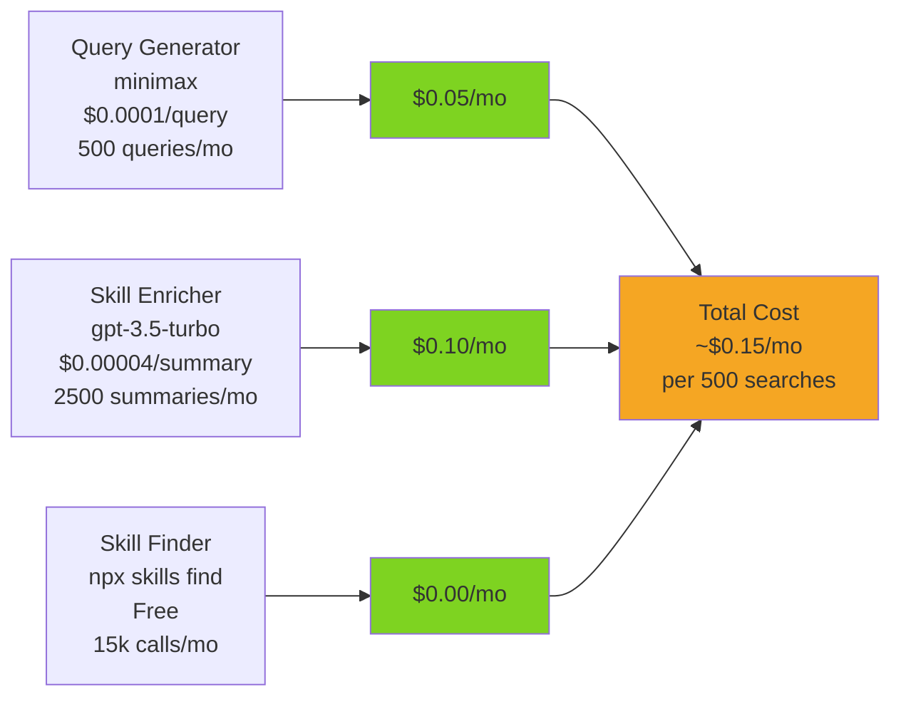

---

## 14. Success Metrics Timeline

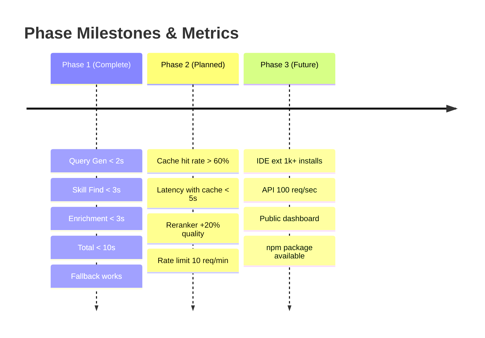

---

## 15. Deployment & Environment

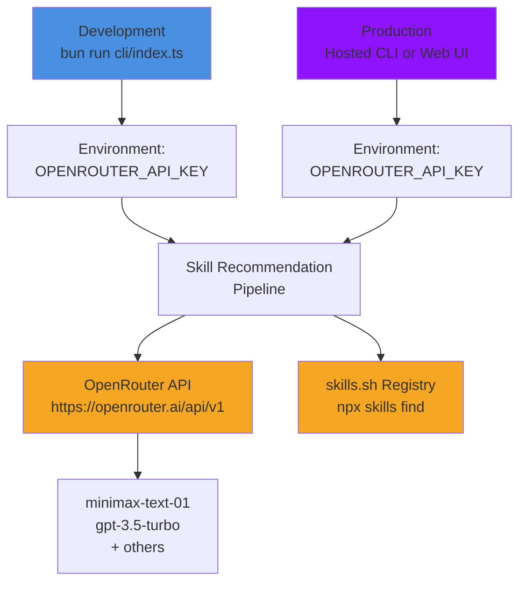

---

## Diagram Legend

| Color | Meaning |
|-------|---------|
| 🔵 Blue | AI/LLM Components (Query Gen, Skill Enrichment) |
| 🟣 Purple | Orchestration/Architecture |
| 🟢 Green | Processing/Output |
| 🟠 Orange | External APIs/External Services |
| 🟡 Yellow | Decision Points/Conditional Logic |

---

## How to View These Diagrams

These Mermaid diagrams can be viewed in:
- **GitHub**: Rendered automatically in markdown
- **Markdown Viewers**: Many support Mermaid (Obsidian, VS Code with extensions)
- **Online**: Copy to https://mermaid.live

---

## References

- [Mermaid Documentation](https://mermaid.js.org/)
- [Skill Recommendation PRD](./prd.md)
- [Production Setup Guide](./PRODUCTION_SETUP.md)
