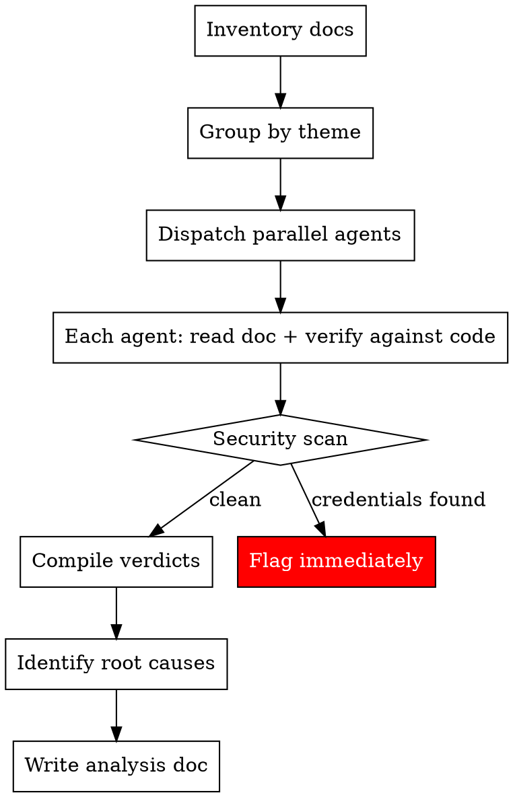

# Auditing Knowledge Docs

## Overview

Systematic audit of knowledge documentation against the live codebase using divide-and-conquer with parallel subagents. Each doc gets a structured verdict with actionable recommendations.

**Core principle:** Every claim in a knowledge doc must be verified against actual code — imports, file paths, schema names, API signatures, and configuration.

## When to Use

- After major migrations (schema renames, package consolidations, architecture shifts)
- Periodic documentation health checks
- Before onboarding (ensure docs won't mislead)
- When you suspect docs have drifted from the codebase

## The Process



### Step 1: Inventory

List all docs in the knowledge directory. Note the count, naming conventions, and any obvious groupings.

### Step 2: Group by Theme

Group docs into 5-8 thematic batches so each subagent gets related docs it can reason about together. Good groupings:

- Auth, identity, sessions
- Database, testing infrastructure
- Core architecture, packages, plugins
- Domain content (knowledge items, folders, conversations)
- Workers, queues, streaming
- Deployment, logging, misc

**Target: 5-8 docs per group.** Too few wastes parallelism, too many overwhelms the agent.

### Step 3: Dispatch Parallel Subagents

Each subagent gets:

1. **Its group of docs to audit** (file paths)
2. **The verification checklist** (see below)
3. **Output format requirements** (see Verdict Taxonomy)

Use the Task tool with `subagent_type: "general-purpose"`. Dispatch all groups in a single message for maximum parallelism.

**Agent prompt template:**

```
Audit these knowledge docs against the live codebase:
[list of file paths]

For EACH doc:
1. Read the doc completely
2. Verify key claims against actual code:
   - Do referenced files/directories exist? (use Glob)
   - Do referenced imports match actual imports? (use Grep)
   - Do schema/table names match actual schema files?
   - Do API endpoints match actual route definitions?
   - Do class/function names match actual implementations?
3. Assign a verdict: ACCURATE, PARTIALLY_OUTDATED, SIGNIFICANTLY_OUTDATED, OBSOLETE, or DEPRECATED
4. List specific inaccuracies with file evidence
5. Flag any hardcoded credentials or sensitive data

Return a structured table with: Doc | Verdict | Key Issues | Evidence Files
```

### Step 4: Compile Results

Merge all subagent reports into a single analysis document. Subagents return 4 columns (Doc, Verdict, Key Issues, Evidence Files). You add two more columns based on their findings:

| Field | Source | Description |
|-------|--------|-------------|
| **Doc** | Subagent | Filename |
| **Verdict** | Subagent | See Verdict Taxonomy |
| **Key Issues** | Subagent | Specific inaccuracies found |
| **Evidence** | Subagent | Codebase files that contradict the doc |
| **Severity** | You (coordinator) | High / Medium / Low — see Severity Scale |
| **Action** | You (coordinator) | Keep / Update / Merge / Drop — based on verdict + redundancy |

### Step 5: Root Cause Analysis

Look for **systemic patterns** across all docs. Common root causes:

- Schema namespace renames (e.g., `auth.*` → `identity.*`)
- Package consolidations (e.g., `@pkg/auth` → `@pkg/identity`)
- Architecture shifts (e.g., repository pattern → provider pattern)
- Infrastructure removal (e.g., queue system → HTTP dispatch)
- System migrations (e.g., runs → jobs)

Document these as **batch-fixable search-and-replace patterns** — they fix the majority of issues across all docs at once.

### Step 6: Write Analysis Doc

Output to the project's analysis directory (e.g., `.ai/analyses/`). Include:

1. Executive summary with counts per verdict
2. Root causes of drift
3. Per-document verdicts table
4. Common search-and-replace patterns for batch fixing
5. Consolidation recommendations (merges, drops)
6. Security issues (if any)
7. Phased action plan

## Verdict Taxonomy

| Verdict | Definition | Action |
|---------|-----------|--------|
| **ACCURATE** | All claims verified correct | Keep as-is |
| **PARTIALLY_OUTDATED** | Core concepts correct, some details stale | Targeted updates |
| **SIGNIFICANTLY_OUTDATED** | Major inaccuracies that could mislead | Major rewrite or consolidate |
| **OBSOLETE** | Describes a system/package/component that no longer exists in any form | Drop |
| **DEPRECATED** | Doc explicitly self-marked as deprecated (contains "DEPRECATED" or "superseded by") | Drop |

**Distinguishing SIGNIFICANTLY_OUTDATED from OBSOLETE:** If the system still exists but has been heavily rearchitected, use SIGNIFICANTLY_OUTDATED. OBSOLETE is only for docs describing something that has been completely removed — no code, no config, no traces remain.

**Redundancy flag:** When two or more docs cover substantially the same topic (regardless of their accuracy), note them as merge candidates in the consolidation recommendations. Redundancy is an action recommendation, not a verdict — a doc can be ACCURATE but still redundant with another ACCURATE doc.

### Severity Scale

When compiling results, assign severity to each outdated doc:

| Severity | Definition |
|----------|-----------|
| **High** | Doc could actively mislead — wrong schema names, wrong API signatures, references to deleted systems as if they exist |
| **Medium** | Doc is partially stale but the core guidance is still directionally correct |
| **Low** | Minor inaccuracies (outdated version numbers, renamed classes) that are unlikely to cause real confusion |

## Verification Checklist

When verifying a doc, check these categories:

| Category | What to Check | How to Check |
|----------|---------------|--------------|
| **File paths** | Do referenced files exist? | `Glob` for the path |
| **Imports** | Are package names correct? | `Grep` for import statements in `src/` |
| **Schema names** | Do table/schema names match? | Check schema definition files |
| **API endpoints** | Do routes exist with correct methods? | Check route files |
| **Class/function names** | Do referenced implementations exist? | `Grep` for class/function definitions |
| **Config files** | Do referenced configs exist? | Check `wrangler.toml`, `package.json`, etc. |
| **Env vars** | Are env var names correct? | Check `.env.example` or config files |
| **Credentials** | Any hardcoded passwords, keys, tokens? | `Grep` for password patterns, API keys |

## Common Drift Patterns

These are the most frequent sources of documentation drift:

1. **Namespace renames** — Schema or package namespaces change but docs keep old names
2. **Pattern migrations** — Architecture patterns change (e.g., repository → provider) but docs describe old pattern
3. **Infrastructure removal** — Services/systems removed but docs still reference them
4. **Feature evolution** — Systems gain new capabilities not reflected in docs
5. **Consolidation** — Multiple packages merged into one but docs still describe them separately

## Common Mistakes

| Mistake | Fix |
|---------|-----|
| Auditing docs without checking code | Every claim needs a codebase file as evidence |
| Too many docs per subagent | Keep to 5-8 docs per group for thorough verification |
| Marking docs as "outdated" without specifics | List exact lines, files, and what's wrong |
| Missing security issues | Always grep for password patterns, API keys, tokens |
| Not identifying root causes | Systemic patterns enable batch fixes across all docs |
| Treating all outdated docs equally | Use the verdict taxonomy to prioritize updates |
