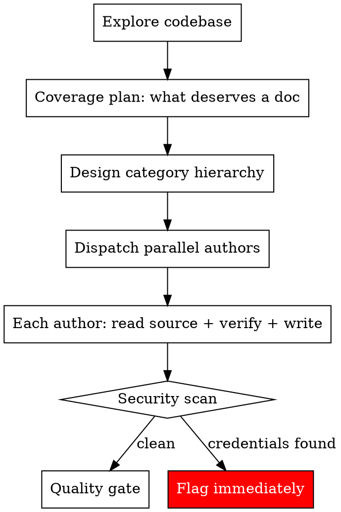
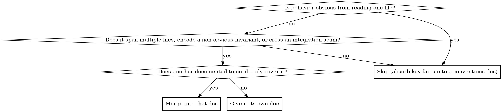

# Drafting Knowledge Docs

## Overview

Draft a complete knowledge-docs directory for a codebase that has none, by reading the code and writing categorized reference docs that mirror the architecture. Every doc is authored from the actual source, not from inference or from another agent's summary.

**Core principle:** Code is the only source of truth. Every claim in a drafted doc must be traceable to a specific file you read. Draft nothing you did not read.

**This is greenfield only.** If knowledge docs already exist, use `auditing-knowledge-docs` (to find drift) and `restructuring-knowledge-docs` (to reorganize) instead. Those skills reconcile existing docs against code; this one creates docs where there are none.

## When to Use

- A codebase (or a subsystem) has no knowledge/reference docs and you need to bootstrap them
- Onboarding docs are needed and none exist
- A new package or service has shipped with no internal documentation

**When NOT to use:**

- Docs already exist and may be stale → `auditing-knowledge-docs`
- Docs exist but are disorganized/redundant → `restructuring-knowledge-docs`
- API/user-facing docs (this skill is for *internal knowledge* docs — architecture, behavior, invariants)

## The Process



### Step 1: Explore the Codebase

Before deciding anything, map the real structure:

- **Packages** — What `@org/*` packages or top-level modules exist? What does each own?
- **Entry points** — Where does execution start? (CLI entry, server bootstrap, main module)
- **Routes / commands** — What API domains or commands exist?
- **Services / core** — What logic layers exist below the thin shell?
- **Schema** — What database schemas/namespaces exist?
- **Workers / external services** — What runs out-of-process?
- **Tests** — How is test infrastructure organized?

The categories and the doc set both come from these real boundaries — not from a generic "how to document a CLI" template.

### Step 2: Coverage Plan — What Deserves a Doc

This is the decision that determines quality. **Coverage is proportional to risk and subtlety, not to line count.** A 700-line flat switch statement gets a paragraph; a 400-line module that silently decides whether to overwrite a user's file gets its own doc.

For each code area, decide document / merge / skip:



| Decision | When |
|----------|------|
| **Document** | Behavior spans multiple files, encodes a non-obvious invariant, or crosses an integration seam (writes user-owned files, talks to external services, enforces a security boundary) |
| **Merge** | Distinct but part of one story with another topic (e.g., three migration modules → one migrations doc) |
| **Skip** | Self-evident from a single file (thin command shells, small utilities). Absorb their key facts (env vars, helpers) into a conventions doc |

Prioritize the **load-bearing, dangerous, and subtle** surfaces first. Produce a coverage table: `Code area | Decision | Rationale | Target doc`.

### Step 3: Design Category Hierarchy

Create numbered directories that map to codebase domains:

```
knowledges/
  00_meta/          # Documentation standards, conventions, glossary
  01_overview/      # Architecture, system map, data flow
  02_<domain>/      # Mirrors a real package/service boundary
  ...
```

**Guidelines:**
- **Mirror packages/services, not doc topics** — categories reflect real code boundaries
- **5-8 categories max** — too many defeats categorization
- **Number-prefixed** dirs and docs — natural ordering (foundational first, specialized later)

### Step 4: Author the Docs

Every doc in the coverage plan gets authored — in full, from the real source. **Do not stop at a skeleton plus a couple of samples.**

**Fan out only when it buys you something.** The principle is "every claim traces to a file the author read" — dispatching subagents helps only when there's more source than one context can read carefully.

- **Author directly** when the scope is small enough that you have already read every source file in full. Handing a fresh agent a summary to re-summarize manufactures the exact drift this skill exists to prevent.
- **Dispatch parallel authors** (Task tool, `subagent_type: "general-purpose"`, all in one message) when the scope is too large to read carefully yourself. Each author owns a subset of docs and reads that subset's source directly.

Whichever path, the authoring contract below is identical.

**Authoring contract** (applies to you when authoring directly, or as the prompt to each author agent):

```
Write the knowledge doc at [output path] for this codebase.

Topic: [what this doc covers]
Source files to read: [explicit list of files this doc is derived from]

Requirements:
1. READ every source file listed above IN FULL before writing. Write only what you
   verified in the source. Do NOT write from general knowledge, inference, or another
   agent's summary — if you cannot confirm a claim in the code, do not make it.
2. Start with an ABOUTME comment (2 lines, <!-- ABOUTME: ... --> format).
3. Include a metadata block: Status, Category, Related Docs, and Source files
   (the exact files this doc is derived from, so future audits can diff against them).
4. Cross-reference sibling docs by their new paths.
5. Flag any hardcoded credentials or secrets you find — do not copy them into the doc.
6. Preserve concrete detail: signatures, invariants, failure modes, gotchas.

Return the path written and the list of source files you actually read.
```

**Critical:** Authors read the *code*, not each other's output. The baseline failure mode is agents summarizing summaries — that manufactures drift on day one.

### Step 5: Quality Gate

Every planned doc must exist and pass before you declare done.

#### Verification Sweep

- **Every claim traceable to a file** — spot-check each doc's `Source files` against its content. A doc making claims about files not in its source list is a red flag.
- **Reconcile cross-doc contradictions** — grep shared nouns (paths, env vars, schema names) across all docs. When two docs disagree, **read the code and fix both**. Do not leave contradictions unresolved.
- **No hallucinated APIs** — referenced functions/paths/endpoints must exist (grep for them).

#### Quality Checklist

For each doc verify:

- [ ] ABOUTME comment at the top (2 lines)
- [ ] Clear `#` title
- [ ] Metadata block (Status, Category, Related Docs, Source files)
- [ ] Cross-referenced paths actually exist
- [ ] No hardcoded credentials
- [ ] Substantive content, not a stub
- [ ] Every doc in the coverage plan was authored (no skeleton-only entries)

## Conventions

Fix these up front so authors don't decide ad hoc:

- **File naming:** number-prefixed, kebab or snake per project norm, one topic per file
- **ABOUTME comment:** 2 lines, `<!-- ABOUTME: ... -->`
- **Metadata block:** Status, Category, Related Docs, Source files
- **Output location:** check the project's `.ai/rules/` for the authoritative docs path before choosing one; do not invent a location if the project defines one

## Common Mistakes

| Mistake | Fix |
|---------|-----|
| Writing docs from inference or from a reader-agent's summary | Authors must read the source files themselves; every claim cites a file |
| Stopping at a skeleton plus a few sample docs | Author every doc in the coverage plan |
| Documenting every module equally | Coverage proportional to risk and subtlety, not line count |
| Over-documenting thin shells and trivial utilities | Skip them; absorb key facts into a conventions doc |
| Categories based on doc topics, not codebase structure | Explore the code first; mirror real boundaries |
| Leaving cross-doc contradictions unresolved | Reconcile against the code in the quality gate — the code wins |
| Deciding conventions and output path mid-writing | Fix naming, metadata, and location before dispatching authors |
| Copying secrets found in code into the docs | Flag and exclude; never propagate credentials |
