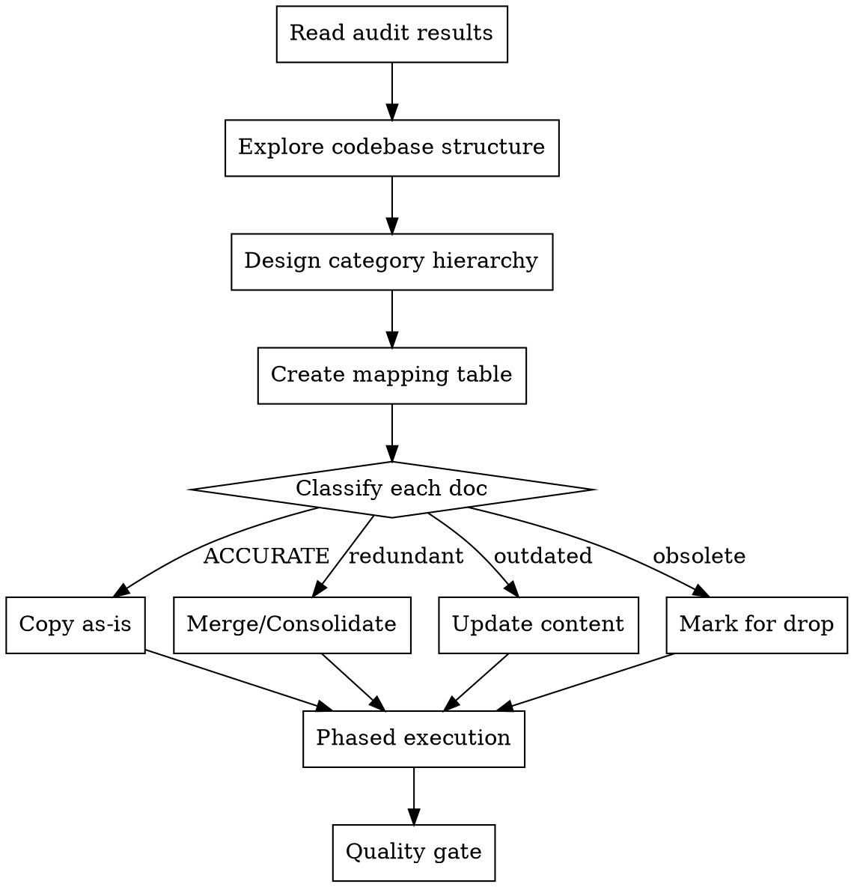

# Restructuring Knowledge Docs

## Overview

Reorganize flat knowledge docs into a categorized directory hierarchy that mirrors the codebase architecture. Merge redundant docs, consolidate related topics, and update stale content — all while preserving the full detail and context of the originals.

**Core principle:** The documentation structure should mirror the codebase structure, not the order docs were written.

**Prerequisite:** Run the `auditing-knowledge-docs` skill first. You need audit verdicts and root cause analysis before restructuring.

## When to Use

- After a knowledge docs audit reveals significant drift (>30% outdated)
- When docs are hard to navigate due to flat structure or inconsistent naming
- When consolidation would reduce redundancy (multiple docs covering same topic)
- When the codebase architecture has changed enough that doc categories no longer match

## The Process



### Step 1: Explore Codebase Structure

Before designing the doc hierarchy, understand the actual codebase:

- **Packages** — What `@org/*` packages exist? What does each own?
- **Routes** — What API domains are there?
- **Services** — What service layers exist?
- **Schema** — What database schemas/namespaces exist?
- **Workers** — What external workers/services exist?
- **Tests** — How is the test infrastructure organized?

The category hierarchy should reflect these real boundaries, not arbitrary groupings.

### Step 2: Design Category Hierarchy

Create numbered directories that map to codebase domains:

```
knowledges/
  00_meta/          # Documentation standards, conventions
  01_backend/       # Core architecture, plugins, deployment
  02_identity/      # Auth, users, billing (matches @org/identity)
  03_content/       # Domain entities (matches content packages)
  04_database/      # Storage, search, schema tooling
  05_workers/       # External services, streaming, jobs
  06_testing/       # Test infrastructure, practices, patterns
```

**Guidelines:**
- **Mirror packages, not docs** — If the codebase has `@org/identity` covering auth + billing, group those docs together
- **5-8 categories max** — Too many defeats the purpose of categorization
- **Number-prefixed** — Enables natural ordering without alphabetical sorting
- **Docs within categories also numbered** — `01_*.md`, `02_*.md` ordered by dependency (foundational concepts first, specialized topics later)

### Step 3: Create Mapping Table

For every existing doc, decide its fate and destination:

| Old Doc | Verdict | Action | New Location | Notes |
|---------|---------|--------|-------------|-------|
| `auth_flows.md` | ACCURATE | Copy | `02_identity/01_auth.md` | No changes needed |
| `auth_deploy.md` | OUTDATED | Rewrite | `02_identity/02_deployment.md` | ES512 → Ed25519 |
| `auth_web.md` | OUTDATED | Merge into | `02_identity/01_auth.md` | Consolidate with above |
| `queues.md` | DEPRECATED | Drop | — | Self-marked deprecated |
| `old_system.md` | OBSOLETE | Drop | — | System no longer exists |

**Doc classification actions:**

| Action | When to Use |
|--------|------------|
| **Copy** | Doc is ACCURATE — move to new location unchanged |
| **Update** | Doc is PARTIALLY_OUTDATED — fix specific issues |
| **Merge** | Multiple docs cover same topic — combine into one |
| **Consolidate** | 3+ docs overlap — create one comprehensive doc from all |
| **Rewrite** | Doc is SIGNIFICANTLY_OUTDATED — keep structure, fix content |
| **Drop** | Doc is OBSOLETE or DEPRECATED — exclude from new structure |

**"Drop" means:** Don't create a corresponding doc in the new categorized structure. It does NOT mean delete the old file — old files stay until the owner explicitly approves deletion (see Step 7).

**Deciding Merge vs. standalone Update:** Two docs should be merged when they share the same primary subject (e.g., both document the auth system). Signals: overlapping section headings, same API endpoints referenced, audit notes them as covering redundant ground. If two docs are in the same category but cover distinct aspects (e.g., auth architecture vs. auth deployment), keep them as separate docs with cross-references.

**When a doc is both outdated AND overlaps with another:** Merge/consolidate takes priority. The content fix happens during the merge, not as a separate step.

### Step 4: Phased Execution

Execute in phases to manage complexity and enable review checkpoints:

**Phase 0: Security**
- Scrub any hardcoded credentials found during audit
- This is always first, always immediate

**Phase 1: Copy accurate docs**
- Simple file copies to new locations
- No content changes needed
- Quick win to establish the new structure

**Phase 2: Complex consolidations**
- Dispatch parallel agents for docs that need 3+ sources merged
- Each agent gets: source docs, audit findings, root cause patterns, output path
- These take the most work — parallelize them

**Phase 3: Merge pairs**
- Dispatch parallel agents for 2-doc merges
- Simpler than consolidations but still need codebase verification

**Phase 4: Single-doc updates**
- Dispatch parallel agents for docs needing targeted fixes
- Apply the batch search-and-replace patterns from the audit

**Phase 5: Quality gate** (see below)

**Parallelism:** Phases 2-4 can often run in parallel since agents work on different output files. Group by independence, not by phase number.

### Step 5: Agent Prompt for Doc Work

Each agent creating/updating a doc needs:

```
Create/update [output path] by [action: merging/updating/rewriting] from:
- [source doc 1 path]
- [source doc 2 path] (if merging)

Audit findings for these docs:
[paste relevant audit verdicts and issues]

Common corrections to apply:
[paste search-and-replace patterns from audit root causes]

Requirements:
1. Start with ABOUTME comment (2 lines, <!-- ABOUTME: ... --> format for .md)
2. Verify every technical claim against the live codebase before writing it
3. Preserve ALL useful detail and context from source docs
4. Use the identity/provider/current patterns, not the old ones
5. Include metadata block (Status, Category, Related Docs)
6. Cross-reference other new docs by their new paths
```

**Critical:** Tell agents to VERIFY against the codebase, not just blindly copy from source docs. The source docs are the ones that drifted — the codebase is the source of truth.

### Step 6: Quality Gate

After all docs are created, run two verification sweeps:

#### Stale Reference Sweep

Grep all new docs for patterns identified in the audit's root causes. For each match, classify as:
- **Genuinely stale** — Fix it
- **Acceptable historical mention** — e.g., "previously known as X" is fine

Common patterns to check:

| Pattern | Should Be |
|---------|-----------|
| Old schema names | Current schema names |
| Old package names | Current package names |
| Old class names (repositories) | Current class names (providers) |
| Removed infrastructure refs | Removed or noted as removed |
| Old API method names | Current API method names |
| Hardcoded credentials | Removed |

#### Quality Checklist

For each new doc verify:

- [ ] Has ABOUTME comment at the top (2 lines)
- [ ] Has clear `#` title
- [ ] Has metadata block (Status, Category, Related Docs)
- [ ] Cross-references use new paths (not old doc numbers)
- [ ] Cross-referenced paths actually exist (grep for referenced filenames)
- [ ] No hardcoded credentials
- [ ] Substantive content (not a stub)
- [ ] For merged/consolidated docs: covers all major topics from each source doc

### Step 7: Handling Old Docs

**Do NOT delete old docs without explicit approval.** The new categorized structure should work alongside the old flat structure until the owner confirms the new docs are satisfactory.

Present the completion report:
- Count of new docs created per category
- Summary of stale references found and fixed
- Quality gate pass/fail per doc
- Explicit note that old docs remain, awaiting deletion instruction

## Consolidation Guidelines

When merging multiple docs into one:

1. **Identify the "most accurate" source** — Use it as the structural base
2. **Layer in unique content from others** — Don't discard details just because they're in a secondary doc
3. **Verify every claim against code** — Don't propagate stale content from any source
4. **Resolve contradictions using the codebase** — When sources disagree, the code wins
5. **Preserve examples and code snippets** — Update them, don't remove them
6. **Keep the same depth of coverage** — Consolidation means less redundancy, not less detail

## Common Mistakes

| Mistake | Fix |
|---------|-----|
| Categories based on doc topics, not codebase structure | Explore the actual codebase first |
| Deleting old docs before approval | Keep both structures until owner confirms |
| Losing detail during consolidation | Verify the new doc covers everything from all sources |
| Copying stale content from source docs | Verify against codebase, don't trust the source docs |
| Skipping the quality gate | Stale references slip through — always sweep |
| Sequential execution when parallel is possible | Independent doc work should be parallelized |
| Not providing audit context to subagents | Agents need the root cause patterns to apply corrections |
